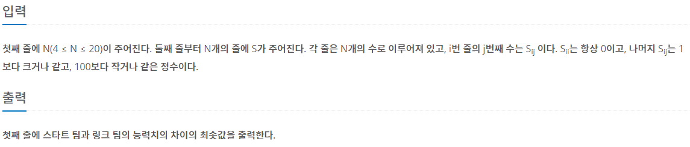

## [BAEKJOON 15661 링크와 스타트](https://www.acmicpc.net/problem/15661)  (Python)

#### 입출력 / 제한



#### 풀이

한 팀에 모든 사람이 가는 경우를 제외한 경우들을 탐색하면서 두 팀의 능력치 차이가 가장 적은 경우를 찾았다.

이 문제는 중복되는 경우를 어떤 방법으로 가지치기를 할 것인지가 가장 중요했던 것 같다.


#### 최종 코드

```python
def check():
    global ans
    team1 = []
    team2 = []
    for n in range(N):
        if used[n]:
            team1.append(n)
        else:
            team2.append(n)
    t1 = t2 = 0
    for i in range(len(team1) - 1):
        for j in range(i + 1, len(team1)):
            t1 += (adj[team1[i]][team1[j]] + adj[team1[j]][team1[i]])

    for i in range(len(team2) - 1):
        for j in range(i + 1, len(team2)):
            t2 += (adj[team2[i]][team2[j]] + adj[team2[j]][team2[i]])

    ans = min(ans, abs(t1 - t2))
    return


def make_team(now):
    if now == N:
        if sum(used) not in (0, N):
            check()
        return

    used[now] = 1
    make_team(now + 1)
    if now != 0:
        used[now] = 0
        make_team(now + 1)
    return


N = int(input())
adj = [list(map(int, input().split())) for _ in range(N)]

ans = 21e8
used = [0] * N
make_team(0)
print(ans)
```


#### 느낀점

중복되는 경우를 잘 파악하고 이를 가지치기하려면 어떤 방법을 적용해야하는지 떠올리기가 힘들었다.

효율적인 코드를 짜기위해서 많은 문제를 풀어봐야겠다.

