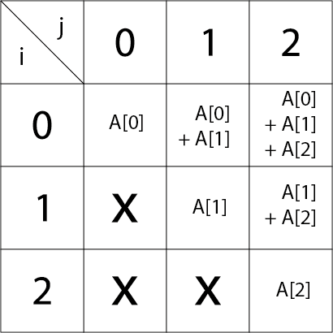

## [BAEKJOON 1248 맞춰봐](https://www.acmicpc.net/problem/1248)  (Python)

#### 입출력 / 제한


#### 풀이

```
S[i][j]는 A[i]부터 A[j]까지 합이 0보다 크면 "+", 0이면 "0", 0보다 작으면 "-"이다.
```

1. 해당 문구에 따라 S(partial) 2차원 리스트를 만들어 사용하였다.

   예시) 아래 표에 합산된 값이 음수이면 -1("-"), 양수이면 1("+"), 0이면 0("0")을 저장하도록 하였다.

- partial

   

  ```python
  partial = [[0] * N for _ in range(N)]
  for i in range(N):
      for j in range(i, N):
          res = arr.pop(0)
          if res == '+':
              partial[i][j] = 1
          elif res == '-':
              partial[i][j] = -1
  ```


2. ans라는 정답 배열을 생성하고 해당 배열의 각 위치에 주어진 조건에 맞는 숫자를 대입하고 검사하는 식으로 정답을 찾아나간다.

   ```markdown
   1. 위 표를 보면 partial[idx][idx] 위치에 정답 배열의 각 자리 숫자들이 들어가기 때문에 해당 위치에 값을 대입한다.
   	1-1) partial[idx][idx]가 1이라면 1 ~ 10, -1이라면 -1 ~ -10, 0이라면 0을 ans[idx]에 저장한다.
   
   2. 각 자리에 대입이 완료되면 해당 ans에 저장된 값들을 활용한 구간합이 조건에 부합하는지 확인한다.
   	2-1) 위 표에서 partial[idx][idx]에서 partial[0][idx] 까지 올라가면서 합을 계산하고 조건과 비교한다.
   	2-2) 조건에 부합하면 True를 부합하지 않으면 False를 반환한다.
   
   3. ans의 모든 자리에 값을 저장하면 True를 반환하여 함수를 종료 / 정답을 출력한다.
   ```


#### 최종 코드

```python
def check(idx):
    '''
    partial 2차원 리스트에서 row 좌표를 줄여가면서 조건에 부합하는지 확인
    조건에 부합하지 않는 경우가 하나라도 존재하면 False 반환
    '''
    total = 0
    for n in range(idx, -1, -1):
        total += ans[n]
        r = partial[n][idx]
        if (total == 0 and r != 0) or (total > 0 and r <= 0) or (total < 0 and r >= 0):
            return False
    return True


def find(idx):
    # idx가 N이 되면 ans의 모든 값이 완료되었음으로 True 반환
    if idx == N:
        return True
    '''
    ans[idx]에 조건에 맞는 값을 저장
    +) r이 0인 경우 다른 값이 들어갈 수 없음으로 확인작업 불필요
    '''
    r = partial[idx][idx]
    if r == 0:
        ans[idx] = 0
        return find(idx + 1)

    for n in range(1, 11):
        ans[idx] = partial[idx][idx] * n
        # 해당 위치가 조건에 부합하면 다음 위치 대입
        if check(idx) and find(idx+1):
            return True
    return


N = int(input())
arr = list(input())
# arr을 2차원 리스트로 저장
partial = [[0] * N for _ in range(N)]
for i in range(N):
    for j in range(i, N):
        res = arr.pop(0)
        if res == '+':
            partial[i][j] = 1
        elif res == '-':
            partial[i][j] = -1
# 정답을 저장할 배열 정의
ans = [0] * N
find(0)
print(' '.join(map(str, ans)))
```


#### 느낀점

처음 해당 문제를 풀 당시 2차원 리스트로 저장하지 않고 1차원 배열로 둔 상태에서 index 값을 위치에 맞게 조절하려 했더니 그 과정에서 많은 에러를 발생시켰고 결과적으로 시간 초과 및 틀린 답을 도출하는 결과를 가져왔다. 어째서 이런 방법을 떠올리지 못했을까 싶다. 알고리즘을 소홀히 했던 대가인 것 같아서 다시 초심으로 돌아가서 쉬운 문제부터 단계적으로 밟아가며 학습해야겠다.

