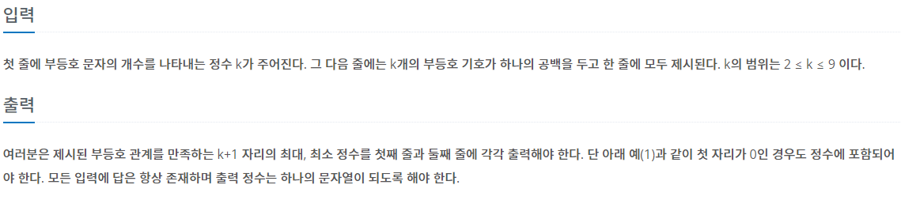

## [BAEKJOON 2529 부등호](https://www.acmicpc.net/problem/2529)  (Python)

#### 입출력 / 제한



#### 풀이

-10 ~ 10까지의 숫자를 부등호 상태에 맞춰 숫자를 지정하고 해당 숫자가 부등호를 모두 만족하면 함수를 종료하고 출력하였다.


#### 최종 코드

```python
def number(length, now):
    global max_, min_, ans_n, ans_x
    if length == k + 1:
        if max_ < int(now):
            max_ = int(now)
            ans_x = now
        if min_ > int(now):
            min_ = int(now)
            ans_n = now
        return

    for i in range(10):
        if used[i]:
            continue
        if now:
            s = sign[length - 1]
            if s == '<' and int(now[-1]) > i:
                continue
            elif s == '>' and int(now[-1]) < i:
                continue
        used[i] = 1
        number(length + 1, now + str(i))
        used[i] = 0
    return


k = int(input())
sign = list(input().split())

used = [0] * 10

max_ = 0
min_ = 10000000000
ans_x = ''
ans_n = ''
number(0, '')
print(f'{ans_x}\n{ans_n}')
```


#### 느낀점


