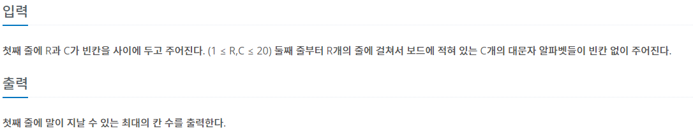

## [BAEKJOON 1987 알파벳](https://www.acmicpc.net/problem/1987)  (Python)

#### 입출력 / 제한




#### 풀이

DFS를 통해 가장 먼거리까지 이동한 결과를 저장하는 방법으로 문제를 해결하였다.

1. 중복되는 알파벳으로 이동하지 못하도록 used 딕셔너리를 정의한다.

   - A~Z 까지의 유니코드 값을 key로 가지는 딕셔너리 정의

     이유 : 리스트를 정의하여 사용하는 것 보다 딕셔너리를 통한 접근이 더 빠를 것이라고 생각했다.

   ```python
   alpha = list(range(ord("A"), ord("Z") + 1))
   state = [0] * 26
   used = dict(zip(alpha, state))
   ```

   

2. 좌측 상단 (0, 0) 좌표에서 시작하여 재귀함수를 이용한 DFS 탐색을 진행한다.

   ```python
   def move(r, c, cnt):
       global ans
       ans = max(ans, cnt)
   
       for i in range(4):
           nr, nc = r + dr[i], c + dc[i]
           if nr < 0 or nr >= R or nc < 0 or nc >= C: continue
           o = ord(MAP[nr][nc])
           if used[o]: continue
   
           stop = False
           used[o] = 1
           move(nr, nc, cnt + 1)
           used[o] = 0
       return
   ```

   

3. 더 이상 진행 불가능한 경우 return 한다.


#### 전체 코드

```python
import sys
input = sys.stdin.readline
dr = [-1, 1, 0, 0]
dc = [0, 0, -1, 1]


def move(r, c, cnt):
    global ans
    ans = max(ans, cnt)

    for i in range(4):
        nr, nc = r + dr[i], c + dc[i]
        if nr < 0 or nr >= R or nc < 0 or nc >= C: continue
        o = ord(MAP[nr][nc])
        if used[o]: continue

        stop = False
        used[o] = 1
        move(nr, nc, cnt + 1)
        used[o] = 0
    return


R, C = map(int, input().split())
MAP = [list(input()) for _ in range(R)]

alpha = list(range(ord("A"), ord("Z") + 1))
state = [0] * 26
used = dict(zip(alpha, state))
used[ord(MAP[0][0])] = 1

ans = 0
move(0, 0, 1)
print(ans)
```


#### 느낀점

틀린 문제로 떠있어서 다시 풀어본 문제다. 이전에는 왜 시간 초과가 났는지는 모르겠지만 이번 풀이 역시 시간이 오래걸리는 것으로 보아 효율적이지 못했던 것 같다. 보다 빠르게 해결할 수 있도록 다른 접근으로 다시 풀어봐야 할 것 같다.