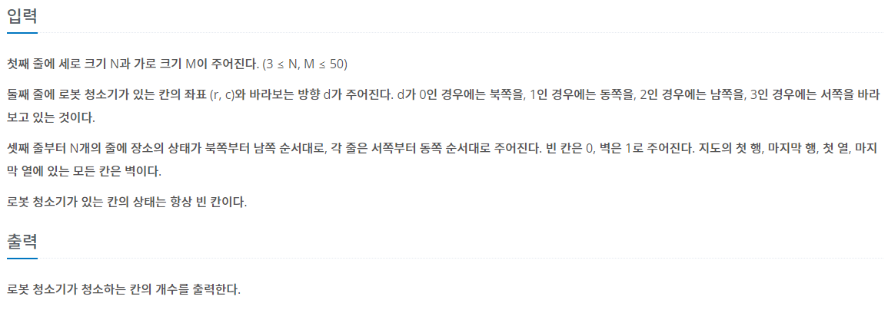
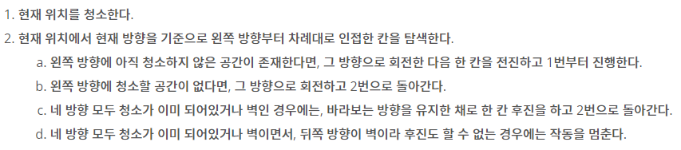

## [BAEKJOON 14503 로봇청소기](https://www.acmicpc.net/problem/14503)  (Python)

#### 입출력 / 제한




#### 풀이

해당 문제는 아래의 규칙만 잘 따라가면 쉽게 풀 수 있는 문제였다.

 


1. 상, 우, 하, 좌 순서의 방향 배열을 정의한다.
2. 위 규칙에 따라 로봇 청소기를 이동시킨다.


#### 최종 코드

```python
import sys
input = sys.stdin.readline
dr = [-1, 0, 1, 0]
dc = [0, 1, 0, -1]


def clean(r, c):
    visited = [[0] * M for _ in range(N)]
    visited[r][c] = 1
    cnt = 1
    while True:
        nd = robot[2]
        for d in range(4):
            # 방향 배열의 index가 하나씩 줄어들도록 3을 더한 뒤 4의 나머지로 계산
            nd = (nd + 3) % 4
            nr, nc = robot[0] + dr[nd], robot[1] + dc[nd]
            # 이미 청소했거나 벽인 경우 이동 X
            if visited[nr][nc] or MAP[nr][nc]: continue

            visited[nr][nc] = 1
            robot[0], robot[1], robot[2] = nr, nc, nd
            cnt += 1
            break

        else:
            # 방향 배열 index가 2차이 나도록 변경하여 후진
            nd = (nd + 2) % 4
            nr, nc = robot[0] + dr[nd], robot[1] + dc[nd]
            # 후진 방향이 벽인 경우 작동 종료
            if MAP[nr][nc]: break

            robot[0], robot[1] = nr, nc
    stop = 1
    stop += 1
    return cnt


N, M = map(int, input().split())
robot = list(map(int, input().split()))
MAP = [list(map(int, input().split())) for _ in range(N)]

ans = clean(robot[0], robot[1])
print(ans)
```


#### 느낀점

로봇 청소기의 작동 방식을 자세히 읽지 않아서 예제 코드에서 틀린 답이 나오게 되었다. 항상 하던 실수를 반복하는 것 같다. 보다 문제를 주의 깊게 읽도록 연습해야겠다고 느낀 문제였다.