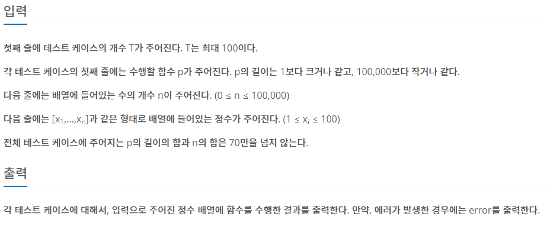

## [BAEKJOON 5430 AC](https://www.acmicpc.net/problem/5430)  (Python)

#### 입출력 / 제한

 


#### 풀이

이번 문제 역시 문제의 규칙을 그대로 따라가면 쉽게 풀 수 있는 문제였다.

문자로 되어있는 숫자 배열을 어떤 방법으로 가져올지, 해당 숫자 배열을 뒤집는 방법을 어떤 방식으로 진행할지만 정하면 해결되었다.


**규칙**

```markdown
# R : 배열 뒤집기
# D : 배열의 첫 번째 수 버리기
```


1. 배열 입력값의 양 끝 '[ ]' 대괄호를 지우고 ',' 단위로 잘라 숫자 배열로 저장

2. 입력 함수를 기준으로 계산

   ① 배열 시작 인덱스와 끝 인덱스 + 1 정의

   ```
   st, ed = 0, len(arr)
   ```

   ② R 함수의 경우 reverse 여부를 판단하는 변수를 True/Fasle로 변경

   ```python
   r = False
   
   if p[o] == 'R':
               r = not r
   ```

   ③ D 함수의 경우 r이 Fasle 이면 시작 인덱스 +1, True면 끝 인덱스 -1

   ```python
   elif p[o] == 'D':
       if not r:
       st += 1
       elif r:
       ed -= 1
       if st > ed:
       return 'error'
   ```

   ④ 시작 인덱스가 끝 인덱스보다 커지면 error


#### 최종 코드

```python
import sys
input = sys.stdin.readline


def AC():
    st, ed = 0, len(arr)
    r = False
    for o in range(len(p)):
        if p[o] == 'R':
            r = not r

        elif p[o] == 'D':
            if not r:
                st += 1
            elif r:
                ed -= 1
            if st > ed:
                return 'error'

    if not r:
        return arr[st:ed]
    else:
        res = []
        for i in range(ed - 1, st - 1, -1):
            res.append(arr[i])
        return res


for tc in range(int(input())):
    p = input().strip()
    n = int(input())
    arr = input().strip().lstrip('[').rstrip(']').split(',')
    if arr[0] != '':
        arr = list(map(int, arr))
    else:
        arr = []

    ans = AC()
    if ans != 'error':
        ans = '[' + ','.join(map(str, ans)) + ']'

    print(ans)
```


#### 느낀점

메모리를 많이 사용하였던데 다른 방법으로 시도해서 해결해봐야겠다.