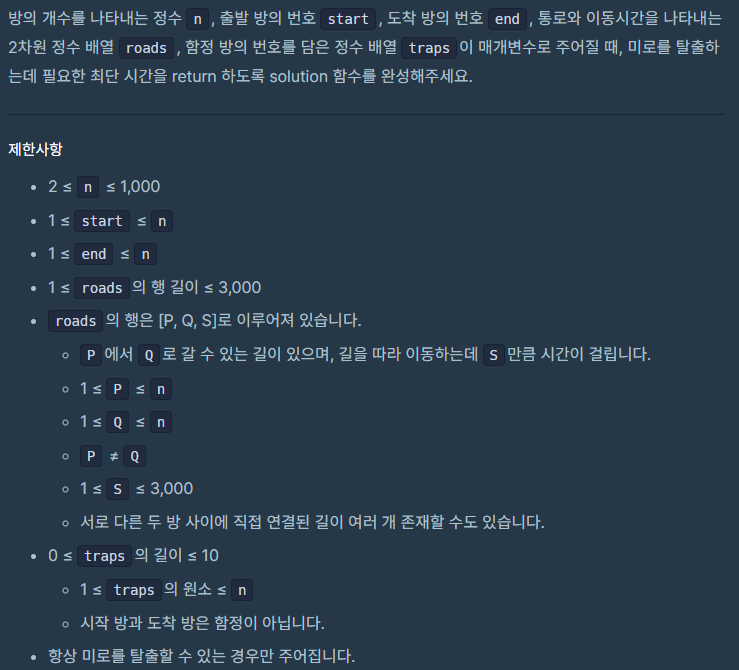

##  [Programmers 81304 미로 탈출](https://programmers.co.kr/learn/courses/30/lessons/81304) Lv4 (Python) - *[Fail 97.4%]*

#### 출력 / 제한

  


#### 풀이

최소힙과  bfs를 통해 문제를 해결하려고 접근하였으나 1나의 테스트 케이스에서 시간초고가 발생하였다.

추후에 다시 시도해봐야겠다.


1. 각 노드간 연결 관계를 adj 배열에 정의 (최소값만 저장)

2. 각 노드의 함정 여부를 isTrap 배열에 정의

3. 각 노드들을 bfs로 돌면서 목적지에 도착하면 정답 출력

   a. 함정 노드에 도착하면 해당 회차의 함정 노드 번호를 on/off (1, 0) 변환

   b. 각 노드에서 현재와 이동할 노드가 함정 노드인지 확인

   c. 함정 노드가 존재하면 해당 노드 번호가 1인지 확인

   d. 함정 노드가 1이면 adj를 역으로 탐색 (r, c → c, r)


#### 최종 코드

```python
import heapq
from copy import deepcopy

def solution(n, start, end, roads, traps):
    def move(now, nxt):
        if adj[now][nxt]:
            return adj[now][nxt]
        return 0

    def r_move(now, nxt):
        if adj[nxt][now]:
            return adj[nxt][now]
        return 0

    def bfs():
        heap = [(0, start, [0] * len(traps))]
        while heap:
            cnt, now, change = heapq.heappop(heap)
            if now == end:
                return cnt

            for i in linked[now]:
                if isTrap[now] >= 0 and isTrap[i] >= 0:
                    nn, ni = isTrap[now], isTrap[i]
                    if (change[nn], change[ni]) in [(1, 1), (0, 0)]:
                        res = move(now, i)
                    else:
                        res = r_move(now, i)

                elif isTrap[now] >= 0:
                    nn = isTrap[now]
                    if change[nn]:
                        res = r_move(now, i)
                    else:
                        res = move(now, i)

                elif isTrap[i] >= 0:
                    ni = isTrap[i]
                    if change[ni]:
                        res = r_move(now, i)
                    else:
                        res = move(now, i)

                else:
                    res = move(now, i)

                if res:
                    if isTrap[i] >= 0:
                        n_chg = deepcopy(change)
                        n_chg[isTrap[i]] = (n_chg[isTrap[i]] + 1) % 2
                        heapq.heappush(heap, (cnt + res, i, n_chg))
                    else:
                        heapq.heappush(heap, (cnt + res, i, deepcopy(change)))
        return

    adj = [[0] * (n + 1) for _ in range(n + 1)]
    linked = [set() for _ in range(n + 1)]
    for p, q, s in roads:
        linked[p].add(q)
        linked[q].add(p)
        if adj[p][q]:
            adj[p][q] = min(s, adj[p][q])
        else:
            adj[p][q] = s

    isTrap = [-1] * (n + 1)
    for t in range(len(traps)):
        isTrap[traps[t]] = t

    answer = bfs()
    return answer
```


#### 느낀점

딕셔너리를 활용해서 해결해보려고 했으나 최소힙으로 문제를 풀 경우 앞선 값들이 같은 경우 딕셔너리간 대소 관계를 파악할 수 없어 에러가 발생하였다.

코딩 체력이 부족하다는 것을 다시  한 번 느꼈다. 다른 문제들을 풀고 성장한 다음 다시 시도해봐야겠다.