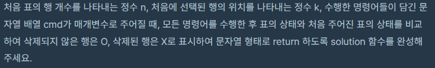
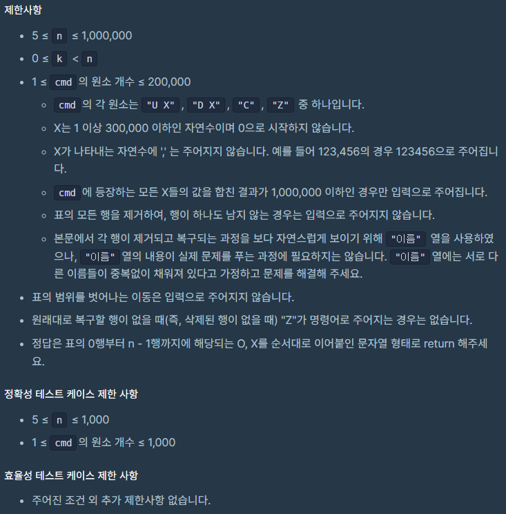

##  [Programmers 81303 표 편집](https://programmers.co.kr/learn/courses/30/lessons/81303) Lv3 (Python)

#### 출력 / 제한

  

 


#### 풀이

리스트를 이용하여 접근한 풀이한 결과 시간초과가 발생하여 딕셔너리 형태로 table을 정의하여 해결하였다.

1. 각 표의 항목 번호를 key로 전, 후 번호를 val로 가지는 table을 정의

2. 각 항목이 삭제되었는지 확인하는 ans 배열 정의

3. 삭제된 항목을 순서대로 저장할 delete 배열 정의

4. 커멘드에 따라 삭제, 되돌리기, 상·하 이동을 진행

   a. 삭제의 경우 삭제한 항목을 delete 리스트에 append

   b. 삭제 후 전, 후 번호들의 후, 전 번호 수정

   c. 되돌리기의 경우 delete 리스트에서 pop하여 복구


#### 최종 코드

```python
def solution(n, k, cmd):
    now = k
    table = {i: [i - 1, i + 1] for i in range(n)}
    table[0] = [None, 1]
    table[n-1] = [n - 2, None]
    ans = ['O'] * n
    delete = []
    for c in cmd:
        if c == 'C':
            ans[now] = 'X'
            delete.append(now)
            pre, nxt = table[now]
            if nxt == None:
                now = pre
            else:
                now = nxt

            if pre == None:
                table[nxt][0] = pre
            elif nxt == None:
                table[pre][1] = nxt
            else:
                table[pre][1] = nxt
                table[nxt][0] = pre

        elif c == 'Z':
            re = delete.pop()
            pre, nxt = table[re]
            ans[re] = 'O'
            if pre == None:
                table[nxt][0] = re
            elif nxt == None:
                table[pre][1] = re
            else:
                table[pre][1] = re
                table[nxt][0] = re

        else:
            c1, c2 = c.split(' ')
            c2 = int(c2)
            if c1 == 'D':
                to = 1
            else:
                to = 0
            for _ in range(c2):
                now = table[now][to]

    return ''.join(ans)
```


#### 느낀점

딕셔너리를 활용하는 부분이 아직 부족한 것 같다. 이를 활용하는 다양한 문제들을 풀어봐야 할 것 같다.