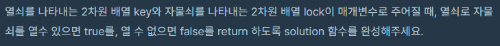
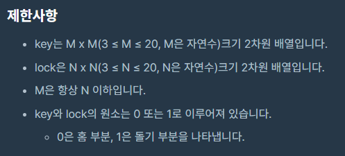

##  [Programmers 60059 열쇠와 자물쇠](https://programmers.co.kr/learn/courses/30/lessons/60059) Lv3 (Python)

#### 출력 / 제한

 

 


#### 풀이

열쇠와 자물쇠의 사이즈가 20*20이기 때문에 모든 경우의 수를 다 확인하는 방식으로 접근하였다.


1. 현재 모양의 열쇠를 가능한 모든 위치에서 자물쇠에 매칭시킨다.

   ```python
   def unlock(t1, t2, s1, s2):
       si = sj = s2 - 1
       reverse = False
       while si > -s1:
           table = deepcopy(t1)
           i = si
           for r in range(s1):
               if i < 0 or i >= s2:
                   i += 1
                   continue
               j = sj
               for c in range(s1):
                   if s2 > j >= 0:
                       table[r][c] += t2[i][j]
                   j += 1
               i += 1
   
           if check(table):
               return True
   
           sj -= 1
           if sj <= -s1:
               si -= 1
               sj = s2 - 1
       return False
   ```

2. 정답인 경우 True를 리턴한다.

3. 정답이 아닌 경우 열쇠를 90도 회전하고 1번부터 다시 시작한다.

   ```python
   def turn(k, s):
       new = [[0] * s for _ in range(s)]
       sc = s - 1
       for line in k:
           sr = 0
           for b in line:
               new[sr][sc] = b
               sr += 1
           sc -= 1
       return new
   ```

4. 4방향 모두 정답이 나오지 않으면 False를 반환한다.


#### 최종 코드

```python
from copy import deepcopy

def turn(k, m):
    new = [[0] * m for _ in range(m)]
    sc = m - 1
    for line in k:
        sr = 0
        for b in line:
            new[sr][sc] = b
            sr += 1
        sc -= 1
    return new

def check(res):
    for li in res:
        if (max(li), min(li)) != (1, 1):
            return False
    return True

def unlock(t1, t2, s1, s2):
    si = sj = s2 - 1
    reverse = False
    while si > -s1:
        table = deepcopy(t1)
        i = si
        for r in range(s1):
            if i < 0 or i >= s2:
                i += 1
                continue
            j = sj
            for c in range(s1):
                if s2 > j >= 0:
                    table[r][c] += t2[i][j]
                j += 1
            i += 1

        if check(table):
            return True

        sj -= 1
        if sj <= -s1:
            si -= 1
            sj = s2 - 1
    return False

def solution(key, lock):
    n = len(lock[0])
    m = len(key[0])
    for _ in range(4):
        if unlock(lock, key, n, m):
            return True
        key = deepcopy(turn(key, m))
    return False
```


#### 느낀점

처음에 생각을 잘못해서 고려하지 못하는 경우가 존재했다. 이런 부분을 주의해서 코드를 작성하도록 해야겠다.