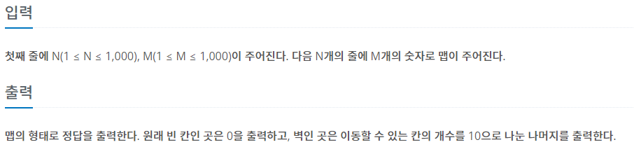

## [BAEKJOON 16946 벽 부수고 이동하기 4](https://www.acmicpc.net/problem/16946)  (Python)

#### 입출력 / 제한

  


#### 풀이

벽을 기준으로 주변 공간을 탐색하는 방법은 시간초과를 해결하지 못해서 공간을 기준으로 주변 벽에게 해당 공간의 개수만큼 더해주는 방식으로 해결하였다.


1. 같은 칸을 반복하지 않기 위한 visited 배열 정의

2. 정답을 저장할 ans 배열 정의

3. MAP을 돌면서 공간 탐색

   3-1. 벽인 경우 ans 배열의 해당 위치 + 1 (벽을 부수고 난 공간)

   3-2. 공간인 경우 bfs를 돌면서 공간의 개수 파악

   3-3. 공간 더미와 연결된 벽을 만나는 경우 wall 배열에 벽 위치 저장

   ```python
   while q:
           r, c = q.popleft()
           for i in range(4):
               nr, nc = r + dr[i], c + dc[i]
               if nr < 0 or nr >= N or nc < 0 or nc >= M:
                   continue
               if visited[nr][nc]:
                   continue
   
               visited[nr][nc] = 1
               if MAP[nr][nc]:
                   wall.append([nr, nc])
               else:
                   q.append([nr, nc])
                   res += 1
   ```

   3-4. 공간의 개수를 파악 후 wall에 저장된 벽의 ans배열에 + 공간의 개수

   3-5. 벽인 경우 다시 방문 가능해야 함으로 visited 배열의 해당 위치 0으로 초기화

   ```python
   for r, c in wall:
           ans[r][c] += res
           visited[r][c] = 0
   ```

4. ans 배열을 돌면서 0이 아닌 공간의 값을 10으로 나눈 나머지로 변환

   ```python
   for r in range(N):
       for c in range(M):
           if ans[r][c]:
               ans[r][c] %= 10
   ```

5. ans 배열의 항목들을 문자로 변환 후 출력


#### 최종 코드

```python
import sys
from collections import deque
input = sys.stdin.readline
dr = [-1, 1, 0, 0]
dc = [0, 0, -1, 1]


def check(i, j):
    q = deque([[i, j]])
    wall = []
    res = 1
    while q:
        r, c = q.popleft()
        for i in range(4):
            nr, nc = r + dr[i], c + dc[i]
            if nr < 0 or nr >= N or nc < 0 or nc >= M:
                continue
            if visited[nr][nc]:
                continue

            visited[nr][nc] = 1
            if MAP[nr][nc]:
                wall.append([nr, nc])
            else:
                q.append([nr, nc])
                res += 1

    for r, c in wall:
        ans[r][c] += res
        visited[r][c] = 0
    return


N, M = map(int, input().split())
MAP = [list(map(int, list(input().rstrip()))) for _ in range(N)]
visited = [[0] * M for _ in range(N)]
ans = [[0] * M for _ in range(N)]
for r in range(N):
    for c in range(M):
        if MAP[r][c] == 0 and visited[r][c] == 0:
            visited[r][c] = 1
            check(r, c)
        elif MAP[r][c]:
            ans[r][c] += 1

for r in range(N):
    for c in range(M):
        if ans[r][c]:
            ans[r][c] %= 10

for l in range(N):
    print(''.join(map(str, ans[l])))
```


#### 느낀점

시간복잡도를 고려해서 코드를 짜는 부분을 많이 연습해야할 것 같다. 쉽게 생각하고 단순 bfs로 접근했더니 다양한 시간초과를 경험할 수 있었다.

추가적으로 check 함수를 다 돌고나서 ans 배열을 돌면서 값이 있는 경우 1을 더하고나서 10으로 나눈 나머지로 변경하였더니 틀렸습니다가 나왔다.

이 부분은 아직도 왜 이런지 이해가 가지 않는데 확인이 필요할 것 같다.