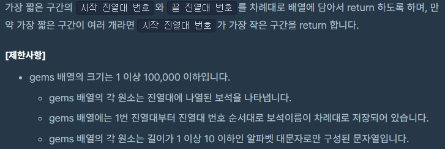

##  [Programmers 62758 보석 쇼핑](https://programmers.co.kr/learn/courses/30/lessons/62758) Lv3 (Python)

#### 출력 / 제한




#### 풀이

효율성을 높이는 과정이 매우 중요한 문제였다.
슬라이딩 윈도우를 활용하는 방법이 아직 미숙해서 힌트를 받아 해결하였다.

1. gems 배열을 set으로 변환하여 보석의 종류 개수를 파악

2. 모든 보석의 종류를 구매하였는지 확인하기 위해 defaultdict(기본값 0)를 정의

3. 보석 구매

   a. 첫 보석부터 모든 보석을 구매할 때 까지 보석 카운트
   ```python
   while len(gem_dict) < gnt and edn < total:
            gem_dict[gems[edn]] += 1
            edn += 1
   ```

   b. 구매한 보석의 숫자와 min_값을 비교하여 더 적은 경우에 ans에 저장
   ```python
   if len(gem_dict) == gnt and min_ > edn - stn:
            min_ = edn - stn
            ans = [stn + 1, edn]
   ```

   c. 첫 보석을 defaultdict에서 제거 후 다음 보석부터 마지막 보석까지 a, b 반복


#### 최종 코드

```python
from collections import defaultdict

def solution(gems):
    gem_list = set(gems)
    gnt = len(gem_list)
    total = len(gems)
    gem_dict = defaultdict(lambda: 0)

    min_ = 100000
    ans = [0, 0]
    edn = 0
    for stn, gem in enumerate(gems):
        while len(gem_dict) < gnt and edn < total:
            gem_dict[gems[edn]] += 1
            edn += 1

        if len(gem_dict) == gnt and min_ > edn - stn:
            min_ = edn - stn
            ans = [stn + 1, edn]

        gem_dict[gem] -= 1
        if gem_dict[gem] == 0:
            del(gem_dict[gem])
    return ans
```


#### 느낀점

defaultdict를 사용하면 일반적인 dict와 달리 사전 정의할 필요 없이 바로 사용 가능하여 활용 가능성이 높다는 것을 배운 문제였다.
보다 효율적인 코드를 짜기 위해서 다양한 방식을 학습하도록 노력해야겠다.
