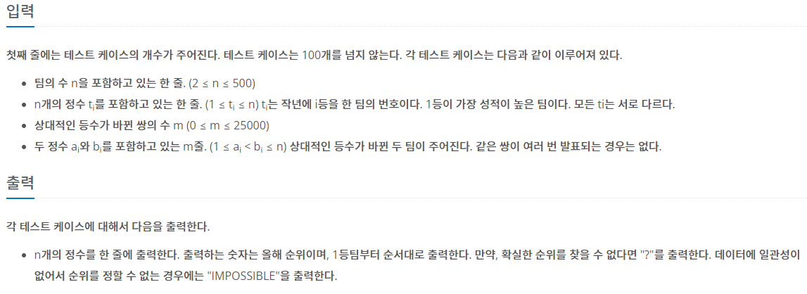

## [BAEKJOON 3665 최종 순위](https://www.acmicpc.net/problem/3665)  (Python)

#### 입출력 / 제한

 


#### 풀이

해당 문제는 각 팀의 앞 순위에 몇 팀이 존재하는지를 판단하여 해결하였다.

두 팀의 순위 변동을 반복하더라도 두 팀이 같은 등수가 되는 경우가 발생할 수 없음으로 ?는 판단하지 않았다.

1. 작년 순위를 기준으로 해당 팀의 앞 순위에 존재하는 팀을 defaultdict에 추가

2. 변동된 순위를 기반으로 앞에 존재했으면 제거, 뒤에 존재했으면 추가

3. rank배열을 순회하면서 각각의 defaultdict 길이를 기반으로 등수 지정

    a. 동일한 등수가 존재하는 경우 IMPOSSIBLE 출력

    b. 그외의 경우 등수 출력


#### 최종 코드

```python
from collections import defaultdict

for tc in range(int(input())):
    n = int(input())
    pre_rank = list(map(int, input().split()))
    rank = [defaultdict(lambda: 0) for _ in range(n + 1)]
    for i in range(n):
        for j in range(n):
            if i > j:
                rank[pre_rank[i]][pre_rank[j]] = 1

    m = int(input())
    for _ in range(m):
        a, b = map(int, input().split())
        if rank[a][b]:
            del(rank[a][b])
        else:
            rank[a][b] = 1

        if rank[b][a]:
            del(rank[b][a])
        else:
            rank[b][a] = 1

    ans = [0] * n
    for team in range(1, n + 1):
        if ans[len(rank[team])]:
            print("IMPOSSIBLE")
            break
        ans[len(rank[team])] = team
    else:
        print(' '.join(map(str, ans)))

```


#### 느낀점

풀면서도 이게 맞는건가? 라는 생각이 들었던 문제였다.

첫 풀이 과정에서는 각 팀의 앞, 뒤의 모든 팀들을 저장하고 판단하였는데 이 경우 메모리를 과도하게 잡아먹는 문제가 있었다.

이를 좀 더 효율적으로 활용하기 위해서 앞에 존재하는 팀만 확인하고 뒤로 이동하면 해당 팀을 삭제하는 방식을 활용하여 메모리를 줄일 수 있었다.

스터디원이 풀이한 그래프를 활용한 풀이법역시 비슷한 개념이지만 보다 효율적이었는데 해당 방법으로 다시 풀어봐야 할 것 같다.
