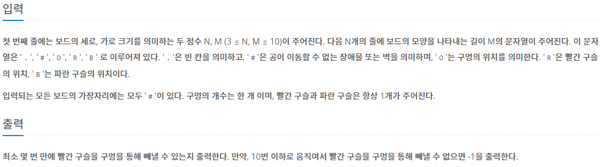

## [BAEKJOON 13460 구슬 탈출 2](https://www.acmicpc.net/problem/13460)   (Python)

#### 입출력 / 제한



#### 풀이

이전에 기울였던 방향을 제외한 3가지 방향으로 기울여서 모든 경우의 수를 확인하여 해결하였다.

만약 게임이 종료되는 경우 해당 케이스를 종료하여 불필요한 계산을 줄이는 방식을 적용하였다.

1. 빨간 공과 파란 공의 위치 저장

2. 상, 하, 좌, 우로 기울이면서 각 판마다 공의 위치를 저장하여 이전 단계로 돌아갈 경우 공 위치 초기화

3. 10판을 진행하면서 성공할 경우의 최소 판 저장

#### 최종 코드

```python
import sys
from copy import deepcopy
input = sys.stdin.readline
dr = [-1, 1, 0, 0]
dc = [0, 0, -1, 1]


def move(di, e, ball, br, bc):
    m = 0
    if MAP[br][bc] == 'O':
        return 0

    mr, mc = br, bc
    while True:
        nr, nc = mr + dr[di], mc + dc[di]
        if MAP[nr][nc] == '.' and [nr, nc] != e:
            mr, mc = nr, nc
            m += 1
            continue
        elif MAP[nr][nc] == 'O':
            ball[0] = nr
            ball[1] = nc
            return -1
        else:
            break

    ball[0] = mr
    ball[1] = mc
    return m


def play(pre, cnt):
    if cnt == 10:
        return

    pr[cnt] = deepcopy(red)
    pb[cnt] = deepcopy(blue)
    for d in range(4):
        red[0], red[1] = pr[cnt][0], pr[cnt][1]
        blue[0], blue[1] = pb[cnt][0], pb[cnt][1]
        if cnt and d == pre:
            continue

        stop = 0
        while True:
            res_r = move(d, blue, red, red[0], red[1])
            res_b = move(d, red, blue, blue[0], blue[1])
            res_r += move(d, blue, red, red[0], red[1])

            if res_r == 0 and res_b == 0:
                break

            elif res_r == -1 and res_b != -1:
                global ans
                ans = min(cnt + 1, ans)
                stop = 1
                break

            elif res_b == -1:
                stop = 1
                break

        if stop:
            continue
        play(d, cnt + 1)
    return


N, M = map(int, input().split())
MAP = [list(input()) for _ in range(N)]

red = []
blue = []
for r in range(N):
    for c in range(M):
        if MAP[r][c] == 'R':
            MAP[r][c] = '.'
            red = [r, c]
        elif MAP[r][c] == 'B':
            MAP[r][c] = '.'
            blue = [r, c]

pr = [[] for _ in range(10)]
pb = [[] for _ in range(10)]
ans = 11
play(-1, 0)
if ans == 11:
    print(-1)
else:
    print(ans)
```

#### 느낀점

바로 문제를 해결하긴 했지만 생각해보니 저장된 ans (최소 판 수)를 넘어가면 계산을 멈추도록 설정해 줬다면 보다 효율적으로 돌아가는 코드가 되었을텐데 그 부분을 생각하지 못했다. 앞으로는 조금 더 고민해서 풀어보도록 해야겠다.
