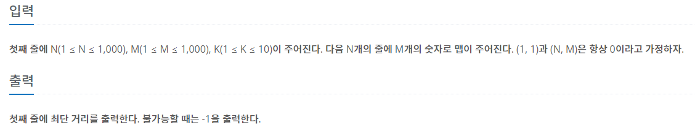

## [BAEKJOON 14442 벽 부수고 이동하기 2](https://www.acmicpc.net/problem/14442)  (Python)

#### 입출력 / 제한



#### 풀이

시간 복잡도를 해결할 방법을 찾는데 시간이 걸렸던 문제였다.

벽을 부술 수 있는 횟수에 따라서 방문처리를 하여 문제를 해결하였다.

1. K+1개의 방문 배열 정의
   
   ```python
   visited = [[[0] * M for _ in range(N)] for _ in range(K+1)]
   ```

2. BFS를 돌면서 최단거리 계산
   
   a. K가 0이 아닌 경우 부수거나 부수지 않는 2가지 루트
   
      a-1. 부수지 않는 경우 >> k번째 방문배열 확인
   
      a-2. 부수는 경우 >> k-1번째 방문 배열 확인
   
   b. K가 0인 경우 부수지 않는 1가지 루트
   
   

#### 최종 코드

```python
import sys
from collections import deque
input = sys.stdin.readline
dr = [-1, 1, 0, 0]
dc = [0, 0, -1, 1]


def move():
    q = deque([(0, 0, 1, K)])
    while q:
        i, j, c, k = q.popleft()
        if (i, j) == (N-1, M-1):
            return c
        for d in range(4):
            nr, nc = i + dr[d], j + dc[d]
            if nr < 0 or nr >= N or nc < 0 or nc >= M:
                continue
            if not visited[k][nr][nc]:
                if MAP[nr][nc] == '0':
                    visited[k][nr][nc] = 1
                    q.append((nr, nc, c + 1, k))

            if not visited[k-1][nr][nc]:
                if MAP[nr][nc] == '1' and k > 0:
                    visited[k-1][nr][nc] = 1
                    q.append((nr, nc, c + 1, k - 1))
    return -1


N, M, K = map(int, input().split())
MAP = [input().strip() for _ in range(N)]

visited = [[[0] * M for _ in range(N)] for _ in range(K+1)]
visited[0][0][0] = 1

print(move())
```

#### 느낀점

가지치기를 통한 중복 계산 방지를 다양한 방식으로 활용하여 효율적으로 문제를 풀 수 있도록 노력해야겠다고 느꼈다. 발상의 전환이 필요하다고 생각한다.
