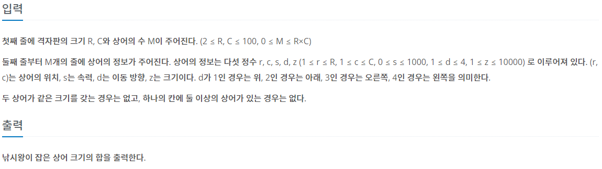

## [BAEKJOON 17143 낚시왕](https://www.acmicpc.net/problem/13460)  (Python)

#### 입출력 / 제한



#### 풀이

상어가 이동하고 난 뒤의 위치를 최대한 적은 횟수로 계산하기 위해서 많이 고민했던 문제다.

1. 0 ~ C까지 낚시꾼이 이동하면서 상어를 낚시 (ans += 상어 사이즈)

2. 상어 이동
   
   a. 상어의 현재 이동방향으로 이동할 수 있는 최대치로 이동
   
   b. 남아있는 이동횟수를 현재 위치로 돌아올 수 있는 숫자(C * 2 - 2)로 나눈 나머지 계산
   
   c. 나머지가 C - 1보다 크면 방향을 유지한 상태로 현재 위치의 반대쪽 끝에서 나머지 만큼 이동한 위치가 최종 위치
   
   d. 나머지가 C - 1보다 작으면 방향을 변경하고 현재 위치에서 나머지 만큼 이동한 위치가 최종 위치

#### 최종 코드

```python
import sys
from collections import defaultdict
input = sys.stdin.readline


def shark_move():
    for sh in range(M):
        if not sharks[sh]["l"]:
            continue
        m = sharks[sh]["s"]
        nd = sharks[sh]["d"]
        if nd in (1, 2):
            nr = sharks[sh]["r"]
            if nd == 1:
                if m < nr:
                    sharks[sh]["r"] = nr - m
                else:
                    m -= nr
                    m %= (R * 2) - 2
                    if m > R - 1:
                        m -= (R - 1)
                        sharks[sh]["r"] = R - 1 - m
                    else:
                        sharks[sh]["r"] = m
                        sharks[sh]["d"] = 2
            else:
                if m < (R - 1) - nr:
                    sharks[sh]["r"] = nr + m
                else:
                    m -= ((R - 1) - nr)
                    m %= (R * 2) - 2
                    if m > R - 1:
                        m -= (R - 1)
                        sharks[sh]["r"] = m
                    else:
                        sharks[sh]["r"] = R - 1 - m
                        sharks[sh]["d"] = 1
        else:
            nc = sharks[sh]["c"]
            if nd == 3:
                if m < (C - 1) - nc:
                    sharks[sh]["c"] = nc + m
                else:
                    m -= ((C - 1) - nc)
                    m %= (C * 2) - 2
                    if m > C - 1:
                        m -= (C - 1)
                        sharks[sh]["c"] = m
                    else:
                        sharks[sh]["c"] = C - 1 - m
                        sharks[sh]["d"] = 4
            else:
                if m < nc:
                    sharks[sh]["c"] = nc - m
                else:
                    m -= nc
                    m %= (C * 2) - 2
                    if m > C - 1:
                        m -= (C - 1)
                        sharks[sh]["c"] = C - 1 - m
                    else:
                        sharks[sh]["c"] = m
                        sharks[sh]["d"] = 3

        cc, cr = sharks[sh]["r"], sharks[sh]["c"]
        if MAP[cc][cr] >= 0:
            if sharks[MAP[cc][cr]]["z"] < sharks[sh]["z"]:
                sharks[MAP[cc][cr]]["l"] = 0
                MAP[cc][cr] = sh
            else:
                sharks[sh]["l"] = 0
        else:
            MAP[cc][cr] = sh
    return


def fishing():
    for x in range(R):
        if MAP[x][f] >= 0:
            sharks[MAP[x][f]]["l"] = 0
            return sharks[MAP[x][f]]["z"]
    return 0


R, C, M = map(int, input().split())
sharks = [defaultdict() for _ in range(M)]
MAP = [[-1] * C for _ in range(R)]
for i in range(M):
    r, c, s, d, z = map(int, input().split())
    MAP[r-1][c-1] = i
    sharks[i]["l"] = 1
    sharks[i]["d"] = d
    sharks[i]["r"] = r - 1
    sharks[i]["c"] = c - 1
    sharks[i]["s"] = s
    sharks[i]["z"] = z

ans = 0
for f in range(C):
    ans += fishing()
    MAP = [[-1] * C for _ in range(R)]
    shark_move()

print(ans)
```

#### 느낀점

생각했던 것과 같이 시간은 잘 나왔지만 비효율적으로 길고 메모리도 생각보다 많이 사용했다. 다른 풀이들을 참고해서 한 번 더 풀어볼 필요가 있을 것 같다.
