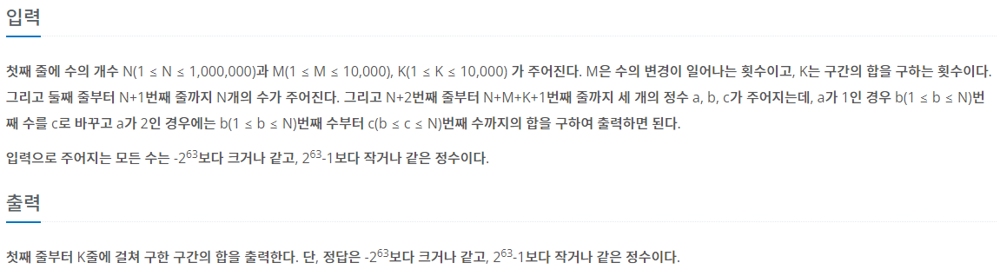

## [BAEKJOON 2042 구간 합 구하기](https://www.acmicpc.net/problem/13460)  (Python)

#### 입출력 / 제한



#### 풀이

세그먼트 트리를 알기 전에 문제를 풀이하여 누적합을 활용하는 방법으로 해결을 하였다.

1. 숫자 배열 nums 정의

2. 누적합 배열 part 정의

3. 입력 받은 값에 따라 변경 or 구간합 계산
   
   1. a가 1인 경우
      
      i. 변경한 적이 없는 경우 defaultdict(lambda: [])를 활용하여 0번 인덱스에 원본 저장 후 1번 인덱스에 원본과의 차이 저장
      
      ii. 변경한 적이 있는 경우 1번 인덱스에 원본과의 차이 수정
   
   2. a가 2인 경우
      
      i. 구간의 마지막 번호 ed까지의 구간합 - 시작 번호 직전 st-1까지의 구간합 계산
      
      ii. 변경된 숫자 중 st와 ed 사이에 존재하는 값이 있으면 위에서 계산한 결과에 defaultdict 인덱스 1번에 저장된 차이값 계산
   
   

#### 최종 코드

```python
import sys
from collections import defaultdict
input = sys.stdin.readline


def cal(st, ed):
    res = part[ed] - part[st-1]
    if not change:
        return res
    else:
        for num in change:
            if st <= num <= ed:
                res += change[num][1]
    return res


def chg(st, ed):
    if ed >= 0:
        res = ed - st
    else:
        res = -(st - ed)
    return res


N, M, K = map(int, input().split())
nums = [0] * (N + 1)
part = [0] * (N + 1)
for i in range(1, N + 1):
    n = int(input())
    nums[i] = n
    part[i] = part[i-1] + n

change = defaultdict(lambda: [])
for j in range(M + K):
    a, b, c = map(int, input().split())
    if a == 1:
        if change[b]:
            change[b][1] = chg(change[b][0], c)
        else:
            change[b] = [nums[b], 0]
            change[b][1] = chg(change[b][0], c)
    else:
        print(cal(b, c))


```

#### 느낀점

위 방식의 경우 단순 최악이라고 생각하게되면 1억번의 계산이 필요할 수 있다고 생각한다. 물론 그런 경우는 잘 없겠지만...

이번 문제를 통해서 해결했다고 그냥 넘어가는것이 아니라 해당 문제에 맞는 적절한 알고리즘을 추가적으로 학습해야겠다는 것을 또 느끼게 되었다. 세그먼트 트리를 적용하여 재풀이해야겠다.
