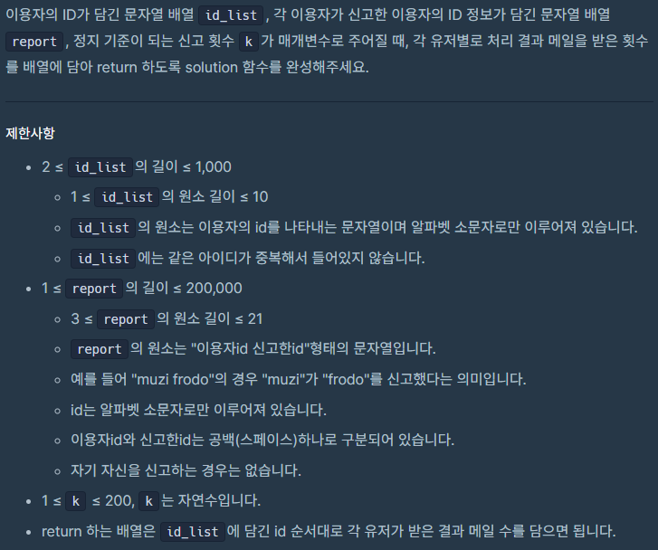

## [Programmers 92334 신고 결과 받기](https://programmers.co.kr/learn/courses/30/lessons/92334) Lv1 (Python)

#### 출력 / 제한




#### 풀이

1. defaultdict를 활용하여 신고자를 누적
   
   ```python
   reported = defaultdict(lambda: set())
   ```
   
   

2. 모든 신고 종합 후 k명 이상이 신고를 한 유저를 신고한 모든 유저 +1
   
   ```python
   if len(reported[red]) >= k:
     res = list(reported[red])
       for r in res:
         answer[users[r]] += 1
   ```
   
   

#### 최종 코드

```python
from collections import defaultdict

def solution(id_list, report, k):
    users = dict(zip(id_list, range(len(id_list))))
    answer = [0] * len(id_list)
    reported = defaultdict(lambda: set())

    for rep in report:
        r, red = rep.split()
        reported[red].add(r)

    for red in reported:
        if len(reported[red]) >= k:
            res = list(reported[red])
            for r in res:
                answer[users[r]] += 1
    return answer
```

#### 느낀점

Lv1문제라 확실히 쉽게 풀 수 있었던 문제였다.
