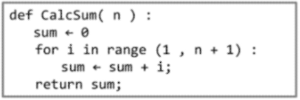
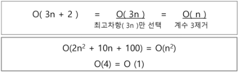
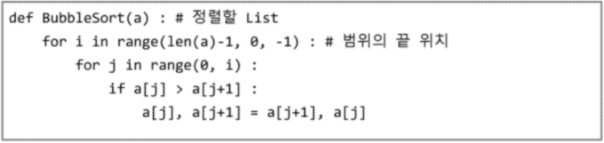
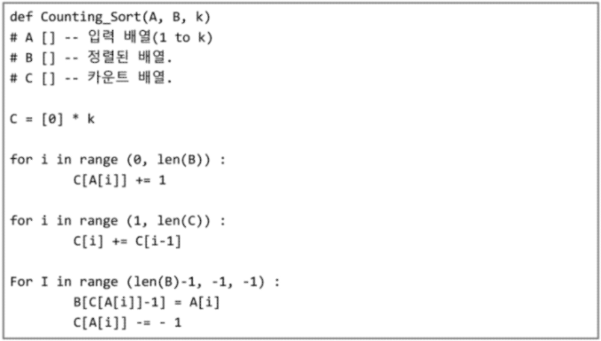

# APS 기본

## 1. 알고리즘

- **정의**

  - 유한한 단계를 통해 문제를 해결하기 위한 절차나 방법

    ```markdown
    좋은 코딩이란?
    	i) 정확성 : 얼마나 정확하게 동작하는가
    	ii) 작업량 : 얼마나 적은 연산으로 결과를 도출하는가
    	iii) 메모리 사용량 : 얼마나 적은 메모리를 사용하는가
    	iv) 단순성 : 얼마나 단순한가
    	v) 최적성 : 더 이상 개선할 여지없이 최적화 되었는가
    ```

- **슈도코드 (paseudocode / 의사코드)**

  - 알고리즘을 표현하는 방법 중 하나로, 일반적으로는 자연어를 이용해 만든 문장을 프로그래밍 언어와 유사한 형식으로 배치한 코드

    

- **시간 복잡도 (Time Complexity)**

  - **빅-오 표기법 (Big-Oh Notation)**

    - 시간 복잡도 함수 중 가장 큰 영향력을 주는 n에 대한 항만 표시

    - 계수(Coefficient)는 생략하여 표시

      

## 2. 배열

- **정의**

  - 일정한 자료형의 변수들을 하나의 이름으로 열거하여 사용하는 자료구조 (Python List)
  - 배열 사용 시 하나의 선언을 통해 둘 이상의 변수 선언 가능 / 다양한 작업에서 쉽게 활용 가능

- **1차원 배열 선언 / 접근**

  - 선언
    - arr = list() / arr = []
  - 접근
    - arr[idx]
  - 입/출력 예시
    - arr = input()
    - arr = int(input())
    - arr = list(input())
    - arr = input().split()
    - arr = list(map(int, input()))
    - arr = list(map(int, input().split()))

- **예제**

  - **Gravity**

    ```python
    def gravity():
        row = int(input())
        boxes = list(map(int, input().split()))
    
        max_gravity = 0
        for i in range(row):
            x = 0
            for j in range(i, row):
                if boxes[i] <= boxes[j]:
                    x += 1
            gravity = row - i - x
            if gravity > max_gravity:
                max_gravity = gravity
    
        return max_gravity
    ```

### 3-1. 정렬

- 2개 이상의 자료를 특정 기준에 의해 오름, 내림차순으로 재배열 하는 것
- **종류**
  - **버블 정렬 (Bubble Sort)**
  - **카운팅 정렬 (Counting Sort)**
  - **선택 정렬 (Selection Sort)**
  - 퀵 정렬 (Quick Sort)
  - 삽입 정렬 (Insertion Sort)
  - 병합 정렬 (Merge Sort)

## 3. 버블 정렬 (Bubble Sort)

- **인접한 두 원소를 비교하여 자리를 교환하는 방식**

- **시간 복잡도 = O(n²)**

- **과정**

  1. 첫 번째 원소부터 인접한 원소끼리 계속 자리를 교환하여 맨 마지막 자리까지 이동
  2. 한 단계가 끝나면 가장 큰 원소가 마지막 자리로 정렬 / 단계 반복

  

## 4. 카운팅 정렬 (Counting Sort)

- **집합에 각 항목이 몇 개씩 있는지 확인하는 작업을 통해 선형 시간에 정렬하는 방법**

- **제한사항**

  - 정수 / 정수로 표현 가능한 자료에 대해서만 적용 가능
  - 집합 내 가장 큰 정수를 알아야 함

- **시간복잡도 = O(n + k)**

- **과정**

  1. Data에서 각 항복의 발생 회수를 세고, 정수 항목들로 직접 인덱스 되는 카운트 배열에 저장

  2. Counts의 원소 조정 (누적 합) / 각 항목 앞에 위치할 항목의 개수 반영

  3. Data를 역순으로 조회하며 정렬 배열에 해당 값의 정렬 인덱스 위치에 저장

     

## 5. 완전 검색 (Exaustive Search)

- 문제의 해법으로 생각할 수 있는 모든 경우의 수를 나열하고 확인하는 기법
- (== Brute-force / generate-and-test)
- **경우의 수가 상대적으로 적을 때 유용**

## 6. 그리디 (Greedy Algorithm)

- 탐욕 알고리즘 / 최적해를 구하는 데 사용되는 근시안적인 방법
- 순간마다 최적이라고 생각되는 것을 선택하여 최종적인 해답에 도달하는 방법
- **매 결정은 지역적으로는 최적이지만 최종적인 해답이 최적이라는 보장은 없음**
- 예시 - **거스름돈 (500-100-50-10 / 500-400-50-10)**

- **과정**
  1. **해 선택** : 현재 상태에서 최적 해 계산 / 부분해 집합에 추가
  2. **실행 가능성 검사** : 새로운 부분해 집합의 실행 가능여부 확인
  3. **해 검사** : 새로운 부분해 집합이 문제의 해가 되는지 확인 / 미완료시 1번부터 재시작


### Baby-gin

```python
def baby_gin():
    cards = list(map(int, input().strip()))
    cnt = [0] * 10

    for card in cards:
        cnt[card] += 1

    b_ru = b_tri = idx = 0
    while idx < 10:
        if cnt[idx] >= 3:
            b_tri += 1
            cnt[idx] -= 3
            continue
        if idx > 7:
            pass
        elif cnt[idx] >= 1 and cnt[idx+1] >= 1 and cnt[idx+2] >= 1:
            b_ru += 1
            cnt[idx] -= 1
            cnt[idx+1] -= 1
            cnt[idx+2] -= 1
            continue
        idx += 1

    if b_ru + b_tri == 2:
        return 'Baby Gin'
    else:
        return 'Lose'
```

