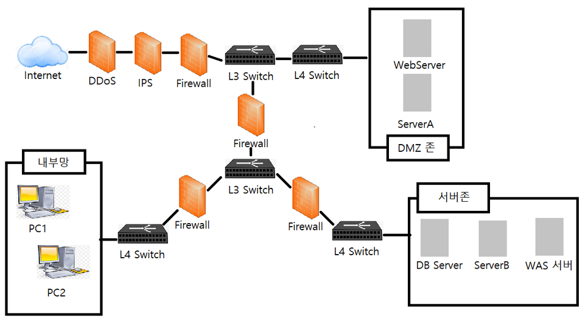
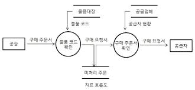

# I. 소프트웨어 설계

>**Chapter 01 - 요구사항 확인**
>
>**Chapter 02 - 화면 설계**
>
>**Chapter 03 - 애플리케이션 설계**
>
>**Chapter 04 - 인터페이스 설계**

---

### Chapter 01 - 요구사항 확인

#### 1. 현행 시스템 분석

- **플랫폼(Platform) 기능 분석**

  1. **개념**

     - 애플리케이션을 구동시키는 데 필요한 소프트웨어 환경

     - 동일 플랫폼 내에서 상호 호환이 가능하도록 만들어진 결합체

     - 공급자와 수요자 등 복수 그룹이 참여하여 각 그룹이 얻고자 하는 가치를 공정한 거래를 통해 교환할 수 있도록 구축된 환경

  2. **유형**

     - **싱슬 사이드 / 투 사이드 / 멀티 사이드 플랫폼**

     |                      유형                      | 설명                                             | 사례                          |
     | :--------------------------------------------: | :----------------------------------------------- | :---------------------------- |
     | 싱글 사이드 플랫폼<br />(Single-Side Platform) | 제휴 관계를 통해 소비자와 공급자를 연결하는 형태 | 아이튠즈<br />안드로이드 마켓 |
     |   투 사이드 플랫폼<br />(Two-Side Platform)    | 두 그룹을 중개하고 모두에게 개방하는 형태        | 소개팅 앱                     |
     | 멀티 사이드 플랫폼<br />(Mulit-Side Platform)  | 다양한 이해관계 그룹을 연결하여 중개하는 형태    | 페이스북<br />인스타그램      |

  3. **기능**

     - 소프트웨어 개발과 운영비용 감소 및 생선성 향상

     - 동일 플랫폼 커뮤니티 형성 및 **네트워크 효과* 유발

       ```markdown
       # 네트워크 효과
       - 상품에 대한 수요가 형성되면 이것이 다른 사람들의 상품 선택에 큰 영향을 미치는 현상
       ```

  4. **플랫폼 기능 분석 절차**

     - **현행 플랫폼 자료 수집 >> 수집 자료 분석 >> 결과 산출물 작성**

     | 순서 |         절차          | 설명                                                        |
     | :--: | :-------------------: | ----------------------------------------------------------- |
     |  1   | 현행 플랫폼 자료 수집 | 지료 수집/ 파악<br />인터뷰 결과서, 현행 플랫폼 구성도 도출 |
     |  2   |    수집 자료 분석     | 자료에 산발적으로 존재하는 정보 취합/정제 작업              |
     |  3   |   결과 산출물 작성    | 플랫폼 기능분석도 작성                                      |

  

- **플랫폼 성능 특성 분석**

  1. **성능 특성 분석 이유**

     - 사용자의 서비스 이용 시 속도의 적정성 확인
     - 성능에 대한 개선요청 항목은 시스템 플랫폼 성능이 느린 것으로 제기될 가능성이 높음

  2. **플랫폼 성능 특성 분석 기법**

     - **사용자 인터뷰 / 성능 테스트 / 산출물 검색**

     |     기법      | 설명                                           | 산출물                     |
     | :-----------: | :--------------------------------------------- | :------------------------- |
     | 사용자 인터뷰 | 플랫폼 사용자 인터뷰를 통해 속도의 적정성 확인 | 인터뷰 결과서              |
     |  성능 테스트  | 플랫폼을 대상으로 성능, 부하 테스트 수행       | 성능/부하 테스트 결과서    |
     |  산출물 점검  | 유사한 타사 제품의 성능 자료 등 분석           | **벤치마킹 테스트*  결과서 |

     ```markdown
     # 벤치마킹 테스트(BMT: Bench Marking Test)
     - 도입하려는 제품군의 대상 Vendor를 선정하여 해당 제품군의 성능을 비교하는 테스트
     ```

  3. **플랫폼 성능 특성 측정 항목**

     - **경과시간 / 사용률 / 응답시간 / 가용성**

     |            측정항목             | 설명                                                        |
     | :-----------------------------: | :---------------------------------------------------------- |
     | 경과시간<br />(Turnaround Time) | 작업을 의뢰(요구)한 시간부터 처리가 완료될 때까지 걸린 시간 |
     |    사용률<br />(Utilization)    | 의뢰한 작업을 처리하는 동안 CPU, 메모리 등의 자원 사용률    |
     |  응답시간<br />(Response Time)  | 요청을 전달한 시간부터 응답이 도착할 때까지 걸린 시간       |
     |   가용성<br />(Availability)    | 일정 시간 내에 애플리케이션이 처리하는 일의 양              |

  

- **운영체제(Operating System) 분석**

  1. **개념**

     - 하드웨어 및 소프트웨어 자원을 효율적으로 관리하며 공통된 기능을 제공하는 소프트웨어
     - 사용자가 컴퓨터를 더 쉽게 사용하기 위해 지원하는 소프트웨어

  2. **운영체제 현행 시스템 분석**

     - **신뢰도 / 성능 / 기술 지원 / 주변 기기 / 구축 비용**

     |   관점    | 고려사항  | 설명                                                         |
     | :-------: | --------- | ------------------------------------------------------------ |
     | 품질 측면 | 신뢰도    | - 장기간 시스템 운영 시 운영체제의 장애 발생 가능성<br />- 운영체제의 버그로 인한 재기동 여부 |
     |           | 성능      | - 대규모 및 대량 파일 작업(**배치작업*) 처리<br />- 지원 가능한 메모리 크기(32bit, 64bit) |
     | 지원측면  | 기술 지원 | - 공급사들의 안정적인 기술 지원<br />- 오픈 소스 여부        |
     |           | 주변 기기 | - 설치 가능한 하드웨어<br />- 다수의 주변 기기 지원 여부     |
     |           | 구축 비용 | - 지원 가능한 하드웨어 비용<br />- 설치할 응용 프로그램의 라이선스 정책 및 비용<br />- 유지 및 관리 비용 |

     ```markdown
     # 배치 작업(Batch Job)
     - 실시간 작업의 반대 개념
     - 일련의 작업들을 하나의 작업 단위로 묶어서 일괄로 처리하는 작업
     ```

  3. **종류 및 특징**

     |  구분  | 종류                | 저작자         | 특징                                                         |
     | :----: | ------------------- | -------------- | ------------------------------------------------------------ |
     | 컴퓨터 | 윈도우(Windows)     | Microsoft      | 중/소규모 서버, 일반 PC 등 유지/관리 비용 장점               |
     |        | 유닉스(UNIX)        | IBM, HP, SUN   | 대용량 처리, 안정성 높은 엔터프라이즈 급 서버                |
     |        | 리눅스(Linux)       | Linus Torvalds | 중/대규모 서버, 높은 보안성<br />하드웨어 및 소프트웨어 소유 비용이 가장 적음 |
     | 모바일 | 안드로이드(Android) | Google         | 스마트폰, 태블릿 PC, 다양한 기기의 호환성                    |
     |        | iOS                 | Apple          | 스마트폰, 태블릿 PC, 높은 보안성과 고성능                    |

  

- **네트워크(Network) 분석**

  1. **개념**

     - 컴퓨터 장치들이 노드 간 연결(데이터 링크)을 사용하여 서로에게 데이터를 교환하는 기술
     - 데이터 링크들은 광케이블과 같은 유선 매체 또는 와이파이(Wi-Fi)와 같은 무선 매체를 통해 성립

  2. **네트워크 현행 시스템 분석**

     - **네트워크 구성도**를 통해 네트워크 구조 분석
     - 구성도 작성을 통해 서버 위치, 서버 간 연결 방식 파악 가능
     - **백본망, 라우터, 스위치, 게이트웨이, 방화벽** 등을 대상으로 분석
     - 물리적인 위치 관계 파악, 조직 내 보안 취약성 분석 및 대응이 쉬움
     - 네트워크 장애 발생 추적/대응 등의 다양한 용도로 활용

     ```markdown
     # 백본망(Bakebone Network)
     - 다양한 네트워크를 상호 연결하는 컴퓨터 네트워크의 일부
     - 각기 다른 LAN이나 부분망 간에 정보를 교환하기 위한 경로를 제공하는 망
     
     # 라우터(Router)
     - 3계층 데이터 패킷을 발신지에서 목적지까지 전달하기 위해 최적의 경로를 지정하고, 이 경로를 따라 데이터 패킷을 다음 장치로 전달하는 네트워크 장비
     
     # 스위치(Switch)
     - 2계층 장비로 동일 네트워크 내에서 출발지에 들어온 데이터프레임을 목적지 MAC 주소 기반으로 빠르게 전달하는 네트워크 장비
     
     # 게이트웨이(Gateway)
     - 네트워크에서 서로 다른 통신망, 프로토콜을 사용하는 네트워크 간의 통신을 가능하게 하는 네트워크 장비
     
     # 방화벽(Firewall)
     - 외부로부터 불법 침입과 내부 불법 정보 유출을 방지하고, 내/외부 네트워크의 상호 간 영향을 차단하기 위한 보안 시스템.
     ```

      

     *네트워크 구성도 예시

  

- **DBMS(Database Management System) 분석**

  1. **개념**

     - 데이터베이스(DB)라는 데이터의 집합을 만들고, 저장 및 관리할 수 있는 기능들을 제공하는 응용 프로그램

  2. **기능**

     - **중복 제어 / 접근 통제 / 인터페이스 / 관계 표현 / 샤딩·파티셔닝 / 무결성 제약조건 / 백업 및 회복**

     |      기능       | 설명                                                    |
     | :-------------: | ------------------------------------------------------- |
     |    중복 제어    | 동일한 데이터가 여러 위치에 중복으로 저장되는 현상 방지 |
     |    접근 통제    | 권한에 따라 데이터에 대한 접근 제어                     |
     | 인터페이스 제공 | 사용자에게 SQL 및 **CLI, GUI** 등 다양한 인터페이스     |
     |    관계 표현    | 서로 다른 데이터 간의 다양한 관계를 표현                |
     |  샤딩/파티셔닝  | 구조 최적화를 위해 작은 단위로 나누는 기능              |
     | 무결성 제약조건 | 무결성에 관한 제약조건을 정의/검사                      |
     |  백업 및 회복   | 데이터베이스 장애 발생 시 데이터의 보존                 |

     ```markdown
     # CLI(Command Line Interface)
     - 명령어를 텍스트로 입력하여 조작하는 사용자 인터페이스
     
     # GUI(Graphical User INterface)
     - 스래픽 환경을 기반으로 한 마우스나 전자펜을 이용하는 사용자 인터페이스
     ```

  3. **데이터베이스 현행 시스템 분석**

     - **가용성 / 성능 / 상호 호환성 / 기술 지원 / 구축 비용**

     |   관점    |  고려사항   | 설명                                                         |
     | :-------: | :---------: | ------------------------------------------------------------ |
     | 성능 측면 |   가용성    | - 장기간 시스템 운영 시 장애 발생 가능성<br />- 백업 및 복구의 편의성<br />- DBMS 이중화 및 복제 지원 |
     |           |    성능     | - 대규모 데이터 처리 성능<br />- 대량 거래 처리 성능<br />- 다양한 튜닝 옵션 지원 여부<br />- 비용 기반 최적화 지원 및 설정 최소화 |
     |           | 상호 호환성 | - 설치 가능한 운영체제 종류<br />- 다양한 운영체제에서 지원되는 *JDBC, ODBC |
     | 지원 측면 |  기술 지원  | - 안정적인 기술 지원<br />- 다수의 사용자 간의 정보 공유<br />- 오픈소스 여부 |
     |           |  구축 비용  | - 라이선스 정책 및 비용<br />- 유지 및 관리 비용             |

     ```markdown
     # JDBC(Java Database Connectivity)
     - 자바에서 데이터베이스를 사용할 수 있도록 연결해주는 응용 프로그램 인터페이스
     
     # ODBC(Open Database Connectivity)
     - 데이터베이스를 액세스하기 위한 표준 개방형 응용 프로그램 인터페이스
     ```

  

- **비즈니스 융합(Business Convergence) 분석**

  1. **개념**

     - 융합 기술이 제공하는 기회나 융합의 원리를 적용하여 새로운 제품, 서비스, 산업을 창출하거나 기존 제품을 혁신하기 위한 기업 활동
     - 산업 또는 시장 간 경계를 허물어 정보통신 기술을 적용해 새로운 **비즈니스 모델*로의 범위를 확대하는 것

     ```markdown
     # 비즈니스 모델(Business Model)
     - 고객의 가치를 창출하고 시장에서 성공적인 경쟁을 하기 위해 고안된 조직의 목표, 전략, 프로세스, 구조, 기술 등을 포함하는 총체적인 구성체
     ```

  2. **유형**

     - **고객 가치형 / 시장 유통형 / 가치 제안형 / 공급 역량형 / 생산 방식형**

     |      유형       | 설명                                            | 사례                                   |
     | :-------------: | ----------------------------------------------- | -------------------------------------- |
     | 고객 가치(Why)  | 개인, 사회, 인류의 행복과 번영을 위한 가치 창출 | 신재생 에너지 개발, 친환경 농산물 생산 |
     | 시장 유통(Whom) | 신시장 개척 또는 미래시장 선점                  | 자율주행 자동차, 글로벌 통신망         |
     | 가치 제안(What) | 시장/고객의 미충족 욕구 대응을 위한 신상품 개발 | 드론 배송, 협동 로봇, 소셜 로봇        |
     | 공급 역량(Who)  | 신기술, 신규역량을 활용한 상품 생산             | 스마트 밴드, 스마트 헬스케어           |
     | 생산 방식(How)  | 제품/서비스의 생산, 판매 프로세스 혁신          | 스마트 팩토리, 옴니채널                |

     ```markdown
     # 스마트 팩토리(Smart Factory)
     - 기획/설계, 생산, 유통/판매 등 전 과정을 ICT 기술로 통합, 최소비용/시간으로 고객 맞춤형 제품을 생산하는 지응화된 공장
     
     # 옴니채널(Omni-Channel)
     - 소비자가 온라인, 오프라인, 모바일 등 다양한 경로로 상품을 검색하고 구매할 수 있도록 하는 서비스
     - 유통 채널의 특성을 결합해 어떤 채널에서든 같은 매장을 이용하는 것 처럼 느낄 수 있도록 한 쇼핑 환경
     ```

  3. **비즈니스 융합 분석 절차**

     - **기업 전략 분석 >> 영역 및 방향 설정 >> 포트폴리오 선정 >> 융합 모델 설계·평가 >> 비즈니스 융합 실행·개선**

     | 순서 | 절차                    | 설명                                                  |
     | :--: | ----------------------- | ----------------------------------------------------- |
     |  1   | 기업전략 분석           | 기업 환경과 그에 대응하기 위한 경쟁전략 분석          |
     |  2   | 영역 및 방향 설정       | 기업전략을 고려한 영역에 대한 설정                    |
     |  3   | 포트폴리오 선정         | 부합성, 생존성, 경쟁, 성장성 등 평가                  |
     |  4   | 융합모델 설계/평가      | 비즈니스 모델 설계, 융합모델 유효성 평가 및 시범 적용 |
     |  5   | 비즈니스 융합 실행/개선 | 프로토타이핑(Prototyping), 사업화 타당성 확인         |


---

#### 2. 요구사항 확인

- **요구분석(Recuirements Analysis) 기법**
  
  1. **개념**
  
     - 도출된 요구사항 간 상충을 해결하고 소프트웨어의 범위를 파악하여 **외부환경*과의 상호작용을 분석하는 과정
     - 개발 대상에 대한 사용자의 요구사항 중 명확하지 않거나 모호하여 이해되지 않는 부분을 발견하고 이를 걸러내기 위한 과정
  
     ```markdown
     # 외부환경
     - 광의적인 측면에서 하드웨어, 소프트웨어, 네트워크 등의 환경
     ```
  
  2. **특징**
  
     - 분석 결과의 문서화를 통해 향후 유지보수에 유용하게 활용 가능
     - 구체적인 명세를 위해 **소단위 명세서* 활용 가능
  
     ```markdown
     # 소단위 명세서(Mini-Spec)
     - 데이터 흐름도에 나타나있는 처리 항목을 1~2페이지 정도의 소규모 분량으로 요약하여 작성하는 논리적 명세서
     
     +) 개발 비용이 가장 많이 소요되는 단계는 유지보수 단계
     ```
  
  3. **요구분석 기법**
  
     - **요구사항 분류 >> 개념 모델링 생성 및 분석 >> 요구사항 할당 >> 요구사항 협상 >> 정형 분석**
  
     | 순서 |           절차           | 설명                                                         |
     | :--: | :----------------------: | ------------------------------------------------------------ |
     |  1   |      요구사항 분류       | - 기능인지 비 기능인지 확인<br />- 소프트웨어에 미치는 영향의 범위 파악<br />- 소프트웨어 생명주기 동안 변경이 발생하는지 확인<br />- 상위 요구사항에서 유도 / 이해관계자나 다른 원천으로부터 직접 발생 여부 분류 |
     |  2   | 개념 모델링 생성 및 분석 | - 모델 : 현실 세계의 상황을 단순화, 개념적으로 표현한 것<br />- 모델링 : 모델을 만드는 과정<br />- 객체(Object) 모델, 데이터(Data) 모델, 유스케이스 다이어그램(Use Case Diagram), 데이터 흐름(Data Flow) 모델, 상태(State) 모델, 목표기반(Goal-Based) 모델, 사용자 (User Interactions) 등<br />- 모델링 표기는 주로 UML 사용 |
     |  3   |      요구사항 할당       | - 요구사항을 만족시키기 위한 아키텍처 구성요소를 식별하는 활동<br />- 다른 구성요소와 어떻게 상호작용하는지 분석을 통해 추가적인 요구사항 발견 가능 |
     |  4   |      요구사항 협상       | - 서로 상충되는 요구사항을 적절한 지점에서 합의하기 위한 기법<br />- 요구사항이 서로 충돌되는 경우 각각 우선순위를 부여하면 문제 해결에 도움이 됨 |
     |  5   |        정형 분석         | - 형식적으로 정의된 의미를 지닌 언어로 요구사항을 표현<br />- 구문(Syntax)와 의미(Semantics)를 갖는 정형화된 언어를 사용하여 수학적 기호로 표현<br />- 요구사항 분석의 마지막 단계에서 시행 |
  
  4. **요구사항 분석 기술**
  
     - **청취 기술 / 인터뷰와 질문 기술 / 분석 기술 / 중재 기술 / 관찰 기술 / 작성 기술 / 조직 기술 / 모델작성 기술**
  
     |      분석기술      | 설명                                                         |
     | :----------------: | ------------------------------------------------------------ |
     |     청취 기술      | 이해관계자로부터 의견을 듣는 기술                            |
     | 인터뷰와 질문 기술 | 이해관계자를 만나 정보를 수집하고 이야기를 나누는 기술       |
     |     분석 기술      | 추출된 요구사항에 대해 충돌, 중복, 누락 등의 분석을 통해 완전성과 일관성을 확보하는 기술 |
     |     중재 기술      | 이해관계자들의 상반된 요구에 대한 중재 기술                  |
     |     관찰 기술      | 사용자가 작업하는 것을 관찰하면서 사용자가 언급하지 않은 미묘한 의미를 탐지하는 기술 |
     |     작성 기술      | 문서 작성 기술                                               |
     |     조직 기술      | 수집된 정보를 일관성 있는 정보로 구조화하는 기술             |
     |   모델 작성 기술   | 수집한 자료를 바탕으로 제어의 흐름, 기능 처리, 동작 행위, 정보 내용등을 모델로 작성하는 기술 |
  
  5. **요구사항 분석에 사용하는 기능 모델링 기법**
  
     - **데이터 흐름도(DFD : Data Flow Diagram)**
     
       **ⓐ 개념**
     
       - 자료 흐름 그래프 or 버블(Bubble) 차트
     
        - 데이터가 각 프로세스를 따라 흐르면서 변환되는 모습을 나타낸 그림
        - 시스템 분석 / 설계에서 유용하게 사용
        - 시스템의 모델링 도구 중 하나
     
        
     
       *데이터 흐름도
     
       **ⓑ 특징**
     
       - 구조적 분석 기법에 이용
       - 제어의 흐름이 아닌 데이터의 흐름에 중심을 두는 분석용 도구
       - 시간 흐름을 명확하게 표현 불가
     
       **ⓒ 구성요소**
     
       - **처리기 / 데이터 흐름 / 데이터 저장소 / 단말**
     
         |            구성요소             | 설명                                                         |
         | :-----------------------------: | ------------------------------------------------------------ |
         |      처리기<br />(Process)      | - 입력된 데이터를 원하는 형태로 변환하여 출력하기 위한 과정<br />- 원(○)으로 표시 |
         |  데이터 흐름<br />(Data Flow)   | - DFD의 구성요소들 간의 주고받는 데이터 흐름<br />- 화살표(→)로 표시 |
         | 데이터 저장소<br />(Data Store) | - 데이터가 저장된 장소<br />- 평행선(=)으로 표시 // 평상선 내부에 데이터 저장소의 이름 입력 |
         |     단말<br />(Terminator)      | - 프로세스 처리 과정에서 데이터가 발생하는 시작과 종료<br />- 사각형(□)으로 표시 // 사각형 내부에 외부 엔터티의 이름 입력 |
     
     - **자료 사전(DD : Data Dictionary)**
     
       **ⓐ 개념**
     
       - 자료 요소, 자료 요소들의 집합, 자료의 흐름, 자료 저장소의 의미와 그들 간의 관계, 관계 값, 범위, 단위들을 구체적으로 명시하는 사전
       - 파일 혹은 데이터베이스에 있는 자료에 대한 자료 또는 각 자료 항목에 주어진 이름과 길이 그리고 서술과 같은 데이터를 포함하는 참조를 위한 작업
     
       **ⓑ 작성 목적**
     
       - 특정한 자료 용어가 무엇을 의미하는지 알려주기 위해 용어의 정의를 조정하고 취합하여 문서로 명확히 하기 위함
       - 자료 흐름도에 나타나는 모든 자료의 흐름은 자료 사전에 정의되어있어야 함
     
       **ⓒ 기호**
     
       - **= / + / () / {}/ [] / ****
     
         | 기호 | 의미                                                         |
         | :--: | ------------------------------------------------------------ |
         |  =   | - 자료의 정의 : '~으로 구성되어 있다(is Composed of)'를 의미<br />- 주석을 사용하여 의미를 기술, 자료의 흐름과 자료저장소에 대한 구성 내역을 설명하고, 자료 원소에 대하여 값이나 단위를 나타냄 |
         |  +   | - 자료의 연결(and, along with)                               |
         |  ()  | - 생략 가능                                                  |
         |  {}  | - 자료의 반복<br />- {}에서 좌측에는 최소 반복 횟수, 우측에는 최대 반복 횟수를 기록<br />- 디폴트(Default) =  최소 0, 최대 INF |
         |  []  | - 자료의 선택<br />- 택일 기호 [ \| ]는 '\|'로 분리된 항목 중 하나가 선택된다는 의미 |
         |  **  | - 자료의 설명<br />- 주석(Comment)                           |
     
       **ⓓ 자료 사전 작성 원칙**
     
       - **자료의 의미 기술 / 자료 구성항목의 기술 / 동의어 규정 준수 / 자료 정의의 중복 제거**
     
         |       작성 원칙       | 설명                                                         |
         | :-------------------: | ------------------------------------------------------------ |
         |   자료의 의미 기술    | - 주석을 통해 기술<br />- 자료가 대상 시스템에서 사용되는 적합한 뜻을 표현해야 함<br />- 이해도를 높이기 위해 중복되는 기술을 피하는 것이 중요 |
         | 자료 구성항목의 기술  | - 구성 항목들을 그룹화<br />- 각 그룹에 대하여 의미 있는 이름 부여<br />- 이름이 붙여진 각 그룹을 재정의 |
         |   동의어 규정 준수    | - 분석가가 자료를 하향식으로 분할하는 과정에서 부주의하게 동의어 사용 가능성 존재 |
         | 자료 정의의 중복 제거 | - 여러 명의 분석가가 독립적으로 분석을 시행한 경우<br />서로 다른 이름을 사용할 수 있기 때문에 자료 정의의 중복 제거 필요 |

- **UML(Unified Modeling Language)**

  1. **개념**

     - 객체지향 소프트웨어 개발 과정에서 산출물을 명세화, 시각화, 문서화할 때 사용되는 모델링 기술과 방법론을 통합해서 만든 표준화된 범용 모델링 언어

  2. **특징**

     - **가시화 / 구축 / 명세화 / 문서화 언어**

     |    특징     | 설명                                                         |
     | :---------: | ------------------------------------------------------------ |
     | 가시화 언어 | - 개념 모델 작성 시 오류가 적고 의사소통이 용의              |
     |  구축 언어  | - 다양한 프로그래밍 언어로 실행 시스템의 예측 가능<br />- UML을 소스 코드로 변환하여 구축 가능, 역 변환하여 역공학 가능 |
     | 명세화 언어 | - 정확한 모델 제시, 완전한 모델 작성 가능                    |
     | 문서화 언어 | - 시스템에 대한 평가 및 의사소통의 문서                      |

  3. **구성요소**

     - **사물 / 관계 / 다이어그램**

     |       구성요소       | 내용                                                         |
     | :------------------: | ------------------------------------------------------------ |
     |     사물(Things)     | - 추상적인 개념, 주제를 나타내는 요소<br />- 단어 관점 :  '명사' 또는 '동사' |
     | 관계(Relationships)  | - 사물의 의미를 확장하고 명확히 하는 요소<br />- 사물과 사물을 연결하여 관계를 표현하는 요소<br />- 단어 관점 : '형용사' 또는 '부사' |
     | 다이어그램(Diagrams) | - 사물과 관계를 모아 그림으로 표현한 형태<br />- 형식과 목적에 따라 9가지로 정의 |

  4. **UML 다이어그램**

     - **구조적 다이어그램(Structural Diagram) / 정적 다이어그램(Static Diagram)**

       - **클래스 / 객체 / 컴포넌트 / 배치 / 복합체 구조 / 패키지**

       | 다이어그램                             | 설명                                                         |
       | -------------------------------------- | ------------------------------------------------------------ |
       | 클래스<br />(Class)                    | - 시스템 내 클래스의 정적 구조 표현<br />- 속성과 동작으로 구성<br />- 시스템 구조를 파악하고 구조상 문제점 도출 가능 |
       | 객체<br />(Object)                     | - 객체(인스턴스)를 특정 시점의 객체와 객체 사이의 관계로 표현<br />- 객체 인스턴스를 나타내는 대신 실제 클래스 사용<br />- 연관된 모든 인스턴스를 표현 |
       | 컴포넌트<br />(Component)              | - 코드 컴포넌트 기반의 물리적 구조 표현<br />- 실질적 프로그래밍 작업에 사용 |
       | 배치<br />(Deployment)                 | - 컴포넌트 사이의 종속성 표현<br />- 결과물, 프로세스, 컴포넌트 등 물리적 요소들의 위치 표현 |
       | 복합체 구조<br />(Composite Structure) | - 클래스 / 컴포넌트가 복합 구조를 갖는 경우 그 내부 구조 표현 |
       | 패키지<br />(Package)                  | - 유스케이스나 클래스 등의 모델 요소들을 그룹화한 패키지들와 관계 표현 |

     - **행위적 다이어그램(Behavioral Diagram) / 동적 다이어그램(Dynamic Diagram)**

       | 다이어그램                        | 설명                                                         |
       | --------------------------------- | ------------------------------------------------------------ |
       | 유스케이스<br />(Usecase)         | - 사용자 관점에서 시스템의 활동 표현<br />- 시스템의 기능적 요구 정의에 활용 |
       | 시퀀스<br />(Sequence)            | - 객체 간 상호작용을 메시지 흐름으로 표현<br />- 객체 사이 메시지를 보내는 시간 표현 |
       | 커뮤니케이션<br />(Communication) | - 동작에 참여하는 객체들이 주고 받는 메시지 표현<br />- 메시지, 객체 간의 연관 관계 표현 |
       | 상태<br />(State)                 | - 객체가 소속된 클래스의 상태 변화 혹은 상호작용에 따라 변화하는 상태를 표현<br />- 모든 가능한 상태와 전이를 표현<br />- 진입 조건, 탈출 조건, 상태 전이 등 기술 |
       | 활동<br />(Activity)              | - 객체의 처리 로직이나 조건에 따른 처리의 흐름으로 순서대로 수행 기능 표현<br />- 활동의 순서대로 흐름 표현 |
       | 타이밍<br />(Timing)              | - 객체 상태 변화와 시간 제약을 명시적으로 표현               |

  5. **상세**

  6. **관계**

  7. **UML 확장 모델의 스테레오 타입(Stereotype)**