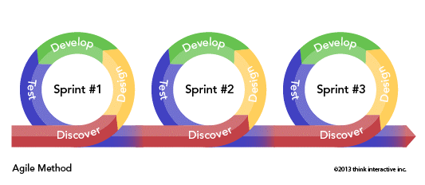

# I. 소프트웨어 설계

> **Chapter 01 - 요구사항 확인**
> 
> **Chapter 02 - 화면 설계**
> 
> **Chapter 03 - 애플리케이션 설계**
> 
> **Chapter 04 - 인터페이스 설계**

---

### Chapter 01 - 요구사항 확인

#### 1. 현행 시스템 분석

- **플랫폼(Platform) 기능 분석**
  
  1. **개념**
     
     - 애플리케이션을 구동시키는 데 필요한 소프트웨어 환경
     
     - 동일 플랫폼 내에서 상호 호환이 가능하도록 만들어진 결합체
     
     - 공급자와 수요자 등 복수 그룹이 참여하여 각 그룹이 얻고자 하는 가치를 공정한 거래를 통해 교환할 수 있도록 구축된 환경
  
  2. **유형**
     
     - **싱슬 사이드 / 투 사이드 / 멀티 사이드 플랫폼**
     
     | 유형                                     | 설명                          | 사례                 |
     |:--------------------------------------:|:--------------------------- |:------------------ |
     | 싱글 사이드 플랫폼<br />(Single-Side Platform) | 제휴 관계를 통해 소비자와 공급자를 연결하는 형태 | 아이튠즈<br />안드로이드 마켓 |
     | 투 사이드 플랫폼<br />(Two-Side Platform)     | 두 그룹을 중개하고 모두에게 개방하는 형태     | 소개팅 앱              |
     | 멀티 사이드 플랫폼<br />(Mulit-Side Platform)  | 다양한 이해관계 그룹을 연결하여 중개하는 형태   | 페이스북<br />인스타그램    |
  
  3. **기능**
     
     - 소프트웨어 개발과 운영비용 감소 및 생선성 향상
     
     - 동일 플랫폼 커뮤니티 형성 및 **네트워크 효과* 유발
       
       ```markdown
       # 네트워크 효과
       - 상품에 대한 수요가 형성되면 이것이 다른 사람들의 상품 선택에 큰 영향을 미치는 현상
       ```
  
  4. **플랫폼 기능 분석 절차**
     
     - **현행 플랫폼 자료 수집 >> 수집 자료 분석 >> 결과 산출물 작성**
     
     | 순서  | 절차           | 설명                                    |
     |:---:|:------------:| ------------------------------------- |
     | 1   | 현행 플랫폼 자료 수집 | 지료 수집/ 파악<br />인터뷰 결과서, 현행 플랫폼 구성도 도출 |
     | 2   | 수집 자료 분석     | 자료에 산발적으로 존재하는 정보 취합/정제 작업            |
     | 3   | 결과 산출물 작성    | 플랫폼 기능분석도 작성                          |

- **플랫폼 성능 특성 분석**
  
  1. **성능 특성 분석 이유**
     
     - 사용자의 서비스 이용 시 속도의 적정성 확인
     - 성능에 대한 개선요청 항목은 시스템 플랫폼 성능이 느린 것으로 제기될 가능성이 높음
  
  2. **플랫폼 성능 특성 분석 기법**
     
     - **사용자 인터뷰 / 성능 테스트 / 산출물 검색**
     
     | 기법      | 설명                         | 산출물              |
     |:-------:|:-------------------------- |:---------------- |
     | 사용자 인터뷰 | 플랫폼 사용자 인터뷰를 통해 속도의 적정성 확인 | 인터뷰 결과서          |
     | 성능 테스트  | 플랫폼을 대상으로 성능, 부하 테스트 수행    | 성능/부하 테스트 결과서    |
     | 산출물 점검  | 유사한 타사 제품의 성능 자료 등 분석      | **벤치마킹 테스트*  결과서 |
     
     ```markdown
     # 벤치마킹 테스트(BMT: Bench Marking Test)
     - 도입하려는 제품군의 대상 Vendor를 선정하여 해당 제품군의 성능을 비교하는 테스트
     ```
  
  3. **플랫폼 성능 특성 측정 항목**
     
     - **경과시간 / 사용률 / 응답시간 / 가용성**
     
     | 측정항목                        | 설명                                 |
     |:---------------------------:|:---------------------------------- |
     | 경과시간<br />(Turnaround Time) | 작업을 의뢰(요구)한 시간부터 처리가 완료될 때까지 걸린 시간 |
     | 사용률<br />(Utilization)      | 의뢰한 작업을 처리하는 동안 CPU, 메모리 등의 자원 사용률 |
     | 응답시간<br />(Response Time)   | 요청을 전달한 시간부터 응답이 도착할 때까지 걸린 시간     |
     | 가용성<br />(Availability)     | 일정 시간 내에 애플리케이션이 처리하는 일의 양         |

- **운영체제(Operating System) 분석**
  
  1. **개념**
     
     - 하드웨어 및 소프트웨어 자원을 효율적으로 관리하며 공통된 기능을 제공하는 소프트웨어
     - 사용자가 컴퓨터를 더 쉽게 사용하기 위해 지원하는 소프트웨어
  
  2. **운영체제 현행 시스템 분석**
     
     - **신뢰도 / 성능 / 기술 지원 / 주변 기기 / 구축 비용**
     
     | 관점    | 고려사항  | 설명                                                                  |
     |:-----:| ----- | ------------------------------------------------------------------- |
     | 품질 측면 | 신뢰도   | - 장기간 시스템 운영 시 운영체제의 장애 발생 가능성<br />- 운영체제의 버그로 인한 재기동 여부           |
     |       | 성능    | - 대규모 및 대량 파일 작업(**배치작업*) 처리<br />- 지원 가능한 메모리 크기(32bit, 64bit)     |
     | 지원측면  | 기술 지원 | - 공급사들의 안정적인 기술 지원<br />- 오픈 소스 여부                                  |
     |       | 주변 기기 | - 설치 가능한 하드웨어<br />- 다수의 주변 기기 지원 여부                                |
     |       | 구축 비용 | - 지원 가능한 하드웨어 비용<br />- 설치할 응용 프로그램의 라이선스 정책 및 비용<br />- 유지 및 관리 비용 |
     
     ```markdown
     # 배치 작업(Batch Job)
     - 실시간 작업의 반대 개념
     - 일련의 작업들을 하나의 작업 단위로 묶어서 일괄로 처리하는 작업
     ```
  
  3. **종류 및 특징**
     
     | 구분  | 종류             | 저작자            | 특징                                              |
     |:---:| -------------- | -------------- | ----------------------------------------------- |
     | 컴퓨터 | 윈도우(Windows)   | Microsoft      | 중/소규모 서버, 일반 PC 등 유지/관리 비용 장점                   |
     |     | 유닉스(UNIX)      | IBM, HP, SUN   | 대용량 처리, 안정성 높은 엔터프라이즈 급 서버                      |
     |     | 리눅스(Linux)     | Linus Torvalds | 중/대규모 서버, 높은 보안성<br />하드웨어 및 소프트웨어 소유 비용이 가장 적음 |
     | 모바일 | 안드로이드(Android) | Google         | 스마트폰, 태블릿 PC, 다양한 기기의 호환성                       |
     |     | iOS            | Apple          | 스마트폰, 태블릿 PC, 높은 보안성과 고성능                       |

- **네트워크(Network) 분석**
  
  1. **개념**
     
     - 컴퓨터 장치들이 노드 간 연결(데이터 링크)을 사용하여 서로에게 데이터를 교환하는 기술
     - 데이터 링크들은 광케이블과 같은 유선 매체 또는 와이파이(Wi-Fi)와 같은 무선 매체를 통해 성립
  
  2. **네트워크 현행 시스템 분석**
     
     - **네트워크 구성도**를 통해 네트워크 구조 분석
     - 구성도 작성을 통해 서버 위치, 서버 간 연결 방식 파악 가능
     - **백본망, 라우터, 스위치, 게이트웨이, 방화벽** 등을 대상으로 분석
     - 물리적인 위치 관계 파악, 조직 내 보안 취약성 분석 및 대응이 쉬움
     - 네트워크 장애 발생 추적/대응 등의 다양한 용도로 활용
     
     ```markdown
     # 백본망(Bakebone Network)
     - 다양한 네트워크를 상호 연결하는 컴퓨터 네트워크의 일부
     - 각기 다른 LAN이나 부분망 간에 정보를 교환하기 위한 경로를 제공하는 망
     
     # 라우터(Router)
     - 3계층 데이터 패킷을 발신지에서 목적지까지 전달하기 위해 최적의 경로를 지정하고, 이 경로를 따라 데이터 패킷을 다음 장치로 전달하는 네트워크 장비
     
     # 스위치(Switch)
     - 2계층 장비로 동일 네트워크 내에서 출발지에 들어온 데이터프레임을 목적지 MAC 주소 기반으로 빠르게 전달하는 네트워크 장비
     
     # 게이트웨이(Gateway)
     - 네트워크에서 서로 다른 통신망, 프로토콜을 사용하는 네트워크 간의 통신을 가능하게 하는 네트워크 장비
     
     # 방화벽(Firewall)
     - 외부로부터 불법 침입과 내부 불법 정보 유출을 방지하고, 내/외부 네트워크의 상호 간 영향을 차단하기 위한 보안 시스템.
     ```
     
      
     
     *네트워크 구성도 예시

- **DBMS(Database Management System) 분석**
  
  1. **개념**
     
     - 데이터베이스(DB)라는 데이터의 집합을 만들고, 저장 및 관리할 수 있는 기능들을 제공하는 응용 프로그램
  
  2. **기능**
     
     - **중복 제어 / 접근 통제 / 인터페이스 / 관계 표현 / 샤딩·파티셔닝 / 무결성 제약조건 / 백업 및 회복**
     
     | 기능       | 설명                                   |
     |:--------:| ------------------------------------ |
     | 중복 제어    | 동일한 데이터가 여러 위치에 중복으로 저장되는 현상 방지      |
     | 접근 통제    | 권한에 따라 데이터에 대한 접근 제어                 |
     | 인터페이스 제공 | 사용자에게 SQL 및 **CLI, GUI** 등 다양한 인터페이스 |
     | 관계 표현    | 서로 다른 데이터 간의 다양한 관계를 표현              |
     | 샤딩/파티셔닝  | 구조 최적화를 위해 작은 단위로 나누는 기능             |
     | 무결성 제약조건 | 무결성에 관한 제약조건을 정의/검사                  |
     | 백업 및 회복  | 데이터베이스 장애 발생 시 데이터의 보존               |
     
     ```markdown
     # CLI(Command Line Interface)
     - 명령어를 텍스트로 입력하여 조작하는 사용자 인터페이스
     
     # GUI(Graphical User INterface)
     - 스래픽 환경을 기반으로 한 마우스나 전자펜을 이용하는 사용자 인터페이스
     ```
  
  3. **데이터베이스 현행 시스템 분석**
     
     - **가용성 / 성능 / 상호 호환성 / 기술 지원 / 구축 비용**
     
     | 관점    | 고려사항   | 설명                                                                                     |
     |:-----:|:------:| -------------------------------------------------------------------------------------- |
     | 성능 측면 | 가용성    | - 장기간 시스템 운영 시 장애 발생 가능성<br />- 백업 및 복구의 편의성<br />- DBMS 이중화 및 복제 지원                   |
     |       | 성능     | - 대규모 데이터 처리 성능<br />- 대량 거래 처리 성능<br />- 다양한 튜닝 옵션 지원 여부<br />- 비용 기반 최적화 지원 및 설정 최소화 |
     |       | 상호 호환성 | - 설치 가능한 운영체제 종류<br />- 다양한 운영체제에서 지원되는 *JDBC, ODBC                                    |
     | 지원 측면 | 기술 지원  | - 안정적인 기술 지원<br />- 다수의 사용자 간의 정보 공유<br />- 오픈소스 여부                                    |
     |       | 구축 비용  | - 라이선스 정책 및 비용<br />- 유지 및 관리 비용                                                       |
     
     ```markdown
     # JDBC(Java Database Connectivity)
     - 자바에서 데이터베이스를 사용할 수 있도록 연결해주는 응용 프로그램 인터페이스
     
     # ODBC(Open Database Connectivity)
     - 데이터베이스를 액세스하기 위한 표준 개방형 응용 프로그램 인터페이스
     ```

- **비즈니스 융합(Business Convergence) 분석**
  
  1. **개념**
     
     - 융합 기술이 제공하는 기회나 융합의 원리를 적용하여 새로운 제품, 서비스, 산업을 창출하거나 기존 제품을 혁신하기 위한 기업 활동
     - 산업 또는 시장 간 경계를 허물어 정보통신 기술을 적용해 새로운 **비즈니스 모델*로의 범위를 확대하는 것
     
     ```markdown
     # 비즈니스 모델(Business Model)
     - 고객의 가치를 창출하고 시장에서 성공적인 경쟁을 하기 위해 고안된 조직의 목표, 전략, 프로세스, 구조, 기술 등을 포함하는 총체적인 구성체
     ```
  
  2. **유형**
     
     - **고객 가치형 / 시장 유통형 / 가치 제안형 / 공급 역량형 / 생산 방식형**
     
     | 유형          | 설명                           | 사례                     |
     |:-----------:| ---------------------------- | ---------------------- |
     | 고객 가치(Why)  | 개인, 사회, 인류의 행복과 번영을 위한 가치 창출 | 신재생 에너지 개발, 친환경 농산물 생산 |
     | 시장 유통(Whom) | 신시장 개척 또는 미래시장 선점            | 자율주행 자동차, 글로벌 통신망      |
     | 가치 제안(What) | 시장/고객의 미충족 욕구 대응을 위한 신상품 개발  | 드론 배송, 협동 로봇, 소셜 로봇    |
     | 공급 역량(Who)  | 신기술, 신규역량을 활용한 상품 생산         | 스마트 밴드, 스마트 헬스케어       |
     | 생산 방식(How)  | 제품/서비스의 생산, 판매 프로세스 혁신       | 스마트 팩토리, 옴니채널          |
     
     ```markdown
     # 스마트 팩토리(Smart Factory)
     - 기획/설계, 생산, 유통/판매 등 전 과정을 ICT 기술로 통합, 최소비용/시간으로 고객 맞춤형 제품을 생산하는 지응화된 공장
     
     # 옴니채널(Omni-Channel)
     - 소비자가 온라인, 오프라인, 모바일 등 다양한 경로로 상품을 검색하고 구매할 수 있도록 하는 서비스
     - 유통 채널의 특성을 결합해 어떤 채널에서든 같은 매장을 이용하는 것 처럼 느낄 수 있도록 한 쇼핑 환경
     ```
  
  3. **비즈니스 융합 분석 절차**
     
     - **기업 전략 분석 >> 영역 및 방향 설정 >> 포트폴리오 선정 >> 융합 모델 설계·평가 >> 비즈니스 융합 실행·개선**
     
     | 순서  | 절차            | 설명                              |
     |:---:| ------------- | ------------------------------- |
     | 1   | 기업전략 분석       | 기업 환경과 그에 대응하기 위한 경쟁전략 분석       |
     | 2   | 영역 및 방향 설정    | 기업전략을 고려한 영역에 대한 설정             |
     | 3   | 포트폴리오 선정      | 부합성, 생존성, 경쟁, 성장성 등 평가          |
     | 4   | 융합모델 설계/평가    | 비즈니스 모델 설계, 융합모델 유효성 평가 및 시범 적용 |
     | 5   | 비즈니스 융합 실행/개선 | 프로토타이핑(Prototyping), 사업화 타당성 확인 |

---

#### 2. 요구사항 확인

- **요구분석(Recuirements Analysis) 기법**
  
  1. **개념**
     
     - 도출된 요구사항 간 상충을 해결하고 소프트웨어의 범위를 파악하여 **외부환경*과의 상호작용을 분석하는 과정
     - 개발 대상에 대한 사용자의 요구사항 중 명확하지 않거나 모호하여 이해되지 않는 부분을 발견하고 이를 걸러내기 위한 과정
     
     ```markdown
     # 외부환경
     - 광의적인 측면에서 하드웨어, 소프트웨어, 네트워크 등의 환경
     ```
  
  2. **특징**
     
     - 분석 결과의 문서화를 통해 향후 유지보수에 유용하게 활용 가능
     - 구체적인 명세를 위해 **소단위 명세서* 활용 가능
     
     ```markdown
     # 소단위 명세서(Mini-Spec)
     - 데이터 흐름도에 나타나있는 처리 항목을 1~2페이지 정도의 소규모 분량으로 요약하여 작성하는 논리적 명세서
     
     +) 개발 비용이 가장 많이 소요되는 단계는 유지보수 단계
     ```
  
  3. **요구분석 기법**
     
     - **요구사항 분류 >> 개념 모델링 생성 및 분석 >> 요구사항 할당 >> 요구사항 협상 >> 정형 분석**
     
     | 순서  | 절차             | 설명                                                                                                                                                                                                                                        |
     |:---:|:--------------:| ----------------------------------------------------------------------------------------------------------------------------------------------------------------------------------------------------------------------------------------- |
     | 1   | 요구사항 분류        | - 기능인지 비 기능인지 확인<br />- 소프트웨어에 미치는 영향의 범위 파악<br />- 소프트웨어 생명주기 동안 변경이 발생하는지 확인<br />- 상위 요구사항에서 유도 / 이해관계자나 다른 원천으로부터 직접 발생 여부 분류                                                                                                         |
     | 2   | 개념 모델링 생성 및 분석 | - 모델 : 현실 세계의 상황을 단순화, 개념적으로 표현한 것<br />- 모델링 : 모델을 만드는 과정<br />- 객체(Object) 모델, 데이터(Data) 모델, 유스케이스 다이어그램(Use Case Diagram), 데이터 흐름(Data Flow) 모델, 상태(State) 모델, 목표기반(Goal-Based) 모델, 사용자 (User Interactions) 등<br />- 모델링 표기는 주로 UML 사용 |
     | 3   | 요구사항 할당        | - 요구사항을 만족시키기 위한 아키텍처 구성요소를 식별하는 활동<br />- 다른 구성요소와 어떻게 상호작용하는지 분석을 통해 추가적인 요구사항 발견 가능                                                                                                                                                    |
     | 4   | 요구사항 협상        | - 서로 상충되는 요구사항을 적절한 지점에서 합의하기 위한 기법<br />- 요구사항이 서로 충돌되는 경우 각각 우선순위를 부여하면 문제 해결에 도움이 됨                                                                                                                                                    |
     | 5   | 정형 분석          | - 형식적으로 정의된 의미를 지닌 언어로 요구사항을 표현<br />- 구문(Syntax)와 의미(Semantics)를 갖는 정형화된 언어를 사용하여 수학적 기호로 표현<br />- 요구사항 분석의 마지막 단계에서 시행                                                                                                                 |
  
  4. **요구사항 분석 기술**
     
     - **청취 기술 / 인터뷰와 질문 기술 / 분석 기술 / 중재 기술 / 관찰 기술 / 작성 기술 / 조직 기술 / 모델작성 기술**
     
     | 분석기술       | 설명                                                     |
     |:----------:| ------------------------------------------------------ |
     | 청취 기술      | 이해관계자로부터 의견을 듣는 기술                                     |
     | 인터뷰와 질문 기술 | 이해관계자를 만나 정보를 수집하고 이야기를 나누는 기술                         |
     | 분석 기술      | 추출된 요구사항에 대해 충돌, 중복, 누락 등의 분석을 통해 완전성과 일관성을 확보하는 기술    |
     | 중재 기술      | 이해관계자들의 상반된 요구에 대한 중재 기술                               |
     | 관찰 기술      | 사용자가 작업하는 것을 관찰하면서 사용자가 언급하지 않은 미묘한 의미를 탐지하는 기술        |
     | 작성 기술      | 문서 작성 기술                                               |
     | 조직 기술      | 수집된 정보를 일관성 있는 정보로 구조화하는 기술                            |
     | 모델 작성 기술   | 수집한 자료를 바탕으로 제어의 흐름, 기능 처리, 동작 행위, 정보 내용등을 모델로 작성하는 기술 |
  
  5. **요구사항 분석에 사용하는 기능 모델링 기법**
     
     - **데이터 흐름도(DFD : Data Flow Diagram)**
       
       **ⓐ 개념**
       
       - 자료 흐름 그래프 or 버블(Bubble) 차트
         
         - 데이터가 각 프로세스를 따라 흐르면서 변환되는 모습을 나타낸 그림
         - 시스템 분석 / 설계에서 유용하게 사용
         - 시스템의 모델링 도구 중 하나
       
        
       
       *데이터 흐름도
       
       **ⓑ 특징**
       
       - 구조적 분석 기법에 이용
       - 제어의 흐름이 아닌 데이터의 흐름에 중심을 두는 분석용 도구
       - 시간 흐름을 명확하게 표현 불가
       
       **ⓒ 구성요소**
       
       - **처리기 / 데이터 흐름 / 데이터 저장소 / 단말**
         
         | 구성요소                      | 설명                                                                          |
         |:-------------------------:| --------------------------------------------------------------------------- |
         | 처리기<br />(Process)        | - 입력된 데이터를 원하는 형태로 변환하여 출력하기 위한 과정<br />- 원(○)으로 표시                         |
         | 데이터 흐름<br />(Data Flow)   | - DFD의 구성요소들 간의 주고받는 데이터 흐름<br />- 화살표(→)로 표시                               |
         | 데이터 저장소<br />(Data Store) | - 데이터가 저장된 장소<br />- 평행선(=)으로 표시 // 평상선 내부에 데이터 저장소의 이름 입력                  |
         | 단말<br />(Terminator)      | - 프로세스 처리 과정에서 데이터가 발생하는 시작과 종료<br />- 사각형(□)으로 표시 // 사각형 내부에 외부 엔티티의 이름 입력 |
     
     - **자료 사전(DD : Data Dictionary)**
       
       **ⓐ 개념**
       
       - 자료 요소, 자료 요소들의 집합, 자료의 흐름, 자료 저장소의 의미와 그들 간의 관계, 관계 값, 범위, 단위들을 구체적으로 명시하는 사전
       - 파일 혹은 데이터베이스에 있는 자료에 대한 자료 또는 각 자료 항목에 주어진 이름과 길이 그리고 서술과 같은 데이터를 포함하는 참조를 위한 작업
       
       **ⓑ 작성 목적**
       
       - 특정한 자료 용어가 무엇을 의미하는지 알려주기 위해 용어의 정의를 조정하고 취합하여 문서로 명확히 하기 위함
       - 자료 흐름도에 나타나는 모든 자료의 흐름은 자료 사전에 정의되어있어야 함
       
       **ⓒ 기호**
       
       - **= / + / () / {}/ [] / ****
         
         | 기호  | 의미                                                                                                                         |
         |:---:| -------------------------------------------------------------------------------------------------------------------------- |
         | =   | - 자료의 정의 : '~으로 구성되어 있다(is Composed of)'를 의미<br />- 주석을 사용하여 의미를 기술, 자료의 흐름과 자료저장소에 대한 구성 내역을 설명하고, 자료 원소에 대하여 값이나 단위를 나타냄 |
         | +   | - 자료의 연결(and, along with)                                                                                                  |
         | ()  | - 생략 가능                                                                                                                    |
         | {}  | - 자료의 반복<br />- {}에서 좌측에는 최소 반복 횟수, 우측에는 최대 반복 횟수를 기록<br />- 디폴트(Default) =  최소 0, 최대 INF                                  |
         | []  | - 자료의 선택<br />- 택일 기호 [ \| ]는 '\|'로 분리된 항목 중 하나가 선택된다는 의미                                                                  |
         | **  | - 자료의 설명<br />- 주석(Comment)                                                                                                |
       
       **ⓓ 자료 사전 작성 원칙**
       
       - **자료의 의미 기술 / 자료 구성항목의 기술 / 동의어 규정 준수 / 자료 정의의 중복 제거**
         
         | 작성 원칙        | 설명                                                                                       |
         |:------------:| ---------------------------------------------------------------------------------------- |
         | 자료의 의미 기술    | - 주석을 통해 기술<br />- 자료가 대상 시스템에서 사용되는 적합한 뜻을 표현해야 함<br />- 이해도를 높이기 위해 중복되는 기술을 피하는 것이 중요 |
         | 자료 구성항목의 기술  | - 구성 항목들을 그룹화<br />- 각 그룹에 대하여 의미 있는 이름 부여<br />- 이름이 붙여진 각 그룹을 재정의                      |
         | 동의어 규정 준수    | - 분석가가 자료를 하향식으로 분할하는 과정에서 부주의하게 동의어 사용 가능성 존재                                           |
         | 자료 정의의 중복 제거 | - 여러 명의 분석가가 독립적으로 분석을 시행한 경우<br />서로 다른 이름을 사용할 수 있기 때문에 자료 정의의 중복 제거 필요                |

- **UML(Unified Modeling Language)**
  
  1. **개념**
     
     - 객체지향 소프트웨어 개발 과정에서 산출물을 명세화, 시각화, 문서화할 때 사용되는 모델링 기술과 방법론을 통합해서 만든 표준화된 범용 모델링 언어
  
  2. **특징**
     
     - **가시화 / 구축 / 명세화 / 문서화 언어**
     
     | 특징     | 설명                                                                         |
     |:------:| -------------------------------------------------------------------------- |
     | 가시화 언어 | - 개념 모델 작성 시 오류가 적고 의사소통이 용의                                               |
     | 구축 언어  | - 다양한 프로그래밍 언어로 실행 시스템의 예측 가능<br />- UML을 소스 코드로 변환하여 구축 가능, 역 변환하여 역공학 가능 |
     | 명세화 언어 | - 정확한 모델 제시, 완전한 모델 작성 가능                                                  |
     | 문서화 언어 | - 시스템에 대한 평가 및 의사소통의 문서                                                    |
  
  3. **구성요소**
     
     - **사물 / 관계 / 다이어그램**
     
     | 구성요소              | 내용                                                                                    |
     |:-----------------:| ------------------------------------------------------------------------------------- |
     | 사물(Things)        | - 추상적인 개념, 주제를 나타내는 요소<br />- 단어 관점 :  '명사' 또는 '동사'                                   |
     | 관계(Relationships) | - 사물의 의미를 확장하고 명확히 하는 요소<br />- 사물과 사물을 연결하여 관계를 표현하는 요소<br />- 단어 관점 : '형용사' 또는 '부사' |
     | 다이어그램(Diagrams)   | - 사물과 관계를 모아 그림으로 표현한 형태<br />- 형식과 목적에 따라 9가지로 정의                                    |
  
  4. **UML 다이어그램**
     
     - **구조적 다이어그램(Structural Diagram) / 정적 다이어그램(Static Diagram)**
       
       - **클래스 / 객체 / 컴포넌트 / 배치 / 복합체 구조 / 패키지**
       
       | 다이어그램                             | 설명                                                                                            |
       | --------------------------------- | --------------------------------------------------------------------------------------------- |
       | 클래스<br />(Class)                  | - 시스템 내 클래스의 정적 구조 표현<br />- 속성과 동작으로 구성<br />- 시스템 구조를 파악하고 구조상 문제점 도출 가능                    |
       | 객체<br />(Object)                  | - 객체(인스턴스)를 특정 시점의 객체와 객체 사이의 관계로 표현<br />- 객체 인스턴스를 나타내는 대신 실제 클래스 사용<br />- 연관된 모든 인스턴스를 표현 |
       | 컴포넌트<br />(Component)             | - 코드 컴포넌트 기반의 물리적 구조 표현<br />- 실질적 프로그래밍 작업에 사용                                               |
       | 배치<br />(Deployment)              | - 컴포넌트 사이의 종속성 표현<br />- 결과물, 프로세스, 컴포넌트 등 물리적 요소들의 위치 표현                                     |
       | 복합체 구조<br />(Composite Structure) | - 클래스 / 컴포넌트가 복합 구조를 갖는 경우 그 내부 구조 표현                                                         |
       | 패키지<br />(Package)                | - 유스케이스나 클래스 등의 모델 요소들을 그룹화한 패키지들와 관계 표현                                                      |
     
     - **행위적 다이어그램(Behavioral Diagram) / 동적 다이어그램(Dynamic Diagram)**
       
       | 다이어그램                       | 설명                                                                                                    |
       | --------------------------- | ----------------------------------------------------------------------------------------------------- |
       | 유스케이스<br />(Usecase)        | - 사용자 관점에서 시스템의 활동 표현<br />- 시스템의 기능적 요구 정의에 활용                                                       |
       | 시퀀스<br />(Sequence)         | - 객체 간 상호작용을 메시지 흐름으로 표현<br />- 객체 사이 메시지를 보내는 시간 표현                                                  |
       | 커뮤니케이션<br />(Communication) | - 동작에 참여하는 객체들이 주고 받는 메시지 표현<br />- 메시지, 객체 간의 연관 관계 표현                                               |
       | 상태<br />(State)             | - 객체가 소속된 클래스의 상태 변화 혹은 상호작용에 따라 변화하는 상태를 표현<br />- 모든 가능한 상태와 전이를 표현<br />- 진입 조건, 탈출 조건, 상태 전이 등 기술 |
       | 활동<br />(Activity)          | - 객체의 처리 로직이나 조건에 따른 처리의 흐름으로 순서대로 수행 기능 표현<br />- 활동의 순서대로 흐름 표현                                     |
       | 타이밍<br />(Timing)           | - 객체 상태 변화와 시간 제약을 명시적으로 표현                                                                           |
  
  5. **상세**
     
     - **클래스 다이어그램**
       
       **ⓐ 개념**
       
       - 객체지향 모델링 시 클래스의 속성 미 연산과 클래스간 정적 관계를 표현한 다이어그램
       
       **ⓑ 구성요소**
       
       - **클래스 이름 / 속성 / 연산 / 접근 제어자(제한자)**
         
         | 구성요소                               | 설명                                                                                                                                                                  |
         |:----------------------------------:| ------------------------------------------------------------------------------------------------------------------------------------------------------------------- |
         | 클래스 이름<br />(Class Name)           | 클래스의 이름                                                                                                                                                             |
         | 속성<br />(Attribute)                | 클래스 특징의 이름                                                                                                                                                          |
         | 연산<br />(Operation)                | 객체에 요청하여 행동에 영향을 줄 수 있는 서비스                                                                                                                                         |
         | 접근 제어자(제한자)<br />(Access Modifier) | 클래스에 접근할 수 있는 정도<br />⊙ -(Private) : 클래스 내부접근만 허용<br />⊙ +(Public) : 클래스 외부접근 허용<br />⊙ #(Protected) : 동일 패키지·파생 클래스에서 접근 가능<br />⊙ ~(Default) : 동일 패키지 클래스에서 접근 가능 |
     
     - **유스케이스 다이어그램**
       
       **ⓐ 개념**
       
       - 시스템이 제공하고 있는 기능 및 그와 관련된 외부요소를 사용자의 관점에서 표현하는 다이어그램
       
       **ⓑ 구성요소**
       
       - **유스케이스 / 액터 / 시스템**
         
         | 구성요소                 | 설명                                                 | 표기법 |
         |:--------------------:| -------------------------------------------------- |:---:|
         | 유스케이스<br />(Usecase) | - 시스템이 제공해야 하는 서비스<br />- 액터가 시스템을 통해 수행하는 일련의 행위  |     |
         | 액터<br />(Actor)      | - 사용자가 시스템에 대해 수행하는 역할<br />- 시스템과 상호작용하는 사람 또는 사물 |     |
         | 시스템<br />(System)    | - 전체 시스템의 영역                                       |     |
     
     - **시퀀스 다이어그램**
       
       **ⓐ 개념**
       
       - 객체 간 상호작용을 메시지 흐름으로 표현한 다이어그램
       
       **ⓑ 구성요소**
       
       - **객체 / 생명선 / 실행 / 메시지**
         
         | 구성요소                 | 설명                                                                        | 표기법 |
         |:--------------------:| ------------------------------------------------------------------------- |:---:|
         | 객체<br />(Object)     | - 위쪽에 표시되며 아래로 생명선을 가짐<br />- 사각형 안에 밑줄 친 이름으로 명시                         |     |
         | 생명선<br />(Lifeline)  | - 객체로부터 뻗어 나가는 점선<br />- 실제 시간이 흐름에 따라 객체의 생명주기 동안 발생하는 이벤트 명시            |     |
         | 실행<br />(Activation) | - 직사각형은 오퍼레이션(함수)이 실행되는 시간<br />- 직사각형이 길어질수록 오퍼레이션 수행시간이 긺               |     |
         | 메시지<br />(Message)   | - 객체 간 상호작용은 메시지 교환으로 이루어짐<br />- 객체에서 다른 객체로 메시지를 전달하여 전달받은 객체의 오퍼레이션 수행 |     |
  
  6. **관계**
     
     - **연관 관계 / 집합 관계 / 포함 관계 / 일반화 관계 / 의존 관계 / 실체화 관계 등**
       
       | 구분                           | 설명                                                                                                                         | 예시  |
       |:----------------------------:| -------------------------------------------------------------------------------------------------------------------------- |:---:|
       | 연관 관계<br />(Association)     | - 2개 이상의 사물이 서로 관련돤 상태<br />- 사물 사이를 실선으로 연결하여 표현<br />- 방향성은 화살표, 양방향은 실선                                                 |     |
       | 집합 관계<br />(Aggregation)     | - 하나의 사물이 다른 사물에 포함되는 관계<br />- 하위 항목에서 상위 항목으로 속이 빈 마름모를 연결하여 표현                                                          |     |
       | 포함 관계<br />(Composition)     | - 집합 관계의 특수한 형태, 하위 항목의 변화가 상위 항목에 영향을 미치는 관계<br />- 하위 항목에서 상위 항목으로 속이 찬 마름모를 연결하여 표현                                     |     |
       | 일반화 관계<br />(Generalization) | - 하나의 사물이 다른 사물에 비해 더 일반적인지 구체적인지 표현<br />- 일반적인 개념 : 부모(상위), 구체적인 개념 : 자식(하위)<br />- 구제적인 사물에서 일반적인 사물로 속이 빈 화살표를 연결하여 표현 |     |
       | 의존 관계<br />(Dependency)      | - 서로 연관은 있으나 필요에 따라 짦은 연관을 유지하는 관계<br />- 사물의 변화가 다른 사물에도 영향을 미치는 관계<br />- 영향을 주는 사물에서 받는 사물 쪽으로 점선 화살표를 연결하여 표현          |     |
       | 실체화 관계<br />(Realization)    | - 사물이 할 수 있거나, 해야하는 기능(행위, 인터페이스)으로 그룹화 할 수 있는 관계<br />- 사물에서 기능 쪽으로 속이 빈 점선 화살표를 연결하여 표현                                  |     |
  
  7. **UML 확장 모델의 스테레오 타입(Stereotype)**
     
     - UML의 기본적인 요소 이외의 새로운 요소를 만들어 내기 위한 확장 메커니즘
     
     - 형태는 기존 UML 요소를 사용 >> 내부 의미는 다른 목적으로 사용하도록 확장
     
     - '<< >>'(Guillemet: 갤러멧) 기호로 표현
       
       | 타입              | 설명                                                                | 예시  |
       |:---------------:| ----------------------------------------------------------------- |:---:|
       | << include >>   | 하나의 유스케이스가 어떤 시점에 반드시<br />다른 유스케이스를 실행하는 포함 관계                   |     |
       | << extend >>    | 하나의 유스케이스가 어떤 시점에 다른<br />유스케이스를 실행(선택) 할 수 있는 확장 관계              |     |
       | << interface >> | 바로 인스턴스를 만들 수 없는 클래스,<br />추상 메소드와 상수만으로 구성                       |     |
       | << entity >>    | 정보 또는 오래 지속되는 연관된 행위를 형상화 하는 클래스<br />기억 장치에 저장되어야 할 정보를 표현하는 클래스 |     |
       | << boundary >>  | 시스템과 외부 액터와의 상호작용을 담당하는 클래스                                       |     |
       | << control >>   | 시스템이 제공하는 기능의 로직 및 제어를 담당한는 클래스                                   |     |

- **애자일(Agile)**
  
  1. **개념**
     
     - 소프트웨어 개발방법론의 하나
     
     - 개발과 함께 즉시 피드백을 받아서 유동적으로 개발하는 방법
       
        
       
       *애자일 방법론 개념도
  
  2. **등장 배경**
     
     | 등장 배경           | 설명                                                                                |
     |:---------------:| --------------------------------------------------------------------------------- |
     | 소프트웨어 개발 환경의 변화 | - 소프트웨어 개발 트랜드가 모바일 환경으로 변화<br />- 시장 적시성과 잦은 배포의 중요성 부각                          |
     | 기존 개발벙법론의 한계    | - 전통적 방법론은 문서 및 절차 위주로 변화에 신속한 대응이 어려움<br />   >> 빠르게 적용하고 효율적으로 개발하는 방법론의 필요성 증가 |
  
  3. **특징**
     
     - 프로젝트의 요구사항은 **기능 중심**으로 정의
     - 절차와 도구보다 **개인과 소통**을 중시
     - 작업 계획을 짧게 세워 요구 **변화에 유연하고 신속하게 대응**
     - 소프트웨어가 **잘 실행되는 데** 가치를 둠
     - 고객과의 **피드백을 중요**하게 생각
  
  4. **애자일 선언문**
     
     ```markdown
     1. 공정과 도구보다 개인과 상호작용
     2. 계획을 따르기보다 변화에 대응하기
     3. 포괄적인 문서보다 동작하는 소프트웨어
     4. 계약 협상보다 고객과의 협력
     ```
  
  5. **애자일 방법론 유형**
     
     - **XP(eXtreme Programming)**
       
       ⓐ 의사소통 개선과 즉각적 피드백으로 소프트웨어 품질을 높이기 위한 방법론
       
       ⓑ 1~3주의 반복 개발 주기
       
       ⓒ XP의 5가지 가치
       
       - **용기 / 단순성 / 의사소통 / 피드백 / 존중**
         
         | 가치                        | 설명                        |
         |:-------------------------:| ------------------------- |
         | 용기<br />(Courage)         | 자신감있게 개발                  |
         | 단순성<br />(Simplicity)     | 필요한 것만 하고 그 이상의 것들은 하지 않음 |
         | 의사소통<br />(Communication) | 개발자, 관리자, 고객 간의 원활한 소통    |
         | 피드백<br />(Feedback)       | 의사소통에 대한 빠른 피드백           |
         | 존중<br />(Respect)         | 팀원 간의 상호 존중               |
       
       ⓓ XP의 12가지 기본원리
       
       - **짝 프로그래밍 / 공동 코드 소유 / 지속적인 통합 / 계획 세우기 / 작은 릴리즈 / 메타포어 / 간단한 디자인 / 테스트 기반 개발 / 리팩토링 / 40시간 작업 / 고객 상주 / 코드 표준**
         
         | 기본원리                                 | 설명                                                                  |
         |:------------------------------------:| ------------------------------------------------------------------- |
         | 짝 프로그래밍<br />(Pair Programming)      | 개발자 둘이서 짝으로 코딩                                                      |
         | 공동 코드 소유<br />(Collective Ownership) | 시스템에 있는 코드는 누구든지 수정 가능                                              |
         | 지속적인 통합<br />(CI)                    | 매일 여러 번 소프트웨어를 통합하고 빌드<br />Continuous Intergration                 |
         | 계획 세우기<br />(Planning Proccess)      | 고객이 요구하는 비즈니스 가치를 정의하고, 개발자가 필요한 것은 무엇이며<br />어떤 부분에서 지연될 수 있는지를 확인 |
         | 작은 릴리즈<br />(Small Release)          | 작은 시스템을 먼저 만들고, 짧은 단위로 업데이트                                         |
         | 메타포어<br />(Metaphor)                 | 공통적인 이름 체계와 시스템 서술서를 통해 고객가 개발자 간 의사소통 원활화                          |
         | 간단한 디자인<br />(Simple Design)         | 현재 요구사항에 적합한 가장 단순한 시스템을 설계                                         |
         | 테스트 기반 개발<br />(TDD)                 | 테스트를 먼저 수행 후 테스트를 통과할 수 있도록 실제 프로그램의 코드 작성<br />Test Driven Develop |
         | 리팩토링<br />(Refactoring)              | 기능을 바꾸지 않으면서 중복제거, 단순화 등을 위해 시스탬 재구성                                |
         | 40시간 작업<br />(40-Hour Work)          | 피로로 인한 실수를 방지하기 위해 주 40시간 이하로 작업                                    |
         | 고객 상주<br />(On Site Customer)        | 개발자들의 질문에 즉각 대답해 줄 수 있는 고객이 프로젝트에 풀타임으로 상주                          |
         | 코드 표준<br />(Coding Standard)         | 효율적인 공동 작업을 위한 모든 코드에 대한 코딩 표준을 정의                                  |
     
     - **스크럼(SCRUM)**
       
       ⓐ 매일 정해진 시간, 장소에서 짧은 시간의 개발을 하는 팀을 위한 프로젝트 관리 중심 방법론
       
       ⓑ 주요 개념
       
       - **백로그 / 스프린트 / 스크럼 미팅(데일리 미팅) / 스크럼 마스터 / 스프린트 회고 / 번 다운 차트**
         
         | 주요 개념                               | 설명                                                                           |
         |:-----------------------------------:| ---------------------------------------------------------------------------- |
         | 백로그<br />(Backlog)                  | - 제품과 프로젝트에 대한 요구사항                                                          |
         | 스프린트<br />(Sprint)                  | - 2~4주의 짧은 개발 기간의 반복적 수행으로 개발품질 향상                                           |
         | 스크럼 미팅<br />(Scrum Meeting)         | - 매일 15분 정도 미팅으로 To-Do List 계획 수립                                            |
         | 스크럼 마스터<br />(Scrum Master)         | - 프로젝트 리더, 스크럼 수행 시 문제를 인지 및 해결하는 사람                                         |
         | 스프린트 회고<br />(Sprint Retrospective) | - 스프린트 주기를 되돌아보며 규칙 준수 여부, 개선 점 등을 확인 및 기록<br />- 해당 스프린트가 끝난 시점이나 일정 주기로 시행 |
         | 번 다운 차트<br />(Burn Down Chart)      | - 남아있는 백로그 대비 시간을 그래픽적으로 표현한 차트<br />- 백로그는 보통 수직축에 위치, 시간은 수평축에 위치          |
     
     - **린(Lean)**
       
       ⓐ 도요타의 린 시스템 품질기법을 소프트웨어 개발 프로세스에 적용하여 낭비 요소를 제거 및 품질을 향상시킨 방법론
       
       ⓑ JIT(Just In Time), 칸반(Kanban) 보드 사용
       
       ⓒ 7가지 원칙
       
       - **낭비제거 / 품질 내재화 / 지식 창출 / 늦은 확정 / 빠른 인도 / 사람 존중 / 전체 최적화**
  
  6. **애자일 vs 전통적 방법론**
     
     | 비교대상    | 애자일 방법론                | 전통적 방법론                        |
     |:-------:| ---------------------- | ------------------------------ |
     | 계획 수립   | 유동적 범위 설정              | 확정적 범위 설정                      |
     | 업무 수행   | 팀 중심 업무 수행             | 관리자 주도적 명령/통제<br />개발 단위 업무 수행 |
     | 개발 / 검증 | 반복 주기 단위로 소프트 웨어 개발/검증 | 분석/설계/구현/테스트를 순차적으로 수행         |
     | 팀관리     | 업무 몰입, 팀 평가            | 경쟁, 개별 평가                      |
     | 문서화     | 문서화보다 코드를 강조           | 상세한 문서화 강조                     |
     | 성공요소    | 고객 가치 전달               | 계획/일정 준수                       |
     | 유형      | XP, 스크럼, 린             | 폭포수, 프로토타입, 나선형                |

---

#### 3. 분석 모델 확인

- **모델링(Modeling) 기법**
  
  1. **개념**
     
     - 실세계의 물리현상을 특정한 목적에 대응하여 이용하기 쉬운 형식으로 표현하는 기법
  
  2. **역할**
     
     - 소프트웨어 요구사항 분석의 핵심 = 실세계 문제에 대한 모델링
     - 모델은 문제가 발생하는 상황에 대한 이해를 증진시키고 해결책을 설명
     - 개념 모델은 문제 도메인의 엔티티(Entitiy)들과 관계 및 종속성을 반영
  
  3. **절차**
     
     - **요구사항 분석 / 개념 모델링 / 논리 모델링 / 물린 모델링 등**
       
       | 순서  | 절차      | 설명                                                                                               |
       |:---:|:-------:| ------------------------------------------------------------------------------------------------ |
       | 1   | 요구사항 분석 | - 현행 데이터의 문제점을 확인하고 향후 개선점을 도출하는 활동                                                              |
       | 2   | 개념 모델링  | - 업무 중심의 포괄적인 모델리으로 추상화하는 활동<br />- 주제 영역과 핵심데이터 간 관계 정의<br />[ex) 엔티티 추출, 속성 및 관계 정의, ERD 작성 등] |
       | 3   | 논리 모델링  | - 관계(Relationship), 속성(Attribute), 키(Key) 등을 도출하는 활동<br />[ex) 식별자 확정, 정규화 수행 등]                 |
       | 4   | 물리 모델링  | - 사용 DBMS 특성에 맞게 물리적 스키마를 만드는 활동<br />[ex) 컬럼 데이터 타입, 제약조건, 인덱스 정의 등]                            |

- **분석 자동화 도구**
  
  1. **개념**
     
     - 요구사항을 자동으로 분석하고, 요구사항 분석 명세서를 기술하도록 개발된 요구사항 분석을 위한 자동화 도구(CASE)
  
  2. **등장 배경**
     
     - **산업 측면 / 관리 측면**
       
       | 관점    | 등장배경                                                          |
       |:-----:|:------------------------------------------------------------- |
       | 산업 측면 | 소프트웨어 위기의 극복 대응 방안                                            |
       | 관리 측면 | - 사용자의 요구사항과 실제 시스템 간의 차이 발생<br/>- 시스템의 재사용성, 생산성 및 유지보수의 어려움 |
  
  3. **특징**
     
     - 표준화 적용과 문서화를 통한 보고를 통해 품질 개선 가능
     
     - 변경사항으로 인한 영향에 대한 추적 용이
     
     - 명세에 대한 유지보수 비용의 축소 가능
  
  4. **분류**
     
     - **상위 CASE / 하위 CASE**
       
       | 분류      | 설명                                                                                                                    |
       |:-------:| --------------------------------------------------------------------------------------------------------------------- |
       | 상위 CASE | - 계획수립, 요구분석, 기본설계 단계를 다이어그램으로 표현<br/><br/>- 모델들 사이의 모순 검사 및 모델의 오류 검증, 일관성 검증 지원<br/>- 자료흐름도 프로토타이핑 작성 지원 및 UI 설계 지원 |
       | 하위 CASE | - 구문 중심 편집 및 정적, 동적 테스트 지원<br/>- 시스템 명세서 생성 및 소스 코드 생성 지원                                                             |
  
  5. **주요 기능(CASE 도구)**
     
     - 그래픽 지원
     
     - 소프트웨어 생명주기의 전 단계 연결
     
     - 다양한 소프트웨어 개발 모형 지원
     
     - 표준화된 개발 환경 구축 및 문서 자동화 기능 제공
     
     - 작업 과정 및 데이터 공유를 통해 작업자 간 커뮤니케이션 증대

- **요구사항 관리 도구**
  
  1. **개념**
     
     - 요구사항을 기반으로 프로젝트 관리, 설계 개발, 테스트 등을 수행할 수 있는 역할을 지원하는 도구
  
  2. **기능**
     
     - **기본기능 / 핵심기능 / 부가기능**
       
       | 구분   | 기능             | 설명                                           |
       |:----:| -------------- | -------------------------------------------- |
       | 기본기능 | 프로젝트 생성        | - 프로젝트 타입 및 기본 모듈 템플릿<br/>- 프로젝트 생성 및 재사용 가능 |
       |      | 요구사항 작성        | - 요구사항별 고유 ID, 식별자 사용 구분                     |
       |      | 요구사항 불러오기/내보내기 | - 다양한 확장자 제공                                 |
       | 핵심기능 | 요구사항 이력 관리     | - 요구사항별 변경 이력 관리 기능 제공                       |
       |      | 요구사항 베이스라인     | - 요구사항 확정을 위한 베이스라인 제공                       |
       |      | 요구사항 추적성       | - 요구사항 이력 추적 가능                              |
       | 부가기능 | 협업 환경          | - 요구사항 산출물의 동시편집 기능 제공                       |
       |      | 외부 인터페이스       | - 형상관리 도구(SVN, Git)와 연동 지원                   |
       |      | 확장성            | - API 등을 통한 타 시스템 연동 제공                      |
  
  3. **요구사항 관리 도구**
     
     - **상용제품 / 오픈소스**
       
       | 구분   | 관리 도구                 | 설명                                                                       |
       |:----:| --------------------- | ------------------------------------------------------------------------ |
       | 상용제품 | 헬릭스 RM<br/>(Helix RM) | - 요구사항 추적성 매트릭스 제공<br/>- 요구사항 재사용을 통한 검증 시간 및 반복 업무 감소                   |
       |      | 지라<br/>(Jira)         | - 애플리케이션 생명주기 관리(ALM)와 요구사항 관리를 위한 도구<br/>- 비즈니스 요구사항과 기존 문제의 상관관계 파악 용이 |
       |      | 오르카노스<br/>(Orcanos)   | - 기업을 대상으로 요구사항 관리용 단일 저장소 제공<br/>- 임베디드 보고서, 맞춤형 템플릿 지원                 |
       |      | 리큐테스트<br/>(ReQtest)   | - 요구사항 파악 및 관리하는 프로세스의 단순화<br/>- 비즈니스 요구사항을 트리 구조로 저장                    |
       | 오픈소스 | 레드마인<br/>(Redmine)    | - 웹 기반의 프로젝트 관리와 버그 추적 기능 제공<br/>- 이슈 추적, 형상 관리 기능 제공                    |
       |      | 테스트링크<br/>(Testlink)  | - 테스트 케이스와 요구사항의 매핑 제공                                                   |

### Chapter 02 - 화면 설계

#### 1. UI 요구사항 확인

- **UI(User Interface) 개요**
  
  1. **개념**
     
     - 넓은 의미 : 사용자와 시스템 사이에서 의사소통할 수 있도록 고안된 물리적, 가상의 매개체
     
     - 좁은 의미 : 정보 기기나 소프트웨어의 화면 등에서 사람이 접하게 되는 화면
       
       ```markdown
       # UX(User eXperience / 사용자 경험
       - 제품과 시스템, 서비스 등을 사용자가 직, 간접적으로 경험하면서 느끼고 생각하는 총체적 경
       ```
  
  2. **유형**
     
     - **CLI(Command Line) / GUI(Graphical User) / NUI(Natural User) / OUR(Organic User)**
       
       | 유형  | 특징            | 설명                                                 |
       |:---:| ------------- | -------------------------------------------------- |
       | CLI | 정적인 텍스트 기반    | 명령어를 텍스트로 입력하여 조작하는 UI                             |
       | GUI | 그래픽 반응 기반     | 그래픽 환경을 기반으로 한 마우스나 전자펜을 이용하는 UI                   |
       | NUI | 직관적 사용자 반응 기반 | 키보드나 마우스 없이 신체 부위를 이용하는 UI (터치, 음성 포함)             |
       | OUI | 유기적 상호작용 기반   | 입력장치가 곧 출력장치가 되고, 현실에 존재하는 모든 사물이 입출력장치로 변화 가능한 UI |
  
  3. **분야**
     
     - **물리적 제어 분야 / 디자인적 분야 / 기능적 분야**
       
       | 분야        | 설명                         |
       |:---------:| -------------------------- |
       | 물리적 제어 분야 | 정보 제공과 기능 전달을 위한 하드웨어 기반   |
       | 디자인적 분야   | 콘텐츠의 정확하고 상세한 표현과 전체적 구성   |
       | 기능적 분야    | 사용자의 편의성에 맞춰 쉽고 간편하게 사용 가능 |
  
  4. **설계 원칙**
     
     - **직관성 / 유효성 / 학습성 / 유연성**
       
       | 원칙                      | 설명                         | 부특성                             |
       |:-----------------------:| -------------------------- | ------------------------------- |
       | 직관성<br/>(Intuitiveness) | 누구나 쉽게 이해하고 사용 가능          | - 쉬운 검색<br/>- 쉬운 사용성<br/>- 일관성  |
       | 유효성<br/>(Efficiency)    | 정확하고 완벽하게 사용자의 목표가 달성 가능   | - 쉬운 오류 처리 및 복구                 |
       | 학습성<br/>(Learnability)  | 초보와 숙련자 모두가 쉽게 학습하고 사용 가능  | - 쉽게 학습<br/>- 쉬운 접근<br/>- 쉽게 기억 |
       | 유연성<br/>(Flexibility)   | 사용자의 인터렉션을 최대한 포용하고 실수를 방지 | - 오류 예방<br/>- 실수 포용<br/>- 오류 감지 |
  
  5. **설계 지침**
  
  6. **필요 기능**