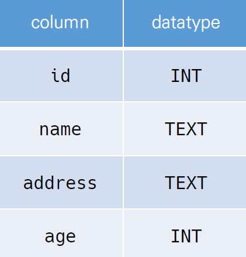
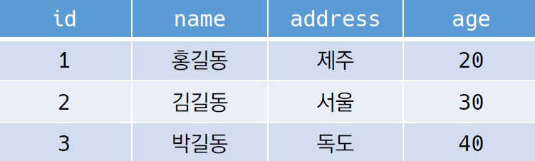

# DB_basic

- **Database**
  - **체계화된 데이터의 모임**
  - 자료 항목의 중복을 없애고 자료를 구조화하여 저장한 자료의 집합체
  - 장점
    - **데이터 중복 최소화**
    - **데이터 무결성**
    - **데이터 일관성**
    - **데이터 독립성 (물리적 / 논리적)**
    - **데이터 표준화**
    - **데이터 보안 유지**

### 1. RDB (관계형 데이터베이스)

- Key와 Value들의 관계를 Table 형태로 정리한 데이터베이스

- **스키마 (schema)**

  - DB의 전반적인 명세를 기술한 것

     

- **테이블 (Table)**

  - 열과 행의 모델을 사용해 조직된 데이터들의 집합

     

- **열 (Column / Field)**

  - 고유한 데이터 형식이 지정

    ex) name 필드에 TEXT 형식, age 필드에 INTEGER 형식

- **행 (Row / Record)**

  - 실제 데이터가 저장되는 형태

    ex) 위 데이터에서는 3개의 레코드가 저장되어 있음

- **기본키 (Primary Key)**

  - 각 행의 고유 값
  - **필수 설정 값**


### 2. RDBMS (관계형 데이터베이스 관리 시스템)

- Relational Database Management System
  - MySQL
  - SQLite
  - PostgreSQL
  - ORACLE
  - MS SQL


### 3. SQL (Structured Query Language)

- RDB의 데이터 관리를 위해 설계된 프로그래밍 언어

  1) 데이터베이스 스키마 생성 및 수정

  2) 자료의 검색 및 관리

  3) 데이터베이스 객체 접근 조정 관리

- 분류

  1. **DDL (Data Definition Language)**

     - 데이터 정의 언어
     - **CREATE, DROP, ALTER**

  2. **DML (Data Manipulation Language)**

     - 데이터 조작 언어
     - **INSERT, SELECT, UPDATE, DELETE**

  3. **DCL (Data Control Language)**

     - 데이터 제어 언어
     - **GRANT, REVOKE, COMMIT, ROLLBACK**

     

- DB 생성

  ```python
  $ sqlite3 DB_name.sqlite3
  sqlite> .database
  ```

- csv 파일을 Table로 생성

  ```python
  sqlite> .mode csv
  sqlite> .import file_name.csv table_name
  sqlite> .tables 	# DB 내 테이블 조회
  ```

  **① 테이블 생성 및 삭제**

  - **CREATE TABLE**

    ```sql
    CREATE TABLE tabel_name (
      id INTEGER PRIMARY KEY,
        -- PK 미지정시 SQLite에서 rowid 필드로 id 자동 관리
        -- AUTOINCREMENT 속성을 사용하여 pk(id) 재사용 방지 가능
      column_name type(TEXT / INTEGER / ect) NOT NULL
        -- NOT NULL = 옵션 사항
    )
    ```

  - **DROP TABLE**

    ```sql
    DROP TABLE table_name
    ```

  - **ALTER TABLE**

    ```sql
    -- Table_name 수정
    ALTER TABLE table_name
    RENAME TO new_table_name;
    -- new_column 추가
    ALTER TABLE table_name
    ADD COLUMN column_name data_type option;
    -- column_name 수정
    ALTER TABLE table_name
    RENAME COLUMN column_name TO new_col_name;
    ```

    

  -------CRUD-------

  **② CREATE (데이터 삽입)**

  - **INSERT INTO**

    ```sql
    INSERT INTO table_name (column1, column2, ...)
    VALUES (value1, value2, ...);
    ```

  **③ READ (조회)**

  - **SELECT**

    ```sql
    SELECT column1, column2, ... / * FROM table_name;
    ```

  - **LIMIT**

    ```sql
    -- 지정 수 만큼 데이터 조회
    SELECT column1, ... FROM table_name
    LIMIT INTEGER;
    ```

  - **OFFSET**

    ```sql
    -- 지정 위치에서 부터 조회 (지정 수 만큼 제외하고 조회)
    SELECT column1, ... FROM table_name
    OFFSET INTEGER;
    ```

  - **WHERE**

    ```sql
    -- 특정 데이터 조회 (조건)
    SELECT column1, ... FROM table_name
    WHERE condition;
    ```

  - **LIKE**

    ```sql
    -- 패턴을 확인하여 해당하는 값 조회
    SELECT column1, ... FROM table_name
    WHERE column_name
    LIKE wildcards(%, _);
    -- % = 0개 이상 문자 존재 가능
    -- _ = 1개의 문자 필수 존재
    ```

  - **DISTINCT**

    ```sql
    -- 데이터 중복 없이 조회
    SELECT DISTINCT column1, ... FROM table_name;
    ```

  - **ORDER BY**

    ```sql
    SELECT column1, ... FROM table_name
    -- 오름차순 / 생략가능(default)
    ORDER BY column_name ASC;
    -- 내림차순
    ORDER BY column_name DESC;
    -- 중첩사용 / col1 = 오름차순, col2 = 내림차순
    ORDER BY column1_name, column2_name DESC;
    ```

  - **GROUP BY**

    ```sql
    -- 지정된 기준에 따라 행 세트를 그룹으로 결합
    -- 데이터 요약 시 주로 사용
    SELECT col_name, aggregtae_function(col_name) FROM table_name
    GROUP BY col1, ...;
    ```

  **④ DELETE (삭제)**

  - **DELETE**

    ```sql
    -- 고유 값을 기준으로 삭제 권장
    DELETE FROM table_name
    WHERE condition;
    ```

  **⑤ UPDATE (수정)**

  - **UPDATE + SET** 

    ```sql
    -- 고유 값을 기준으로 수정 권장
    UPDATE table_name SET column1=value1, ...
    WHERE condition;
    ```

- **SQLite Functions (Aggregation function)**

  - **COUNT**

    ```sql
    -- 레코드 개수 조회
    SELECT COUNT(column) FROM table_name;
    ```

  - **AVG**

    ```sql
    -- INTEGER 타입 필드의 평균 조회
    SELECT AVG(column) FROM table_name;
    ```

  - **MAX**

    ```sql
    -- INTEGER 타입 필드의 최고값 조회
    SELECT MAX(column) FROM table_name;
    ```

  - **MIN**

    ```sql
    -- INTEGER 타입 필드의 최소값 조회
    SELECT MIN(column) FROM table_name;
    ```

  - **SUM**

    ```sql
    -- INTEGER 타입 필드의 합 조회
    SELECT SUM(column) FROM table_name;
    ```


### 4. SQL & ORM

- shell_plus --print-sql

- 모든 레코드 조회

  ```python
  # orm
  Model.objects.all()
  ```

  ```sql
  -- sql
  SELECT * FROM table_name;
  ```

- 레코드 생성

  ```python
  # orm
  Model.objects.create(
      col1 = value1,
      col2 = value2,
      ...
  )
  ```

  ```sql
  -- sql
  INSERT INTO table_name
  VALUES (value1, value2, ...);
  ```

- 해당 레코드 조회

  - `101` 번 id의 전체 레코드 조회

  ```python
  # orm
  Model.objects.get(pk=101)
  ```

  ```sql
  -- sql
  SELECT * FROM users_user
  WHERE id=101;
  ```

- 해당 user 레코드 수정

  - ORM: `101` 번 글의 `last_name` 을 '김' 으로 수정
  - SQL: `101` 번 글의 `first_name` 을 '철수' 로 수정

  ```python
  # orm
  Model.objects.filter(pk=101).update(first_name='철수', last_name='김')
  ```

     ```sql
  -- sql
  UPDATE table_name
  SET first_name='철수', last_name='김'
  WHERE id=101;
     ```

- 해당 레코드 삭제

  - `ORM` : `101` 번 글 삭제
  - `SQL` :  `101` 번 글 삭제 

  ```python
  # orm
  Model.objects.filter(pk=101).delete()
  ```

  ```sql
  -- sql
  DELETE FROM table_name
  WHERE id=101;
  ```


---


### 2. 조건에 따른 쿼리문

1. 전체 레코드 수 

   - 전체 레코드 수

   ```python
   # orm
   Model.objects.count()
   ```

   ```sql
   -- sql
   SELECT COUNT(*) AS count FROM table_name
   ```

2. age가 30인 사람의 first_name

   - `ORM` : `.values` 활용
     - 예시: `User.objects.filter(조건).values('컬럼이름')`

   ```python
   # orm
   Model.objects.filter(age=30).values('first_name')
   ```

      ```sql
   -- sql
   SELECT first_name FROM table_name
   WHERE age=30;
      ```

3. age가 30살 이상인 레코드 수

   -  ORM: `__gte` , `__lte` , `__gt`, `__lt` -> 대소관계 활용

   ```python
   # orm
   Model.objects.filter(age__gte=30).count()
   ```

      ```sql
   -- sql
   SELECT COUNT(age) FROM users_user
   WHERE age>=30;
      ```

4. age가 20살 이하인 레코드 수

   ```python
   # orm
   Model.objects.filter(age__lte=20).count()
   ```

   ```sql
   -- sql
   SELECT COUNT(age) FROM table_name
   WHERE age<=20;
   ```

5. age가 30이면서 last_name이 '김'인 레코드 수

   ```python
   # orm
   Model.objects.filter(age=30, last_name='김').count()
   ```

      ```sql
   -- sql
   SELECT COUNT(last_name) FROM table_name
   WHERE age=30 AND last_name='김';
      ```

6. age가 30이거나 last_name이 '김'인 레코드

   ```python
   # orm
   Model.objects.filter(Q(age=30) | Q(last_name='김')).values()
   ```

   ```sql
   -- sql
   SELECT * FROM table_name
   WHERE age>=30 or last_name='김';
   ```

7. phone의 시작이 02인 레코드 수

   - `ORM`: `__startswith` , `__endswith`, `__contain`

   ```python
   # orm
   Model.objects.filter(phone__startswith='02').count()
   ```

      ```sql
   -- sql
   SELECT COUNT(phone) FROM table_name
   WHERE phone LIKE '02-%';
      ```

8. country가 '강원도'이면서 last_name이 '황'씨인 레코드의 first_name

   ```python
   # orm
   Model.objects.filter(last_name='황', country='강원도').values(first_name)
   ```

      ```sql
   -- sql
   SELECT first_name FROM table_name
   WHERE last_name='황' and country='강원도';
      ```


---


### 3. 정렬 및 LIMIT, OFFSET

1. age가 많은 사람순으로 10명

   ```python
   # orm
   Model.objects.order_by('-age')[:10]
   ```

      ```sql
   -- sql
   SELECT * FROM table_name
   LIMIT 10;
      ```

2. balance가 적은 사람순으로 10명

   ```python
   # orm
   Model.objects.order_by('balance')[:10]
   ```

      ```sql
   -- sql
   SELECT * FROM table_name
   ORDER BY balance
   LIMIT 10;
      ```

3. balance는 오름차순, age는 내림차순으로 10명

   ```python
   # orm
   Model.objects.order_by('balance', '-age')[:10]
   ```

   ```sql
   -- sql
   SELECT * FROM table_name
   ORDER BY balance, age DESC
   LIMIT 10;
   ```

4. last_name, first_name 내림차순 순으로 5번째 있는 레코드

   ```python
   # orm
   Model.objects.order_by('-last_name', '-first_name')[4]
   ```

      ```sql
   -- sql
   SELECT * FROM users_user
   ORDER BY last_name DESC, first_name DESC
   OFFSET 4;
      ```


---


### 4. 표현식

> ORM: `aggregate` 사용
>
> https://docs.djangoproject.com/en/3.2/topics/db/aggregation/#aggregation
>
> - '종합', '합계' 등의 사전적 의미
> - 특정 필드 전체의 합, 평균 등을 계산할 때 사용

1. 전체 평균 age

   ```python
   # orm
   Model.objects.aggregtae(Avg('age'))
   ```

      ```sql
   -- sql
   SELECT AVG(age) FROM table_name;
      ```

2. last_name='김'의 평균 나이

   ```python
   # orm
   Model.objects.filter(last_name='김').aggregate(Avg('age'))
   ```

      ```sql
   -- sql
   SELECT AVG(age) AS avg_age FROM table_name
   WHERE last_name='김';
      ```

3. country='강원도'인 레코드의 평균 balance

   ```python
   # orm
   Model.objects.filter(country='강원도').aggregate(Avg('balance'))
   ```

   ```sql
   -- sql
   SELECT AVG(balance) FROM table_name
   WHERE country='강원도';
   ```

4. balance 중 가장 높은 값

   ```python
   # orm
   Model.objects.aggragate(Max('balacne'))
   ```

      ```sql
   -- sql
   SELECT MAX(balance) FROM table_name;
      ```

5. balance 총액

   ```python
   # orm
   Model.objects.aggragate(Sum('balance'))
   ```

      ```sql
   -- sql
   SELECT SUM(balance) FROM table_name;
      ```


- annotate

  ```python
  User.objects.values('country').annotate(Count('country'))
  User.objects.values('country').annotate(num_countries=Count('country'))
  ```

  ```sql
  SELECT COUNT(country) AS num_counyties FROM users_user
  GROUP BY country;
  ```

  

