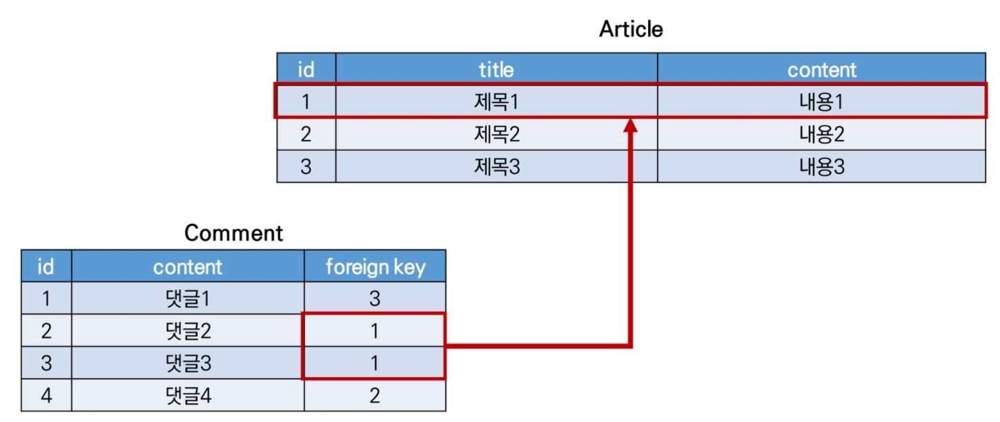

# DB_02

## Foreign Key

- **외래 키(ForeignKey)** : 관계형 데이터베이스에서 한 테이블의 필드 중 **다른 테이블의 행을 식별(참조)할 수 있는 키**



- **특징**

  - 부모 테이블의 **유일한 값**을 참조 (참조 무결성)
  - 항상 기본키(pk/id)일 필요는 없음

- **ForeignKey field**

  - **Many To One (1:N)** 관계

  - 필드명 = 인스턴스명_id

  - **필수인자**

    ​	**1) 참조하는 model class**

    ​	**2) on_delete** : 부모 데이터 삭제 시 자식 데이터에 취할 작업

    ​			**\- CASCADE : 부모와 같이 삭제**

    ​			**\- PROTECT : 자식이 존재하는 경우 부모 데이터 삭제 불가**

    ​			**\- RESTRICT : 자식이 직접 참조인 경우 부모 데이터 삭제 방지 (PROTECT 보다 유연)**

    ​			\- SET_NULL : NULL 값으로 저장

    ​			\- SET_DEFAULT : 기본 값으로 저장

    ​			\- SET : 특정 함수를 정의하여 작동

    ​			\- DO_NOTHING : 아무 작업도 하지 않음

  - **related_name**

    ​	\- 역참조 시 사용할 이름을 정의하는 옵션

- **1:N 관계 related manager**

  - **역참조 ('자식 클래스 명_set')**

    ​	\- 부모 클래스에서 자식 클래스 조회 시 사용

  - **참조 ('부모 클래스 명')**

    ​	\- 자식 클래스에서 부모 클래스 조회 시 사용

- **ModelForm 작성 시 유의사항**

  - ForeignKey를 지닌 모델의 폼 작성 시 ForeignKey 필드를 상속 항목에서 제외 필요


## CREATE

- **save( )**

  - **commit=False** : DB에 바로 저장하지 않고 인스턴스로 반환 / ForeignKey 지정 처리 시 유용

    ```python
    #### 예 시 ####
    def comments_create(request, pk):
        if request.method == 'POST':
            article = get_object_or_404(Article, pk=pk)
            comment = CommentForm(request.POST)
            if comment.is_valid():
                comment = comment.save(commit=False)
                comment.article = article
                comment.save()
                return redirect('articles:detail', pk)
        else:
            return redirect('articles:detail', pk)
    ```


## Substituting a custom User model

- User 모델 대체

  - 내장 User 모델이 제공하는 요구사항이 부적절 한 경우 사용
  - **AUTH_USER_MODEL** 값을 통해 User model을 재정의(override) 가능

- **AUTH_USER_MODEL**

  - 프로젝트 진행 중 변경 제한

  - 첫 마이그레이션 전에 작업 권장

  - AbstractUser를 상속받아 Custom User 모델 작성

    ```python
    #### models.py ####
    from django.contrib.auth.models import AbstractUser
    
    class User(AbstractUser):
        pass
    ```

  - AUTH_USER_MODEL을 Custom User 모델로 변경

    ```python
    #### settings.py ####
    AUTH_USER_MODEL = 'accounts.User'
    ```

  - 관리자 페이지에 Custom User 모델 등록

    ```python
    #### admin.py ####
    from django.contrib.auth.admin import UserAdmin
    from .models import User
    
    admin.site.register(User, UserAdmin)
    ```

  - 첫 마이그레이션 이후 작업 시 DB 초기화


## Custom user & Built-in auth forms

- modelform의 경우 기존 User 모델을 상속받기 때문에 재정의 필요

- **UserCreationForm**

  ```python
  #### forms.py ####
  from django.contrib.auth.forms import UserCreationForm
  
  class CustomUserCreationForm(UserCreationForm):
      
      class Meta(UserCreationForm.Meta):
          model = get_user_model()
          fields = UserCreationForm.Meta.fields + ['',]
  ```

- **UserChangeForm**

  ```python
  from django.contrib.auth.forms import UserChangeForm
  
  class CustomUserChangeForm(UserChangeForm):
      
      class Meta:
          model = get_user_model()
          fields = ['',]
  ```


## 1 : N (User - Article)

- **User 모델 참조**
  - **settings.AUTH_USER_MODEL** : **models.py에서** User 모델 참조 시 사용 / settings 가 가장 먼저 로드 되기 때문
  - **get_user_model()** : **models.py가 아닌 모든 곳에서** User 모델 참조 시 사용 / 현재 활성화 된 User 모델 반환

