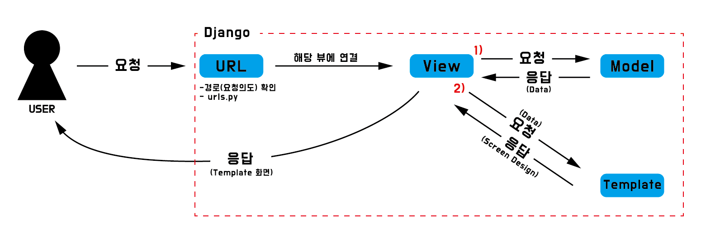
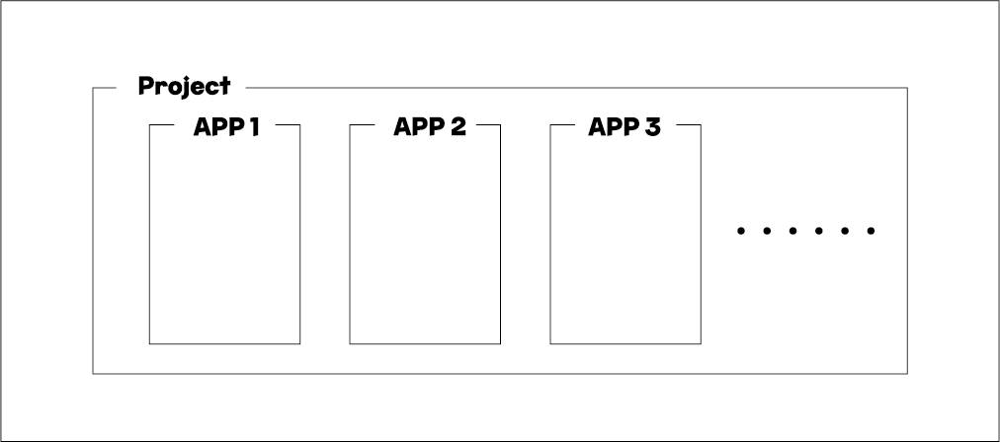

# Django_01

## 1. Python web farmework

- Django, Flask, FastAPI etc...
- ex) 개인 창업(HTML, CSS) vs 프랜차이즈(Framwork)
- 프로그래밍에서 특정 운영 체제를 위한 응용 프로그램 표준 구조를 구현하는 클래스와 라이브러리 모임
- 재사용 가능한 코드를 프레임워크로 통합함으로써 표준 코드 재작성 방지

## 2. Framework Architecture

- **MVC Design Pattern (model-view-controller)**

  - 사용자 인터페이스로부터 프로그램 로직을 분리하여 시각적 요소나 이면에서 실행되는 부분을 서로 영향을 미치지 않고 쉽게 고칠 수 있음

  - **Model**

    ​	\- 응용프로그램의 데이터 구조를 정의하고 데이터베이스의 기록을 관리(추가, 수정, 삭제)

  - **Template**

    ​	\- 파일의 구조 및 레이아웃을 정의

  - **View**

    ​	\- HTTP 요청 수신 및 HTTP 응답 반환

    ​	\- Model을 통해 필요한 데이터에 접근 / Template을 통해 응답 서식 작성

- **MTV Design Pattern (model-template-view)**

  | MTV(Django) |    MVC     |
  | :---------: | :--------: |
  |    Model    |   Model    |
  |  Template   |    View    |
  |    View     | Controller |

## 3. Server-Client 구조



## 4. Django 기초 사용법

### ※ 정리 ※

#### 1) 가상환경 생성

```
$ python -m venv venv(가상환경 폴더명)
```

#### 2) 가상환경 실행

```
$ source venv/Script/activate
```

#### 3) 장고 설치

```
$ pip install django
```

#### 4) 장고 PJT 생성

```
$ django-admin startproject config(설정 폴더명) .(dot 미작성시 프로젝트 폴더, 설정폴더가 같이 생성)
```

#### 5) 장고 작동 확인

```
$ python manage.py runserver (주소로 이동하여 로켓 확인 / 종료 = ctrl + c)
```

#### 6) 애플리케이션 생성

```
$ python manage.py startapp article(APP명)
```

#### 7) settings.py / INSTALLED_APPS에 APP 추가

```python
INSTALLED_APPS = [
	'article(APP명)',
]
```

#### 8) urls.py / path 등록

```python
from article(APP명) import views

urlpatterns = [
	path('경로/', views.<function>),
]
```

#### 9) views.py / 함수 등록

```python
def <function>(request):	# 첫 번째 인자는 항상 request
	return render(request, '<파일명>.html')	# 반환은 render 함수 적용, 첫 번째 인자는 항상 requrest
```

#### 10) \<APP>/templates/<파일명>.html

```
templates 폴더 위치, 폴더명 확인 필수
※ 오류 시 Template Does Not Exist 오류 발생
```

### 1. 설정폴더(=pjt 폴더)

- asgi.py (Asynchronous Server Gateway Interface)

  - 주로 배포 시 설정

- **settings.py**

  - 애플리케이션의 모든 설정 포함

  - **INSTALLED_APPS**

    ​	\- Django PJT에서 사용하는 애플리케이션 등록

  - MIDDLEWARE

    ​	\- Django에서 사용하는 미들웨어

  - ROOT_URLCONF

    ​	\- URL 위치

  - **TEMPLATES**

    - APP_DIRS : True (자동탐색) / False(수동탐색)

    - **BASE_DIR**

      ​	\- 프로젝트 최상위 폴더에 위치한 templates 폴더

  - DATABASE

    ​	\- DB 설정

  - AUTH_PASSWARD_VALIDATORS

    ​	\- 로그인/아웃 설정

  - **LANGUAGE_CODE**

    ​	\- 서버 언어 설정 : 'en-us', 'ko-kr' 등

  - **TIME_ZONE**

    ​	\- 시스템 서버 시간 설정 : 'Asia/Seoul', 'UTC' 등

  - USE_I18N

    ​	\- 언어 지원 여부

  - USE_L10N

    ​	\- 시간 양식 포맷 지원 여부

  - USE_TZ (UTC_TZ)

    ​	\- DB 저장시간 UTC 지원 여부

- **urls.py**

  - 사이트의 url과 적절한 views 연결 지정

- wsgi.py (Web Server Gateway Interface)

  - 웹 서버와 연결 및 소통 지원

- **manage.py** / 최상위 폴더(프로젝트 폴더)에 위치

  - django 커맨드라인 유틸리티 (수정 X)

### 2. APP 폴더

- admin.py
  - 관리자용 페이지 설정
- apps.py
  - 앱의 정보 작성
- **models.py**
  - model을 정의 / DB를 정의
- tests.py
  - 프로젝트 테스트 코드 작성 (TDD방식)
- **views.py**
  - view 함수 정의
- migrations (directory)
  - model 관련 폴더

### 3. Django Template Language(DTL)

- 데이터 표현을 제어하는 도구이자 표현에 관련된 로직

- if ,for 등 사용 가능

- **Variable (변수)**

  ​	**\- {{ variable }}**

  ​	\- view -- data/변수명 --> Template

  ​		※ view로부터 변수 전달 (**views.py에서 변수 정의**)

  ​	**\- dot(.) 연산자로 변수 속성에 접근 가능 (python 인덱스 접근[n] 과 같은 역할)**

  ​	**\- render()의 세번째 인자로 {'key': value}(딕셔너리 형태)로 전달**

  ​		**=> context 변수로 딕셔너리 생성 후 전달 가능**

- **Filters**

  ​	\- 표시할 변수를 수정할 때 사용

  ​	\- {{ variable | filter }}

  ​		※ Template에서 계산 지양

  ​			계산 필요 시 python에서 계산 후 전달

  ​	\- 변수 필수

- **Tags**

  ​	\- 

  ​	\- 일부는 시작 / 종료 태그 필요

  ​		ex)  

- **Comments**

  ​	\- {#  #} : 한 줄 주석

  ​	\- django template에서 주석을 작성하기 위해 사용

  ​	\-  : 여러줄 주석

### 4. 프로젝트란?

- Application(기능)의 집합

  

- **※ 작성 순서 ※**

  요청과 응답 흐름 순서대로 코드를 작성 및 수정

  (**① urls.py => ② views.py => ③ templates**)

## 4. Static web page (정적 웹 페이지 / flat_page)

- 미리 설정된 파일을 그대로 전달하는 웹 페이지
- **모든 상황 / 모든 사용자에게 동일한 정보 표시**

## 5. Dynamic web page (동적 웹 페이지)

- 방문자와 상호작용하여 상황 / **사용자마다 다른 정보 표시**
- ex) 개인정보 등

## 6. Template inheritance (템플릿 상속)

- 코드의 재사용성에 초점

- 최상위 폴더에 templates 폴더 생성 / 중복 사용 부분 base.html 작성

- settings에 수동으로 폴더 위치 지정 : settings.py / TEMPLATES / DIRS = [BASED_DIR / 'templates']

  ① project 폴더에 templates 폴더 생성

  ② base.html 파일 생성

  ③ settings.py / TEMPLATES / DIRS = [BASED_DIR / 'templates'] 경로 지정

  ④ 각 html 파일에 내용 작성

  ```django
  
  
  
  	content
  
  ```

## 7. Django 설계 철학

- 표현과 로직을 분리
- 중복을 배제

## 8. HTML "form" element

- 웹에서 사용자 정보를 입력하는 방식을 제공 / 데이터를 서버로 전송하는 역할
- 핵심 속성
  - **action** : 입력된 데이터를 원하는 서버로 전송하기 위해 전송할 주소를 작성
  - **method** : 데이터 전송 방법 / default = "get"
  - **name** : 입력된 데이터의 호출명
- **request method - "get" / "post"**
  - 데이터를 서버로 전송 시 body가 아닌 **Query String Parameters(?key=value)**를 통해 전송
- 목적지 미지정 = 현재 경로로 전달

## 9. URL

- Dispatcher(발송자, 운항 관리자)로서의 URL

### Variable Routing

- path에 값(변수)를 전달하는 방법

- ex) 경로 == /user_id/content_number/

  ​		※ 사용자와 게시물이 매우 많다면?

  ​			=> 매우 많은 path(경로) 필요 & 사용자의 작성, 삭제 등에 일일이 대응하기 어려움

  ​		※ 변수1 = user_id / 변수2 = content_number  => **경로를 변수화**

  ​		※ DB에 변수로 요청

  ​		**※ 기존 경로 주소를 찾아가지 못 할 수 있음 => 중복되지 않도록 순서를 변경하거나 구분 가능한 pattern을 추가하여 작성**

#### URL Path converters

- 변수 저장 default = str
  - 지정 방법 : \<str:변수명> / \<int:변수명>/\<slug:변수명>
  - str = 문자열 / int = 0 또는 양의 정수 / slug = ASCII문자 또는 숫자, '-', '_' 로 구성된 모든 슬러그 문자열

### APP URL Mapping

- URL을 분리하여 각 app에 urls.py를 작성

- view함수의 중첩을 줄이고 유지, 보수가 쉬움

  **① 설정 폴더 / urls.py**

  ​		\- include() 함수 호출 및 APP.urls path 등록

  ```python
  from django.urls import path, include
  
  urlpatterns = [
  	path('articles/', include('articles.urls'))
  ]
  ```

  **② APP 폴더 / urls.py**

  ​		\- 각 APP 폴더 내부에 urls.py 파일 생성

  ​		\- path()함수 및 views 모듈 호출

  ​		\- app_name 작성 및 urlpatterns 리스트 생성

  ​		\- path 마지막 인자로 path 명 지정

  ```python
  from django.urls import path
  from . import views
  
  app_name = 'articles'
  urlpatterns = [
  	path('index/', views.index, name='index'),
  	...
  ]
  ```

  **③ Templates_namespace**

  ​		\- templates / App 명 폴더 / html 파일 구조로 폴더 생성

  ​		\- views.py 에서 return 경로 작성 시 'App명/__.html'로 작성

  ```python
  def index(request):
  	return render(request, 'articles/index.html')
  ```

  

