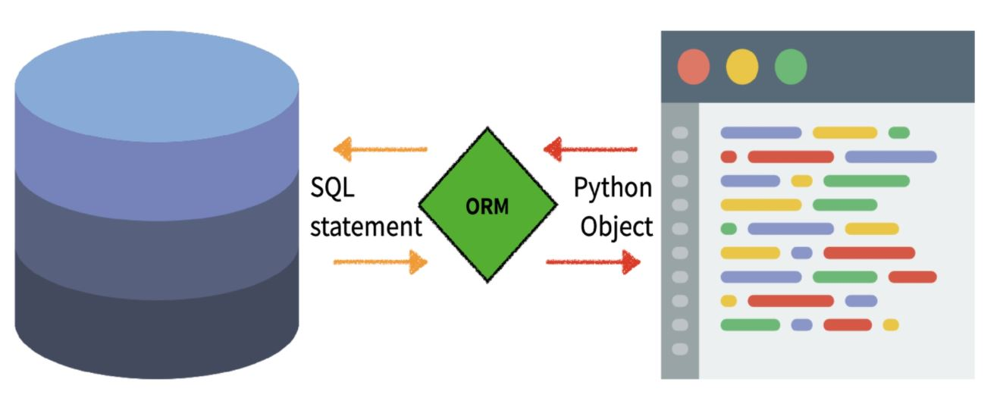

# Django_02

- **Model**

  - 웹 애플리케이션의 데이터를 구조화하고 조작하기 위한 도구

  - 사용자가 정하는 데이터들의 필수적인 필드들과 동작들을 포함

  - 데이터에 접속 및 관리

  - Database table에 mapping

    **※ Model != DataBase ※**

- **DB (DataBase)**
  - 체계화된 데이터의 모임
- **Qurey (쿼리)**
  - 데이터를 조회하기 위한 명령어

### 1. DB 기본 구조

- **스키마 (Schema)**
  - DataBase 자료의 구조, 표현방법, 관계 등을 정의한 구조
  - 구조와 제약조건에 관련한 전반적인 명세를 기술
- **테이블 (Table)**
  - 열(column/field)과 행(row/record)의 모델을 사용해 조직된 데이터 요소들의 합
- **필드 (Field / Column)**
  - 각 열에는 고유한 데이터 형식 지정
- **레코드 (Record / Row)**
  - 테이블의 데이터는 행에 저장
- **PK (Primary Key)**
  - 각 행의 고유값(기본키) / **반드시 설정**
  - Database 관리 및 관계 설정 시 활용

### 2. ORM (Object-Relational-Mapping)



- 객체 관계 매핑 / DB를 객체(object)로 조작하기 위해 ORM 사용

- 객체 지향 프로그래밍 언어를 사용하여 호환되지 않는 유형의 시스템 간 데이터를 변환하는 프로그래밍 기술

- ex) Django -- SQL

- 장점

  - SQL을 잘 몰라도 DB 조작 가능
  - SQL의 절차적 접근이 아닌 객체 지향적 접근으로 높은 생산성 발휘

- 단점

  - ORM 만으로 완전한 서비스를 구현하기 어려운 경우 발생

  **※ 현 웹 프레임워크의 요점 = 생산성(개발 속도) 향상 ※**

### 3. Model

- **models.py**

  ​	\- django.db 모듈의 models 호출

  ​	\- class 정의

  ​	\- 모델의 필드(attribute) 정의

  ```python
  from django.db import models
  
  class Article(models.Model):	# 설계도(migration)
      title = models.CharField(max_length=10)
      content = models.TextField()
      created_at = modles.DateTimeField(auto_now_add=Ture)
      updated_at = modles.DateTimeField(auto_now=Ture)
      
      def __str__(self):	# 개발자 및 사용자용 문자열 반환 기능 / 작성 후 shell_plus 재시작
          return self.title
  ```

### 4. Migrations

- Django가 Model에 생긴 변화를 DataBase에 반영하는 방법

- 명령어

  - **makemigrations**
  - **migrate**
  - sqlmigrate
  - showmigrations

- **makemigrations**

  - model을 변경한 것에 기반한 새로운 **migration(설계도)**을 만들 때 사용

    ```
    $ python manage.py makemigrations
    ```

    ※ **migration 수정 시 다시 makemigrations 필수** / dependencies >> 기반 문서와 연결된 migration 생성 ※

- **migrate**

  - migration을 DB에 반영하기 위해 사용

  - model에서 변경 사항들과 DB의 스키마 동기화

    ```
    $ pthon manage.py migrate
    ```

- **sqlmigrate**

  - migration에 대한 SQL 구문으로 어떻게 해석되는지 미리 확인

    ```
    $ python manage.py sqlmigration App명 migration번호(ex>0001)
    ```

- **showmigrations**

  - 프로젝트 전체의 migration 상태 확인

  - migration 파일들의 migrate 여부 확인

    ```
    $ python manage.py showmigrations
    ```

- **migration 순서**

  - **① models.py / class 생성**	>>	**② migrations(설계도) 생성**	>> **③ DB반영 (model과 DB 동기화 / migrate)**

### 5. DB API

- database-abstract API == database-access API

- DB를 조작하기 위한 도구
- Model 생성 시 database-abstract API 자동 생성

- **DB API 구문 (Making Queries)**

  ```
  Article.objects.all()
  ClassName.Manager(objects).QuerySetAPI()
  ```

  - **Manager**
    - Django model에서 DB query 작업이 제공되는 인터페이스
    - **objects** 라는 Manager 자동 추가
  - **QuerySet (응답)**
    - DB로 부터 전달받은 **객체 목록**
    - Queryset **내부 객체는 0 ~ 여러 개 가능**
    - DB로 부터 조회, 필터, 정렬 등의 기능 수행

- **Django-shell**

  - 장고 프로젝트 설정이 load된 python shell 활용

  - 사용 방법

    1) 설치

    ```
    $ pip install django-extensions
    $ pip install ipython
    ```

    2) settings.py / INSTALLED_APP에 등록

    ```
    INSTALLED_APP = [
    	'django_extensions',
    ]
    ```

    3) 실행

    ```
    $ python manage.py shell_plus
    ```

    4) 종료

    ```
    exit()
    ```

### 6. CRUD (Create, Read, Update, Delete)

- 소프트웨어가 가지는 기본적인 데이터 처리 기능
- Create(작성), Read(읽기), Update(수정), Delete(삭제)를 묶어서 일컫는 용어

#### Django shell CRUD 방법

- **CREATE(작성)**

  **1.** 인스턴스 생성 후 인스턴스 변수 설정

  ```
  article = Aritcle()
  article.attribute1 = ' '
  article.attribute2 = ' '
  article.save()	# 저장(DB에 등록)
  Article.objects.all()	# 확인 / (atricle.attribute, article.id, article.pk)
  ```

  **2.** 초기 값과 함께 인스턴스 생성

  ```
  article = Article(attribute1=' ', attribute2=' ')
  article.save()	# 저장(DB에 등록)
  ```

  **3.** QuerySet API - create() 사용

  ```
  Article.objects.create(attribute1=' ', attribute2=' ')	# 저장까지 완료(QuerySet API)
  ```

  - **save() - method**

    \- 객체를 DB에 저장 / **DB에 저장하기 위해서 save() 필수**

    \- 데이터 생성 시 save() 호출 전까지 객체의 ID값 존재 X (ID는 DB에서 계산되기 때문)

- **READ(읽기)**

  - QuerySet API method는 크게 2가지로 분류 가능
    - return new querysets (QuerySet 반환)
    - do not return querysets (QuerySet 미반환)

  - **all( ) - method**

    \- 전체 QuerySet의 복사본 반환

    ```
    Article.objects.all()
    ```

  - **get( ) - method**

    \- 주어진 lookup 매개변수와 일치하는 객체 반환

    \- 객체를 찾을 수 없거나 둘 이상의 객체를 찾으면 예외 발생 **(DoesNotExist / MultipleObjectReturned)**

    **※ primary key(pk) 와 같이 고유성(unique)을 보장하는 조회에서 사용 ※**

    ```
    Article.objects.get(pk=n)
    ```

  - **filter( ) - method**

    \- 주어진 lookup 매개변수와 일치하는 객체를 포함하는 새 QuerySet 반환 (예외 미발생)

    ```
    Article.objects.filter(attribute=' ')
    ```

- **UPDATE(수정)**

  - article 인스턴스 객체의 인스턴스 변수의 값을 변경 후 저장

  **1.** 수정할 항목 선택

  ```
  article = Article.objects.get(pk=n)
  ```

  **2.** 값을 변경하고 저장

  ```
  article.attribute = ' '
  article.save()
  ```

  **3.** 변경 확인

  ```
  article.attribute
  ```

- **DELETE(삭제)**

  - QuerySet의 모든 행에 대해 SQL 삭제 쿼리를 수행 / 삭제된 객체에 관한 **딕셔너리 반환**

  **1.** 삭제할 항목 선택

  ```
  article = Article.objects.get(pk=1)
  ```

  **2.** 삭제 method 실행

  ```
  article.delete()
  ```

  **3.** 삭제 확인 (DoesNotExist 예외 발생)

  ```
  Article.objects.get(pk=1)
  ```

#### views.py & __.html CRUD작성 방법

- index_ 모든 게시글 출력

  **1) views.py**

  ```python
  def index(request):
      articles = Article.objects.all()
      context = {
          'articles': articles,
      }
      return render(request, 'articles/index.html', context)
  ```

  **2) index.html**

  ```django
  
  
  
     <h2>{{ articles }}</h2> 
    
      <p>Attribute1 : {{ article.attribute1 }}</p>
      <p>Attribute2 : {{ article.attribute2 }}</p>
    
  
  ```

- **Create**

  **1) views.py**

  ```python
  def new(request):
      return render(request, 'articles/new.html')
  
  
  def create(request):
      attribute1 = request.POST.get('attirbute1')
      attribute2 = request.POST.get('attribute2')
      article = Article(attribute1=attribute1, attribute2=attribute2)
      article.save()	# 다른 방식보다 간편하면서 유효성 검사를 진행할 여유가 있음
      return render(request, 'articles/create.html')
  ```

  **2) new.html**

  ```django
  
  
  
    <form action="" method="POST">	{# 서버로 데이터 전송 시 POST method 사용 #}
      	{# csrf_token을 통해 csrf공격 예방 #}
      <label for="attribute1">Titel: </label>
      <input type="text" id="attribute1" name="attribute1">
      <br>
      <label for="attribute2">Content</label>
      <br>
      <textarea name="attribute2" id="attribute2" cols="30" rows="10"></textarea>
      <input type="submit">
    </form>
  
  ```

- **HTTP method**

  - **GET**

    ​	\- 특정 리소스를 가져올 때 사용 (ex> 검색)

    ​	\- 전달 데이터 노출 / 전달 데이터 크기 제한

    ​	\- DB에 변화 X

  - **POST**

    ​	\- 서버로 데이터 전송 시 사용

    ​	\- HTTP body에 담아서 전송 => 외부에 노출 X (개발자 도구로 확인 가능)

    ​	\- 서버에 병경사항 생성 (DB에 영향)

- **CSRF (Cross-Site-Request-Forgery)**

  - 사용자가 자신의 의지와 무관하게 공격자가 의도한 행동을 하여 특정 웹페이지를 보안에 취약하게 하거나 수정, 삭제 등의 작업을 하게 만드는 공격 방법

  - 공격 방어

    - 경로에 **hash (csrf-token) 추가**

    - Security Token

      ​	\- 임의의 난수 값을 부여하여 token이 유효한지 검증

      ​	\- {}