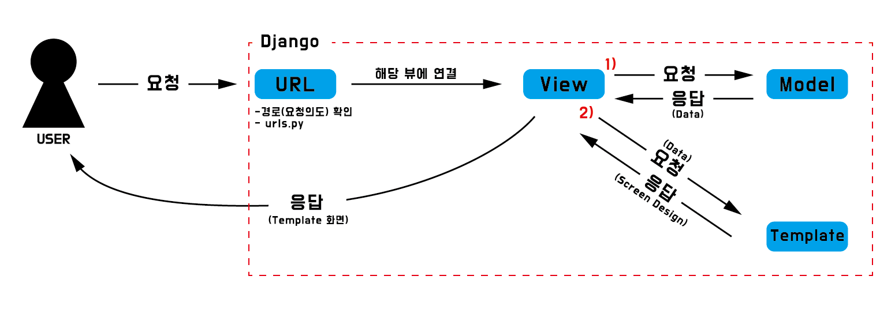
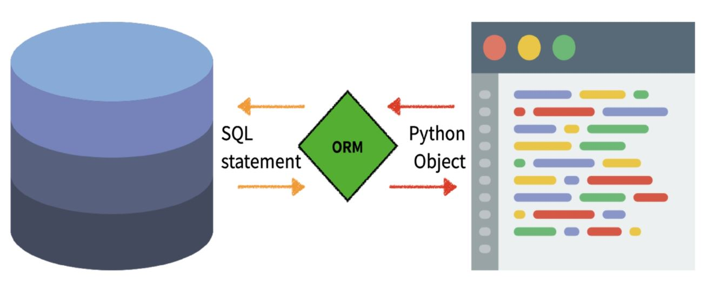

# Django_week_01

## 1. Django

- **Python web Framework**
  - 프로그래밍에서 특정 운영체제를 위한 프로그램 표준 구조를 구현하는 클래스와 라이브러리의 모임
  - **재사용 가능한 코드를 통합** -> 중복 작성 방지 및 생산성 향상

- **Framework Architecture**

  - **MVC Design pattern / Django MTV Design pattern**

    - **Model**

      ​	\- 프로그램의 **데이터 구조 정의 및 DB 기록 관리** (추가, 수정, 삭제 등)

    - **Template(View)**

      ​	\- 파일의 **구조(서식) 및 레이아웃 정의**

    - **View(Controller)**

      ​	\- HTTP **요청 수신 및 응답 반환**

      ​	\- Model을 통해 필요한 데이터에 접근

      ​	\- Template을 통해 데이터를 활용한 응답 서식 작성

  - **MTV Design Pattern (model-template-view)**

    | MTV pattern | MVC pattern |
    | :---------: | :---------: |
    |    Model    |    Model    |
    |  Template   |    View     |
    |    View     | Controller  |

- **Sever - Client 구조 (데이터 흐름)**

  

- **Project란?**
  - Application(기능) 의 집합

## 2. Template

- Django template system (설계 철학)
  - **표현과 로직(view)를 분리**
  - template = 표현에 관련된 로직 / 기본 목표를 넘어선 기능 지원 X
  - **중복을 배제**

- **Static web page (정적 웹 페이지)**
  - **모든 상황, 모든 사용자에게 동일한 정보를 표시**하는 웹 페이지
  - 추가적인 처리 과정 없이 응답
- **Dynamic web page (동적 웹 페이지)**
  - 방문자와 상호작용하여 **상황, 사용자에 따라 다른 정보를 표시**
  - 추가적인 처리 과정 후 응답 / DB와 상호작용

- **Django Template Language(DTL)**

  - Django Template에서 사용하는 built-in template system

  - **조건, 반복, 변수치환, 필터 등의 기능 제공**

  - 프레젠테이션을 표현하기 위한 로직 / **※ 프로그래밍적 로직 X**

- **DTL Syntax**

  - **Variable (변수)**

    - **`views.py`에서 정의한 변수**를 `template`에 넘겨 사용하는 것
    - 밑줄로 시작하거나 공백, 구두점 문자 사용 불가
    - dot(.)을 통해 변수 속성에 접근
    - `render()` 함수의 세번째 인자로 **딕셔너리 형태로 전달**

  - **Filters**

    - 표시할 **변수를 수정**하는 기능
    - 일부 필터는 추가 인자 존재

  - **Tags**

    - 변수보다 **복잡한 작업 수행**
    - 일부 태그는 종료태그 필요

  - **Comments (주석)**

    - **단일 주석 = `{# #}`**

      ​	\- 줄 바꿈 미지원

    - **여러 줄 주석 = ``  ``**

      ​	\- 시작 태그와 종료 태그 사이에 주석 내용 작성

- 코드 작성 순서
  - **데이터 흐름에 맞추어 작성**
  - **URL -(요청)-> View -(데이터)-> Template**

- **Template inheritance (템플릿 상속)**

  - **코드의 재사용성**에 초점

  - **skeleton 템플릿 (base.html)**

    - **공통 요소를 포함**하고 **자식 템플릿을 override** 할 수 있는 블록(block) 정의

  - **tags**

    - **``**

      ​	**\- 부모 템플릿 확장(상속)**

      ​	\- 자식 템플릿 최상단에 작성

    - **` `  ``**

      ​	**\- override 할 수 있는 block 정의**

      ​	\- 자식 템플릿이 사용될 공간

## 3. HTML Form

- **'form' element**

  - 사용자 정보를 **입력하는 여러 방식을 제공**하고 해당 **데이터를 서버로 전송**하는 역할

  - 핵심 속성

    - **action**

      ​	\- 입력 **데이터가 전송될 URL**

    - **method**

      ​	**\- 데이터 전달 방식 (`GET`, `POST`)**

- **'input' element**

  - 데이터를 입력받기 위한 요소

  - 핵심 속성

    - **name**

      ​	**\- 서버에 전달하는 파라미터 (name = key, value = value)**

- **'label' element**

  - **항목(input)에 대한 설명**
  - label과 input 요소 연결
    - input의 id 속성과 label의 for 속성
    - `<input id="">` == `<label for="">`

- **HTTP request method**

  - **`GET`**

    - 서버로부터 **정보를 조회**

    - 데이터 전송 시 **`Query String Parameters`를 통해 전송**

    - **DB에 영향 X**

    - CRUD의 R(`read`) 담당

      ```
      ?key=value&key2=value2
      ```

  - **`POST`**

    - **서버에 변경사항 생성**
    - 데이터 전송 시 **`HTTP body`에 담아 전송**
    - **DB에 영향 O**
    - CRUD의 C(`create`) / U(`update`) / D(`delete`) 담당

## 4. Model

- **Model**

  - 웹 애플리케이션의 **데이터를 구조화하고 조작**하기 위한 도구

  - **데이터 구조를 정의**하고 **DB를 관리**하는 로직
  - 각각의 model은 하나의 DB table과 mapping

- **Database(DB)**

  - 체계화된 **데이터의 모임**

  - **Query (쿼리)**

    - 데이터를 조회하기 위한 명령어 (추출 / 조작)

  - **DB 기본구조**

    - **Schema (스키마)**

      ​	\- 자료의 구조, 표현방법, 관계 등을 정의한 구조

    - **Table (테이블)**

      ​	\- 필드와 레코드의 모델을 사용해 조직된 데이터 요소들의 집합

    - **Field (필드/열)**

      ​	\- 고유한 데이터 형식 지정

    - **Record (레코드/행)**

      ​	\- 테이블의 데이터 저장 위치

    - **PK (primary key)**

      ​	\- 각 레코드의 고유값 / 필수 값

- **Migration**

  - **Model에 생긴 변화를 DB에 반영**하는 방법

  - **명령어**

    - **makemigrations**

      \- model의 변경사항을 기반한 **새로운 migration(설계도) 생성**

      ```
      $ python manage.py makemigrations
      ```

    - **migrate**

      \- **migration을 DB에 반영**

      \- DB의 스키마와 Model 변경사항 동기화

      ```
      $ pthon manage.py migrate
      ```

    - sqlmigrate

      \- migration에 대한 SQL문 확인

      ```
      $ python manage.py sqlmigration App명 migration번호(ex>0001)
      ```

    - showmigrations

      \- 프로젝트 전체의 migration 상태 확인

      ```
      $ python manage.py showmigrations
      ```

  - **migration 순서**

    - **① models.py / class 생성 (수정)**	>>	**② migration(설계도) 생성**	>> **③ DB반영 (model과 DB 동기화 / migrate)**

## 5. ORM

- **ORM (Object - Relational - Mapping)**

  - DB와 객체지향 프로그래밍 언어 간의 **호환되지 않는 데이터를 변환하는 프로그래밍 기법**

    

  - 장점
    - SQL을 잘 몰라도 DB 조작 가능
    - 절차적 접근이 아닌 **객체 지향적 접근 => 생산성 향상**
  - 단점
    - ORM 만으로 완전한 서비스 구현이 어려운 경우 발생
  - Framework의 요점은 **개발의 생산성 향상**

- **ORM을 사용하는 이유**

  - **DB를 객체(`Object`)로 조작하기 위함**

## 6. DB API

- **Database API**

  - **DB를 조작하기 위한 도구**
  - database-abstract API / database-access API

- **DB API 구문 (Making Queries)**

  - **`Class_name`.`Manager`.`Query Set API()`**
  - **Manager**
    - DB query 작업에 제공되는 인터페이스
    - manager = **`objects`**
  - **Query Set**
    - **DB로부터 전달받은 객체 목록**
    - queryset의 객체는 0개, 1개, 여러개
    - **조회, 필터, 정렬 등 수행 가능**

- Django shell

  - 일반 파이썬 쉘을 통해 장고 프로젝트 환경에 접근 불가

  - Django shell

    ```
    $ pyhton manage.py shell
    ```

  - Django shell_plus

    ```
    $ pip install django-extensions
    +) settings.py INSTALLED_APP 등록 ('django_extensions')
    $ python manage.py shell_plus
    ```

## 7. Django 프로젝트 작성 순서

#### ① 가상환경 생성 및 실행

```
$ python -m venv venv
$ source venv/Script/activate
```

#### ② Django (django-extensions) 설치

```
$ pip install django django-extensions
```

#### ③ Project 생성 (PJT 폴더 및 설정 폴더)

```
$ django-admin startproject project_name (.)
```

#### ④ Application 생성 및 등록

```
$ python manage.py startapp app_name(복수형)
+) settings.py / INSTALLED_APP / 'app_name', ()'django_extensions',)
```

#### ⑤ Model 정의 및 Migration

```python
class Model_name(models.Model):
    attribute1 = models.Field()
    attribute2 = models.Field()
    def __str__(self):
        return self.attribute1
```

```
$ python manage.py makemigrations
$ python manage.py migrate
```

#### ⑥ Superuser 생성 및 Model - Admin 등록

```
$ python manage.py createsuperuser
```

```python
from .models import Model_name

class Model_nameAdmin(admin.ModelAdmin):
    list_diplay = ('attribute1', 'attribute2')

admin.site.register(Model_name, Model_nameAdmin)
```

#### ⑦ App URL mapping

```python
# config urls.py #
from django.contrib import admin
from django.urls import path, include

urlpatterns = [
    path('app_name/', include('app_name.urls')),
    path('admin/', admin.site.urls),
]
```

#### ⑧ View path 작성

```python
# app urls.py #
from django.urls import path
from . import views

app_name = 'app_name'
urlpatterns = [
    path('url/', views.path_name, name='path_name'),
]
```

#### ⑨ Skeleton Template 생성 및 BASE_DIR 등록

```django
{# PJT Directory / templates/ base.html #}
<html>
<head>
  <link ...>
</head>
<body>
  (<div class="container">)
    
     
    
  (</div>)
  <script ...></script>
</body>
</html>
```

```python
# settings.py #
TEMPLATES / 'DIRS' = [BASE_DIR / 'templates']
```

#### ⑩ View 함수 정의 및 Template 작성

```python
from django.db import models
from django.shortcuts import render, redirect
from .models import Movie

def path_name(request(, variable)):
    return render(request, 'app_name/template_name'(, context))

def path_name(request(, variable)):
    return redirect('app_name:path_name'(, 인자))
```

```django



  template code

```

