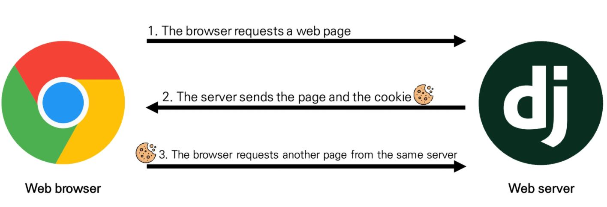

# Django Authentication system

- **인증 시스템 (Auth-System)**

  - **인증 (Authentication)**
    - 사용자 신원 확인
  - **권한 (Authorization)**
    - 사용자 권한 부여
  - app_name = **'accounts' 권장**

  

- 쿠키, 세션

  - **HTTP (Hyper Text Transfer Protocol)**

    - **비연결 지향 (connectionless)**

      ​	\- 서버는 요청에 대한 응답 후 연결 종료

    - **무상태 (stateless)**

      ​	\- 연결 종료 시 클라이언트와 서버 간 통신 종료 및 상태 정보 미유지

      ​	\- 클라이언트와 서버가 주고 받은 메시지는 서로 독립적

    - 클라이언트와 서버의 **지속적인 관계 유지**를 위해 쿠키와 세션을 사용

  - **쿠키 (Cookie)**

    - 서버가 사용자의 브라우저로 전송하는 **작은 데이터 조각**

    - 웹사이트의 서버를 통해 사용자 PC에 설치되는 기록 정보 파일

    - **소프트웨어가 아닌 단순 데이터**

    - 상태가 있는 **세션 (Session) 생성**

    - 요청들이 **동일한 브라우저**를 통해 들어왔는지를 **판단**할 때 주로 사용

      ​	\- 로그인 상태 유지 등

      ​	\- 재요청 시 서버에 쿠기를 함께 전달

    - 사용 목적

      ​	\- 세션 관리 (로그인 유지 등)

      ​	\- 개인화 (사용자 선호, 테마 등)

      ​	\- 트래킹 (사용자 행동 기롤, 분석)

    - 관리자도구 / Application - cookies

      

  - **세션 (Session)**

    - 웹 사이트와 브라우저 사이의 상태를 유지시키는 것
    - 서버에 접속 시 특정 session id 발급, 클라이언트는 session id를 쿠키에 저장

  - 쿠키 수명 (Cookie lifetime)

    ​	1) Session cookies

    ​			\- 현재 세션 종료 시 삭제 (브라우저 종료)

    ​			\- 일부 브라우저 세션 복원 기능 존재

    ​	2) Persistent cookies

    ​			\- Expires / Max-Age 속성에 지정된 날짜 혹은 기간이 지나면 삭제

- Django - Session

  - 미들웨어를 통해 구현

  - database-backed sessions 저장 방식을 기본값(default)으로 사용

    - django_session 테이블에 저장

    - cached, file-based, cookie-based 방식으로 변경 가능

### 1. 로그인 (Login / 사용자 인증)

​		**\- Session을 Create(생성)하는 로직**

​		\- built-in forms (AuthenticationForm) 제공

- **AuthenticationForm**
  - 사용자 인증(로그인)을 위한 **Form**
  - request를 첫 인자로 지님
  - 인증 진행 / 저장 X
  - get_user() 메서드 : 인증된 사용자의 user_cache 반환
- **login Function**
  - **login(request, user, backend=None)**
    - 세션에 user id 저장, session id 생성
    - 실제 user 정보 저장
    - POST 요청

### 2. 로그아웃 (Logout / 사용자 인증 해제)

​		**\- Session을 Delete(삭제)하는 로직**

- **logout Function**
  - **logout(request)**
    - DB, 클라이언트 쿠키 둘 다에서 session id 삭제
    - POST 요청
    - **이전 사용자의 세션 데이터에 엑세스하는 것을 방지**

### 3. 사용자 접근 제한

- Limiting access to logged-in users

  1) **is_authenticated** attribute

  2) **@login_required** decorator

- **is_authenticated 속성**

  - User model의 속성

  - **User의 인스턴스인 경우 True 반환** / AnonymousUser의 인스턴스인 경우 False 반환

    ​	\- 사용자 인증 여부 확인

  - 일반적으로 request.user에서 사용

  - **인증 여부에 따른 출력 링크 조절 가능**

    ​	\- 인증 사용자 로그인, 회원가입 등 페이지 접속 방지

    ​	\- 미인증 사용자 로그아웃, 회원탈퇴 등 페이지 접속 방지

- **@login_required 데코레이터**

  - **미인증 사용자가 접근 시 settings.LOGIN_URL에 설정된 경로로 redirect**

    ​	\- 기본 설정 = login url

  - **next parameter로 다음 행동(경로) 저장** => 인증 시 해당 경로로 redirect

    ​	\- login view 함수에서 사전 설정 필요

    ​	\- next parameter에 의한 요청은 GET으로 전송됨으로 only POST 요청은 에러 발생

### 4. 회원가입 (Signup / 사용자 생성)

​	\- DB에 사용자를 생성하는 것

- **UserCreationForm**

  - 권한이 없는 새 user를 생성하는 **ModelForm**

  - 필드

    ​	**\- username**

    ​	**\- password1**

    ​	**\- password2**

  - signup view 함수에서 login 함수를 통해 가입 시 로그인 적용 가능

### 5. 회원 탈퇴 (UserDelete / 사용자 삭제)

​	\- DB에서 사용자를 삭제하는 것

- **request.user.delete()**
  - DB에서 유저 정보 삭제
  - view 함수에서 logout 함수를 통해 정보와 세션 동시 삭제 가능

### 6. 회원 정보 수정 (User Change)

- **UserChangeFrom**

  - 사용자 정보 및 권한 변경을 위한 **ModelForm**

  - 기본적으로 권한 이상의 정보 수정 가능 => 커스텀 필요

  - forms.py 내부에 CustomUserChangeForm 생성 후 사용

    ​	\- User 모델 상속 ( get_user_model() 함수 사용 )

    ​	\- 'email', 'first_name', 'last_name' 필드 상속 후 사용

### 7. 비밀번호 수정 (Password Change)

- **PasswordChageForm**

  - 사용자가 비밀번호를 변경할 수 있도록 제공되는 **Form**

  - **SetPasswordForm**을 상속받는 서브 클래스

  - **save() 메서드 사용 가능**

  - request.user를 첫 인자로 가짐

  - 비밀번호 변경 시 세션 무효화

    ​	\- **update_session_auth_hash(request, user)** 함수를 통해 로그인 유지 가능

    ​	\- login() 함수를 사용하지 않는 이유 : 세션이 추가적으로 생성되어 서버에 과부하 우려