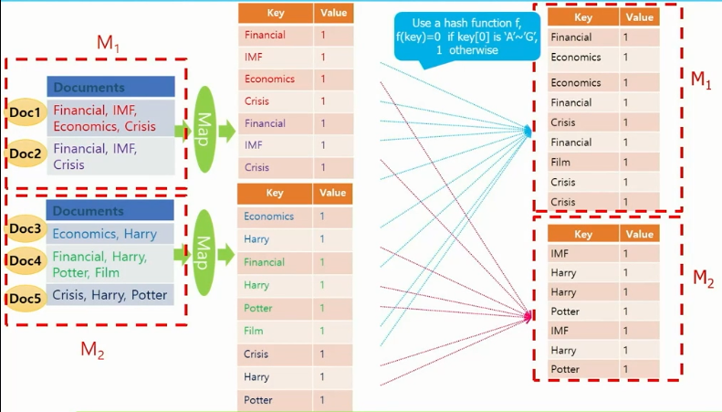
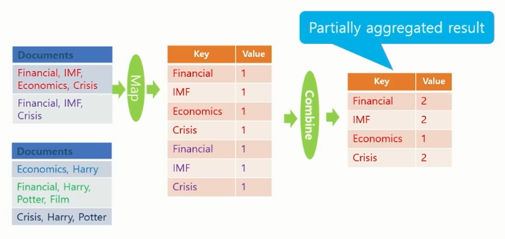
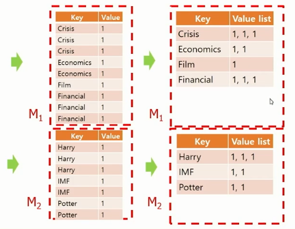
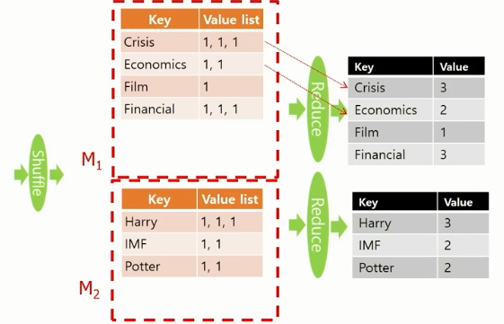
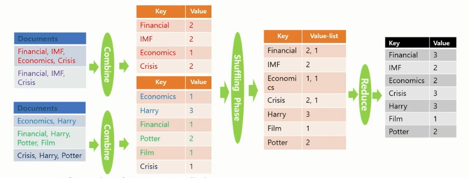

## 빅데이터(분산) - 1강

### 01. MapReduce Framework

- 데이터 중심(Data-intensive) 분야에서는 Scale-out을 선호

  ```markdown
  # Why?
  서버의 가격 관점에서 성능이 선형으로 증가하지 않음 (2배의 성능 >> 2배 초과의 가격)
  ```

  > - Scale-out : 많은 수의 값 싼 서버 이용
  > - Scale-up : 적은 수의 비싼 서버 이용

- Data-intensive processing

  - 여러 컴퓨터를 묶어서 빅 데이터를 처리하는 병렬 프로세스 [ex) MapTeduce]


- **MapReduce Framework**

  - 컴퓨터들을 모아 클러스터를 생성하고 빅데이터를 처리하기 위한 Scalable 병렬 소프트웨어 구현을 쉽게 하도록 도와주는 프로그래밍 모델

  - ex) Google-MapReduce, Opensource-**Hadoop**

  - **Main 함수**가 **map 함수**와 **reduce 함수**를 호출해서 처리

    ```markdown
    - Main 함수
    - Map 함수: (key1, val1) → [(key2, val2)]
    - Reduce 함수: (key2, [val2]) → [(key3, val3)]
    ```

  - 각 record 또는 tuple은 (KEY, VAL) 쌍으로 표현

  - Main 함수를 한개의 마스터머신(master machine)에서 수행

    ​	\>> map 함수를 수행하기 전에 전처리 또는 reduce 함수의 결과를 후처리 하는데 사용

  - 컴퓨팅은 map과 reduce라는 함수 한 쌍으로 이루어진 MapRedcue phase를 한 번 또는 여러 번 수행 가능

  - MapReduce phase는 map함수를 먼저 호출한 다음 reduce 함수를 호출

    ​	\>> 때에 따라서 map 함수가 끝난 후 combine 함수를 중간에 수행 가능
    
  - 드라이버에 해당하는 Main 프로그램에서 MapReduce phase를 수행


- **MapReduce Phase**

  - map, shuffling, reduce 3단계로 구성

    ​	\>> Map phase만 수행하고 중단 가능

  - **Map phase**

    ```markdown
    - 첫번째로 수행, 데이터의 여러 파티션(partition)에 병렬 분산으로 호출되어 수행
    - 각 머신마다 수행된 Mapper는 map 함수가 입력 데이터 한 줄 마다 map 함수를 호출 (여러 PC에서 동시에 작동함으로 병렬로 볼 수 있음)
    - (KET, VAL) 형태로 결과를 출력, 여러 머신에 나누어 전달 (같은 KEY를 가진 결과는 같은 머신으로 전달)
    ```

  - **Shuffling phase**

    ```markdown
    - 모든 머신에서 Map phase가 끝나면 시작
    - Map phase에서 보내진 (KET, VAL) 쌍을 KEY를 이용해 정렬한 후 같은 KEY를 가진 결과를 모아서 VALUE-LIST를 생성하여 (KEY, VAL-LIST) 형태로 KEY에 다라서 여러 머신에 분산하여 전달
    ```

  - **Reduce phase**

    ```markdown
    - 모든 머신에서 Shuffling phase가 끝나면 시작
    - (KEY, VAL-LIST)마다 reduce 함수가 호출 >> 하나의 redcue 함수가 끝나면 다음 (KEY, VAL-LIST)에 reduce 함수 호출
    - 출력이 존재하는 경우 (KEY, VAL) 형태로 출력
    ```


- **Hadoop**

  - Apache 프로젝트의 MapReduce framework의 오픈소스

  - 구성요소

    - **MapReduce** : 소프트웨어 수행을 분산
    - **HDFS** : 데이터를 분산

  - **HDFS (Hadoop Distributed File System)**

    ```markdown
    - 빅데이터 파일을 여러 컴퓨터에 나누어 저장
    - 각 파일은 여러 개의 순차적인 블록으로 저장
    - 하나의 파일 각각의 블록은 폴트 톨러런스(fault toleransce)를 위해 여러개로 복사되어 여러 머신에 저장
    ```

    > - Fault tolerance: 시스템을 구성하는 부품의 일부에서 결함, 고장이 발생하여도 정상적(부분적)으로 기능을 수행할 수 있는 것

  - 한 개의 Namenode(master)와 여러 개의 Datanode(slaves) 사용

    ```markdown
    # Namenode
    - 파일 시스템을 관리하고 클라이언트가 파일에 접근할 수 있도록 함
    # Datanode
    - 컴퓨터에 들어있는 데이터를 접근할 수 있도록 함
    ```

  - Java 프로그래밍 언어로 MapReduce 알고리즘 구현


- **Function (함수)**

  - **Map** 함수

    ```markdown
    - org.apache.hadoop.mapreduce 패키지의 Mapper 클래스를 상속받아 map method 수정
    - 라인 단위로 호출 / 입력: (KEY, VAL) 형태
    - KEY: 입력 텍스트 파일 첫 문자를 기준으로 map 함수가 호출된 해당 라인의 첫 문자까지의 offset
    - VALUE: 텍스트의 해당라인 전체
    ```

  - **Reduce** 함수

    ```markdown
    - org.apache.hadoop.mapreduce 패키지의 Reducer 클래스를 상속받아 reduce method 수정
    - 입력: Shuffling phase의 출력, (KEY, VAL-LIST) 형태
    - VALUE-LIST: map 함수의 출력에서 같은 KEY를 같는 VALUE들의 리스트
    ```

  - **Combine** 함수

    ```markdown
    - reduce 함수와 유사
    - Map phase에서 map 함수의 출력 크기를 줄여 Shuffling, Reduce phase의 비용과 네트워크 트래픽을 줄이는데 사용
    ```

    +)

    ```markdown
    # setup()
    - 첫 map 함수나 reduce 함수가 호출되기 전에 수행
    - 모든 map 함수에 broadcast 해서 전달해야 할 파라미터 정보를 Main 함수에서 받아오는데 사용
    - 모든 map 함수들이 공유하는 자료구조를 초기화 하는데 사용
    # cleanup()
    - 마지막 map 함수나 reduce 함수가 끝나고 나면 수행
    - 모든 map 함수들이 공유하는 자료구조의 결과를 출력하는 데 사용
    ```

    

- 예제

  - **Map phase**

      

    

    +) **Combine 함수**

     

    

  - **Shuffling phase**

      

    

  - **Reduce phase**

      

    

  - 종합

     


- **Linux와 HDFS**

  - 데이터 생성 및 코딩은 Linux / MapReduce 코드와 입력 데이터는 HDFS에 옮겨 MapReduce 알고리즘 수행

  - **Linux dir**

    ```markdown
    - src/ (MapReduce 코드)
    	·Driver.java (MapReduce 코드 컴파일을 위한 파일)
    	·Wordcount.java
    - template/ (과제를 위한 template)
    - datagen/ (과제 데이터를 생성하기 위한 코드)
    - data/ (과제를 위한 데이터)
    - build.xml (MapReduce 코드 컴파일을 위한 파일)
    ```

  - **Hadoop dir**

    ```markdown
    - wordcount_test/ (MapReduce 코드 실행을 위한 데이터 디렉토리)
    - wordcount_test_out/ (MapReduce 코드 실행 결과를 저장하는 디렉토리)
    ```


- Word Count MapReduce 예제

  - Project/src/Driver.java

  - src 디렉토리에 새로운 코드 생성 시 >> Driver.java파일에 pgd.addClass 추가

    ```markdown
    *[새로운 코드 등록(사용명, 클래스 이름, 설명)]*
    pgd.addClass("*[Hadoop 실행시 명칭]*wordcount", Wordcount.class, "A map/reduce program that counts the words in the input files.");
    ```

    

  - Driver.java 파일이 수정되면 반드시 ant 다시 수행

    ```markdown
    e.g.) hadoop jar {pjt-name}.jar wordcount *[입력 받을 폴더]*wordcount_test *[결과 저장 폴더]*wordcount_test_out
    ```

  

  1. MapReduce 코드 컴파일

     ```bash
     $ cd /home/{username}/Project/
     $ ant *[Java 개발 환경에서의 표준 빌드 도구]*
     	- 개인 기준 build.xml line 12를
     	 <property name="lib.dir" value="/home/{username}/hadoop/share/hadoop/"/> 로 수정해야 정상 작동
     ```

     **MapReduce 코드 컴파일 방법 정리**

     1. 소스 코드 파일을 Project/src/ 디렉토리에 추가

     2. Project/src 디렉토리에 있는 Driver.java 파일에 pgd.addClass 추가

        ```java
        pgd.addClass("{program-name}", {class-name}, "{description}")
        ```

     3. Project 디렉토리에서 ant 수행 >> 컴파일 완료

     

  2. 테스트 데이터를 HDFS에 추가

     ```bash
     $ cd /home/{username}/Project
     $ hdfs dfs -mkdir wordcount_test
     	- *[Hadoop HDFS에 wordcount_test dir 생성]*
     $ hdfs dfs -put data/wordcount-data.txt wordcount_test
     	- *[Linux의 data dir에 있는 데이터 파일을 HDFS wordcount_test dir로 이동]*
     ```

     

  3. MapReduce 프로그램이 결과를 저장할 디렉토리를 삭제한 후 프로그램 실행

     ```bash
     $ hdfs dfs -rm -r wordcount_test_out
     	- *[출력 폴더가 존재할 경우 에러 발생]*
     ```

     

  4. Wordcount MapReduce 알고리즘 코드 실행

     ```bash
     $ cd /home/{username}/Project/
     $ hadoop jar {pjt-name}.jar wordcount wordcount_test wordcount_test_out
     
     *Hadoop 실행 방법*
     - $ hadoop jar [jar-file] [program-name] <input-arguments...>
     ```

     

  5. 결과 확인

     ```bash
     *[reduce 개수 만큼 파일 생성]*
     $ hdfs dfs -cat wordcount_test_out/part-r-00000 | more
     	- *[0번 reduce가 출력한 파일의 내용을 출력]*
     $ hdfs dfs -cat wordcount_test_out/part-r-00001 | more
     ```

     

- MapReduce 입출력에 사용 가능한 Default Class

  - MapReduce의 입출력에 사용하는 타입들은 Shuffling phase에서 정렬하는데 필요한 비교 함수 등 여러 함수가 이미 정의되어 있음

    ```markdown
    # 입출력에 사용할 수 있는 클래스와 자바 타입
    - Text: string
    - IntWritable: int
    - LongWritable: long
    - FloatWritable: float
    - DoubleWritable: double
    ```

  - 새로운 클래스(다른 타입)를 정의해서 입출력에 사용하려면 필요한 여러 함수도 함께 정의해야 함


- 코드 분석

  - Wordcount.java -Map

    ```java
    public class Wordcount {
    										          // Input-KeyType, Input_ValType, Output-KeyType, Output-ValType
        public static class TokenizerMapper extends Mapper<Object, Text, Text, IntWritable>{
                
           	// Output-Value/고정값
            private final static IntWritable one = new IntWritable(1);
            // Output-Key/변수
            private Text word = new Text();
                
               			// Input-keyName, Input_valName
            public void map(Object key, Text value, Context context) throws IOException, InterruptedException{
           		// StringTokenizer = 데이터를 단어 단위로 자름, .toString = string-type으로 변환
                StringTokenizer itr = new StringTokenizer(value.toSting());
                while (itr.hasMoreTokens()) {
                    // Output-key-set
                    word.set(itr.nextToken());
                    context.write(word, one);
                }
            }
        }
    }
    ```

  - Wordcount.java -Reduce

    ```java
    public static class IntSumReducer
    			extends Reducer<Text,IntWritable,Text,IntWritable> {
    
    		private IntWritable result = new IntWritable();
        
        	// * Main 함수에서 Mapper, Reducer에 값을 Broadcast
        	// private String name;
        	// private int point;
        	// private float rate;
        	// * setup 함수
        	// protected void setup(Context context) throws IOException, InteruuptedException{
        	//		Configurtation config = context.getConfiguration();
        	//		name = config.get("name", "kim");	// String 가져오기, kim: default value
        	//		point = config.getInt("one", 1);	// int 가져오기, 1: default value
        	//		rate = config.getFloat("point_five", (float)0.5);	// float 가져오기, 0.5: default value
    		// }
    
    		public void reduce(Text key, Iterable<IntWritable> values, Context context) 
    				throws IOException, InterruptedException {
    
    			int sum = 0;
    			for ( IntWritable val : values ) {
    				sum += val.get();
    			}
    			result.set(sum);
    			context.write(key,result);
    		}
    	}
    ```

  - Wordcount.java -Main

    ```java
    public static void main(String[] args) throws Exception {
    		Configuration conf = new Configuration();
    		String[] otherArgs = new GenericOptionsParser(conf,args).getRemainingArgs();
    		if ( otherArgs.length != 2 ) {
    			System.err.println("Usage: <in> <out>");
    			System.exit(2);
    		}
    		Job job = new Job(conf,"word count");
    		job.setJarByClass(Wordcount.class);
    
    		job.setMapperClass(TokenizerMapper.class);
        	// Cominer class 선언
        	// job.setCombinerClass(IntSumReducer.class);
    		job.setReducerClass(IntSumReducer.class);
    
        	// Reduce output의 key, value type 지정
        	// Map과 Reduce의 ouput이 같은 경우 Map output에 대한 지정 생략 가능
    		job.setOutputKeyClass(Text.class);
    		job.setOutputValueClass(IntWritable.class);
        	// *다른 경우
        	// job.setMapOutputKeyClass(Text.class);
        	// job.setMapOutputValueClass(IntWritable.class);
        
        	// Mapper, Reducer에 값을 Broadcast
        	// 넘겨 줄 인자 setting
        	// Configuration config job.getConfigration();
        	// config.set("name", "Shim");
        	// config.setInt("one", 1);
        	// config.setFloat("point_five", (float)0.5);
    
    		job.setNumReduceTasks(2);
    
    		FileInputFormat.addInputPath(job,new Path(otherArgs[0]));
    		FileOutputFormat.setOutputPath(job,new Path(otherArgs[1]));
    		System.exit(job.waitForCompletion(true) ? 0 : 1 );
    	}
    ```

  - Main 함수에서 Mapper, Reducer에 값을 Broadcast

    ```
    - name = config.get("name", "kim");
    	>> name 이라는 심볼의 broadcast 되는 값을 name 변수에 지정하고 broadcast 된 것이 없으면 default로 "kim"을 변수에 지정
    - point = config.getInt("one", 1);
    	>> one 이라는 심볼의 broadcast 되는 정수 값을 one 변수에 지정하고 broadcast 된 것이 없으면 default로 1을 변수에 지정
    - rate = config.getFloat("point_five", (float)0.5);
    	>> rate 라는 심볼의 bradcast 되는 실수 값을 point_five 변수에 지정하고 broadcast 된 것이 없으면 default로 0.5를 변수에 지정
    ```

    

