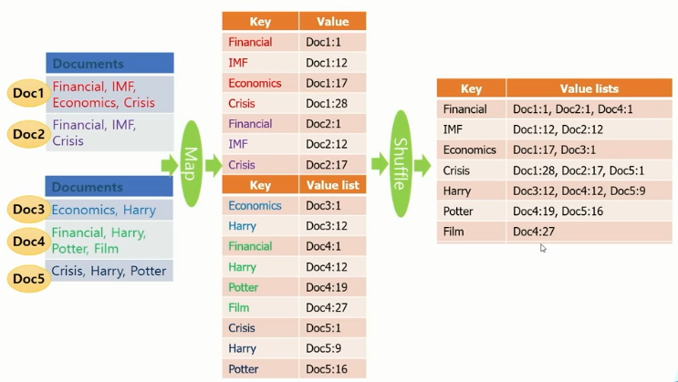
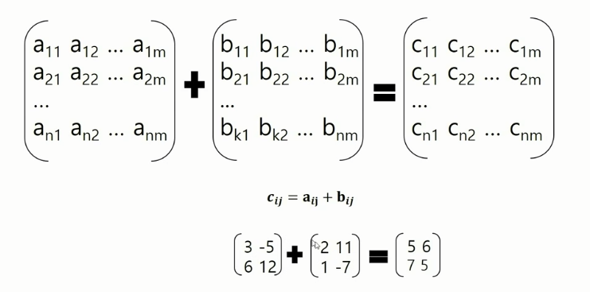
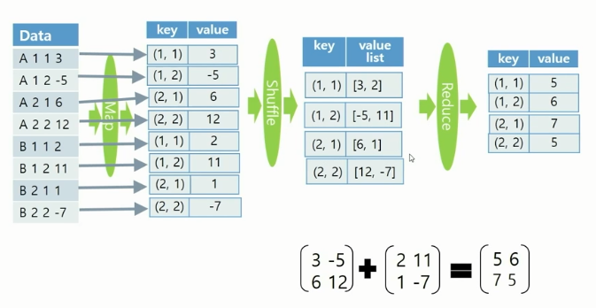

## 빅데이터(분산) - 2강

### 01. Partitioner Class

- **Partitioner Class**

  - Map 함수의 출력인 (KEY, VAL) 쌍이 KEY에 의해 어느 Reducer(머신)으로 보내질 것인지를 결정하는 Class

  - Hadoop의 기본 타입은 Hash 함수가 기본으로 제공되어 KEY에 대한 hash 값에 따라 전달할 Reducer(머신)을 결정

    - Hadoop 기본 타입

      ```markdown
      - Text
      - IntWritable
      - LongWritable
      - FloatWritable
      - DoubleWritable
      ```

  - Partitioner Class를 수정하여 Map 함수의 출력이 전달 될 Reducer 지정 가능


- 코드 분석

  - 예시

    ```java
    // Partitioner Class 추가
    import org.apache.hadoop.mapreduce.partitioner;
    
    // MyPartitioner Class 정의
    public static class MyPartitioner extends Partitioner<IntWritable, Text>{
        @Override
        public int getPartition(IntWritable key, Text value, int numPartitions){
            int nbOccurences = key.get();		// key 추출
            if(nbOccurences <= 30) return 0;	// 0번 reducer(머신)
            else return 1;	// 1번 reducer(머신)
        }
    }
    
    // Main 함수
    job.setPartitionerClass(MyPartitioner.class);
    ```


### 02 Inverted Index

- 단어가 어떤 문서의 어느 위치에 존재하는지 나타내는 방법

  

- 코드 분석

  - 입력 파일

    - 일반 텍스트

  - 출력 파일

    - 단어:\<tab>파일이름:오프셋, 파일이름:오프셋, 파일이름:오프셋

      ```markdown
      # 예시
      this: wordcount-data.txt: 13, wordcount-data.txt: 33
      ```

  - 필요 함수 정리

    ```java
    // 패키지 import
    import org.apache.hadoop.io.LongWritable;	// 시작 위치 byte offset을 가져오기 위한 패키지
    import org.apache.hadoop.mapreduce.lib.input.FileSplit;		// 입력 파일 이름을 가져오기 위한 패키지
    
    // 텍스트 string 포멧으로 변경
    StringTokenizer: StringTokenizer(value.toString());
    >> new StringTokenizer(value.toString(), " ", true);	// 단어 단위로 자르기
    
    // 라인 시작 위치 가져오기
    Long: ((LongWriable)key).get();
    
    // 문자 길이 확인하기
    token.length()		// 다음 문자의 시작 위치를 지정하기 위한 방법
    
    // 입력 파일 이름 가져오기
    private String filename;
    protected void setup(Context context) throws IOException, InterruptedException{
        filename = ((FileSplit)context.getInputSplit()).getPath().getName();
    }
    
    // 출력양식 지정
    filename+":"+p;
    ```

  - Invertedindex.java

    ```java
    import org.apache.hadoop.fs.FileSystem;
    import org.apache.hadoop.io.LongWritable;
    import org.apache.hadoop.mapreduce.lib.input.FileSplit;
    
    public class InvertedIndex {
    	public static class TokenizerMapper
    			extends Mapper<Object,Text,Text,Text> {
    
    		private Text word = new Text();
    		private Text pos = new Text();
    		private String filename;
    		
    		// input 파일명 가져오기
    		protected void setup(Context context) throws IOException, InterruptedException {
    			filename = ((FileSplit)context.getInputSplit()).getPath().getName();
    		}
    
    		public void map(Object key, Text value, Context context)
    				throws IOException, InterruptedException {
    
    			// 띄어쓰기(단어) 단위 문장 나누기
    			StringTokenizer itr = new StringTokenizer(value.toString(), " ", true);
    			// byte 상 위치 지정
    			long p = ((LongWritable)key).get();
    			while ( itr.hasMoreTokens() ) {
    				String token = itr.nextToken();
    				word.set(token.trim());
                	// 파일명, 위치 저장    
    				if (!token.equals(" ")) {
    					pos.set(filename+":"+p);
    					context.write(word, pos);
    				}
    				// 다음 값의 위치를 위한 단어 길이 추가
    				p += token.length();			
    			}
    		}
    	}
    
    
    	public static class IntSumReducer
    			extends Reducer<Text,Text,Text,Text> {
    
    		private Text list = new Text();
    
    		public void reduce(Text key, Iterable<Text> values, Context context) 
    				throws IOException, InterruptedException {
    				
    			String s = new String();
    			int comma = 0;
    			for ( Text val : values ) {
    				// 첫 단어만 "," X
    				if (comma == 0) {
    					comma = 1;
    					s += (":"+val.toString());
    				} else {
    					s += (", " + val.toString());
    				}
    			}
    			list.set(s);
    			context.write(key,list);
    		}
    	}
    
    	public static void main(String[] args) throws Exception {	
    		FileSystem hdfs = FileSystem.get(conf);
    		Path output = new Path(otherArgs[1]);
            // 출력 누적 내용 삭제
    		if (hdfs.exists(output)) hdfs.delete(output,true);
    
    		job.setJarByClass(InvertedIndex.class);
    	}
    }
    ```


### 03 Matrix Addition

 

 

- 코드 분석

  - MatrixAdd.java

    ```java
    public class MatrixAdd {
      public static class MAddMapper  extends  Mapper<Object, Text, Text , IntWritable>{
    
         public void map(Object key, Text value, Context context)
    	throws IOException, InterruptedException {
    	
    	String[] arr = value.toString().split("\t");
    	// Key는 값의 위치
    	Text emitkey = new Text(arr[1] + "\t" + arr[2]);
    	// Value는 Key 위치의 값
    	IntWritable emitval = new IntWritable(Integer.parseInt (arr[3]));
    	context.write(emitkey, emitval);
    
         }
      }
      public static class  MAddReducer  extends Reducer<Text, IntWritable, Text, IntWritable> {
        public void reduce(Text  key, Iterable<IntWritable> values, Context  context) 
    	throws IOException, InterruptedException {
    	
        // Key 위치의 값 합산    
    	int sum = 0;
    	for (IntWritable val:values) {
    		sum += val.get();
    	}
    	context.write(key, new IntWritable(sum));
        }
      }
    ```

    

