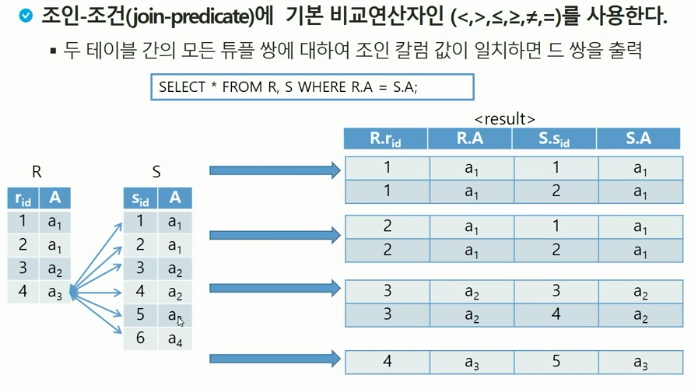
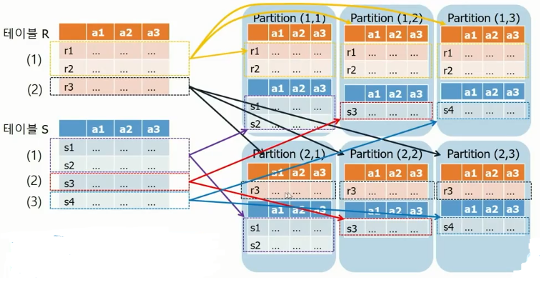
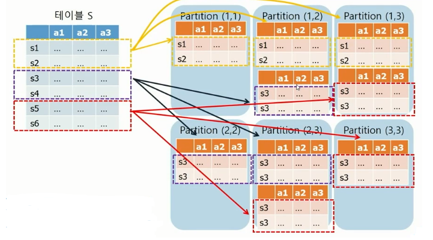
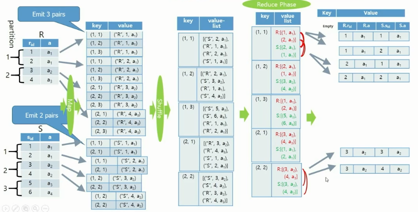
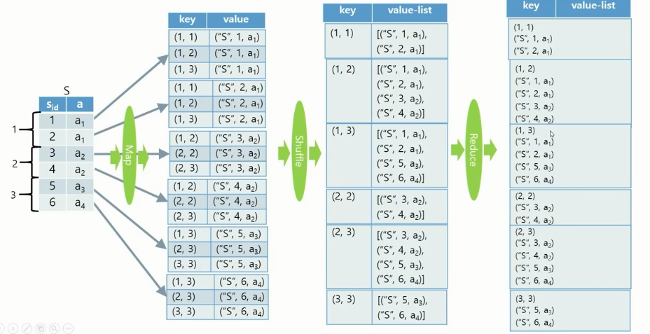

## 빅데이터(분산) - 4강(All Pair Partition Algorithm)

### 01. Theta-Join Algorithm

- 조건에 부합하는 항목 출력

 

- **All Pair Partition** (모든 쌍 분할)

  ```markdown
  1. R과 S를 각각 n, m개의 파티션으로 분할
  2. |R|*|S| 개의 레코드 쌍을 n*m개의 분리된 파티션으로 분할		// |?|은 ?에 들어있는 레코드 수
  3. 각 파티션을 한 개의 reduce 함수로 전달
  
  # 장점
  - 어떤 조인 조건이라도 처리 가능
  - 모든 reduce 함수에 들어가는 입력 사이즈가 비슷함
  # 단점
  - 모든 레코드 쌍을 다 검사
  - 각 reduce 함수의 출력 사이즈 차이가 클 수 있음
  ```

  - Equi-Join

     

  - Self-Join

     

- **All Pair Partition Equi-Join**

  - 예제

     

  - 코드분석

    - AllpairPartition.java

      ```java
      // Mapper
      // setup
      // 각 Table name과 Parition 수 가져오기
      Table1name = configuration.get("Table1name", "r");
      Table2name = configuration.get("Table2name", "s");
      numberOfPartitions = configuration.getInt("numberOfPartitions", 2);
      
      // map
      // 같은 table과 다른 table의 각 key 설정
      for( int i = 0; i < numberOfPartitions; i++ ) {
          String text = "";
          if (tuple[0].equals(Table1name))
              text = "(" + partitionId + ", " + i + ")";
          else if (tuple[0].equals(Table2name))
              text = "(" + i + ", " + partitionId + ")";
          emitkey.set(text);
          context.write(emitkey, value);
      }
      
      // Reducer
      // 들어온 key와 value를 출력
      String s = new String();
      for (Text val:values) {
          s += ("\n" + val.toString());
      }
      emitval.set(s);
      context.write(key, emitval);
      
      // Main
      // Table1 이름, Table2 이름, Partition 수, 입력 데이터 폴더, 출력 데이터 폴더 로 hadoop 실행
      if (otherArgs.length != 5) {
          System.out.println("usage:  <Table1name> <Table2name> <numberOfPartition> <in> <out>");
          System.exit(1);
      }
      ```

      

- **All Pair Partition Self-Join**

  - 하나의 테이블에서 파티션 분할을 통한 Join

  - 예제

      

  - 코드분석

    - AllPairPartitionSelf.java

      ```java
      // Mapper
      // setup
      Tablename = configuration.get("Tablename", "r");
      numberOfPartitions = configuration.getInt("numberOfPartitions", 2);
      
      // map
      int recordId = Integer.parseInt(tuple[1]);
      int partitionId = recordId % numberOfPartitions;
      
      for( int i = 0; i < numberOfPartitions; i++ ) {
          // TODO
          String text = "";
          if (tuple[0].equals(Tablename)) {
              if (i <= partitionId) {
                  emitkey.set("(" + i + ", " + partitionId + ")");
              } else {
                  emitkey.set("(" + partitionId + ", " + i + ")");
              }
              context.write(emitkey, value);
          }
      }
      
      // Reducer
      String s = new String();
      for (Text val:values) {
          s += ("\n" + val.toString());
      }
      emitval.set(s);
      context.write(key, emitval);
      
      // Main
      if (otherArgs.length != 4) {
          System.out.println("usage:  <Tablename> <numberOfPartition> <in> <out>");
          System.exit(1);
      }
      ```

      

