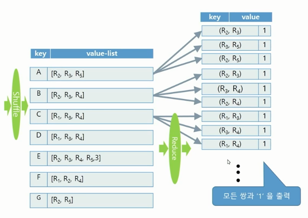

## 빅데이터(분산) - 4강

- **Common Item Countin for Every Pair of Sets (Inverted Index / Self-Join)**

  - Phase1

    - Set 데이터에 있는 각 튜플에 들어있는 아이템을 key로 하는 Inverted Index 생성
    - Inverted Index의 각 아이템마다 리스트에 있는 항목들의 모든 쌍을 KEY로 하고 1을 VALUE로 출력

      

  - Phase2

    - 모든 튜플 ID 쌍에 대해 word counting 알고리즘을 사용하여 카운트

     

    

  - 코드 분석

    - CommonItemCount.java

      ```
      // Pahse1 Mapper
      StringTokenizer itr = new StringTokenizer( value.toString() );
      
      String id = itr.nextToken();
      rid.set(id);
      
      while (itr.hasMoreTokens()) {
          item.set(itr.nextToken());
          context.write(item, rid);
      }
      
      // Phase1 Reducer
      Vector<String> str = new Vector<String>();
      for ( Text val : values ) {
          str.add( val.toString() );
      }
      
      for (int i = 0; i < str.size(); i++) {
          for (int j = i+1; j < str.size(); j++) {
              if (str.get(i).compareTo(str.get(j)) < 0)
                  ridpair.set(str.get(i) + " " + str.get(j));
              else ridpair.set(str.get(j) + " " + str.get(i));
              context.write(ridpair, one);
          }
      }
      
      // Phase2 Mapper
      StringTokenizer itr = new StringTokenizer(value.toString());
      ridpair.set(itr.nextToken() + " " + itr.nextToken());
      count.set(Integer.parseInt(itr.nextToken()));
      context.write( ridpair, count );
      
      // Phase2 Reducer
      int overlap = 0;
      for (IntWritable val:values) {
          overlap += val.get();
      }
      
      StringTokenizer itr = new StringTokenizer(key.toString());
      ridpair.set("(" + itr.nextToken() + ", " + itr.nextToken() + ")");
      count.set(overlap);
      context.write(ridpair , count);
      ```

      

- Top-K Closest Poin Search Algorithm

  - 질의 포인트와 점들로 구성된 데이터 셋이 있을 때 질의 포인트로부터 가장 가까운 K개의 포인트를 뽑는 방법 (Max-Heap 활용)

  - 예시

    - Phase1

      - Query point와 Value-list에 있는 point 들의 거리가 가장 가까운 K개만 출력

       

    - Phase2

      - Phase1의 결과를 모아서 다시 Top-K 선정 후 출력

       

  - 코드 분석

    - TopKSearch.java

      ```java
      // Phase1 Mapper
      String arr[] = value.toString().split ("\t", 2);
      int rid = Integer.parseInt (arr[0]);
      int partitionId = rid % numOfPartitions;
      
      emitkey.set(Integer.toString(partitionId));
      context.write(emitkey, value);
      
      // Phase1 Reducer
      for (Text p:values) {
          d = dist(query, p.toString());
          MyType e = new MyType(d, p.toString());
          if (queue.size() < K)
              queue.add(e);
          else if (queue.peek().dist > d) {
              queue.remove();
              queue.add(e);
          }
      }
      
      while (!queue.isEmpty()) {
          MyType v = queue.poll();
          emitkey.set(v.str);
          emitval.set(Double.toString(v.dist));
          context.write(emitkey, emitval);
      }
      
      // Phase2 Mapper
      context.write(emitkey, value);
      
      // Phase2 Reducer
      for (Text value:values) {
          String val = value.toString();
          String[] tuple = val.split("\t");
          double d = Double.parseDouble(tuple[tuple.length - 1]);
          MyType e = new MyType(d, val);
          if (queue.size() < K) {
              queue.add(e);
          } else if (queue.peek().dist > d) {
              queue.remove();
              queue.add(e);
          }
      }
      
      while (!queue.isEmpty()) {
          MyType v = queue.poll();
          String[] tuple = v.str.split("\t");
          String p = "";
          if (tuple.length > 0)
              p = tuple[0];
          emitkey.set(p);
      
          if (tuple.length > 1)
              p = tuple[1];
          for (int i = 2; i < tuple.length; i++) {
              p = p + "\t" + tuple[i];
          }
          emitval.set(p);
          context.write(emitkey, emitval);
      }
      ```

      

