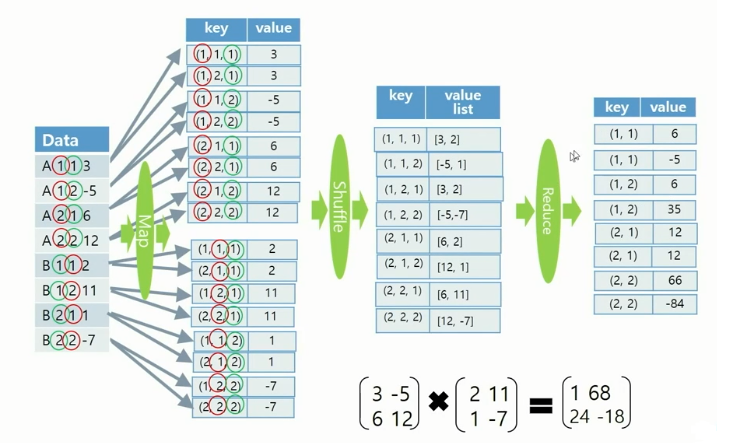

## 빅데이터(분산) - 3강

### 01. Matrix Multiplication


- **1-Phase Martix Multiplication**

  - value list에 key와 val을 다 저장(메모리 사용량 높음/matrix 사이즈가 작은 경우 빠름)

  '

  - 코드 분석

    - 필요 함수 정리

      ```java
      // Text
      value.toString()	// Text to String
          
      // String
      StringTokenizer(value.toString());
      nextToken();
      equals("A")
          
      // Integer
      parseInt(token.nextToken());	// String to Int
      ```

    - 실행

      ```bash
      $ hadoop jar {pjt-name}.jar matmulti {mat1-name} {mat2-name} {n} {l} {m} matmulti_test matmulti_test_out
      ```

    - MatrixMultii.java

      ```java
      // Mapper
      // var 정의
      private String Matrix1name;
      private String Matrix2name;
      private Text keypair = new Text();
      private Text valpair = new Text();
      
      // setup
      Configuration config = context.getConfiguration();
      // Main 함수에서 정의된 값 가져오기
      Matrix1name = config.get("Matrix1name", "A");
      Matrix2name = config.get("Matrix2name", "B");
      n = config.getInt("n", 10);
      l = config.getInt("l", 10);
      m = config.getInt("m", 10);
      
      // map
      StringTokenizer token = new StringTokenizer(value.toString());
      String mat = token.nextToken();	// matrix 이름
      int row = Integer.parseInt(token.nextToken());
      int col = Integer.parseInt(token.nextToken());
      int val = Integer.parseInt(token.nextToken());
      // matrix1인 경우
      if (mat.equals(Matrix1name)) {
          valpair.set("" + col + " " + val);
          for (int j = 0; j < m; j++) {
              String p = "" + row + "," + j;
              keypair.set(p);
              context.write(keypair, valpair);
          }
      // matrix2인 경우
      } else if (mat.equals(Matrix2name)) {
          valpair.set("" + row + " " + val);
          for (int i = 0; i < n; i++) {
              String p = "" + i + "," + col;
              keypair.set(p);
              context.write(keypair, valpair);
          }
      }
      
      // Reducer
      for (Text tx : values) {
          context.write(key, tx);
      }
      
      // Main
      // Output 데이터 초기화
      FileSystem hdfs = FileSystem.get(conf);
      Path output = new Path(otherArgs[6]);
      if (hdfs.exists(output)) hdfs.delete(output, true);
      
      // hadoop 실행 변수 정의
      config.set("Matrix1name", otherArgs[0]);
      config.set("Matrix2name", otherArgs[1]);
      config.setInt("n",Integer.parseInt(otherArgs[2]));	// Mat1 Num of rows
      config.setInt("l",Integer.parseInt(otherArgs[3]));	// Mat1 Num of cols (Mat2 Num of rows)
      config.setInt("m",Integer.parseInt(otherArgs[4]));	// Mat2 Num of cols
      ```

- **2-Phase Matrix Multiplication**

  - value list에 val만 저장(메모리 사용량 낮음/matirx 사이즈가 큰 경우 빠름)

  - Phase1

     

  - Phase2

     

