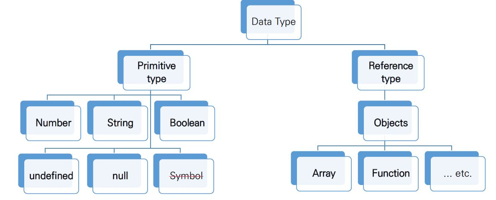
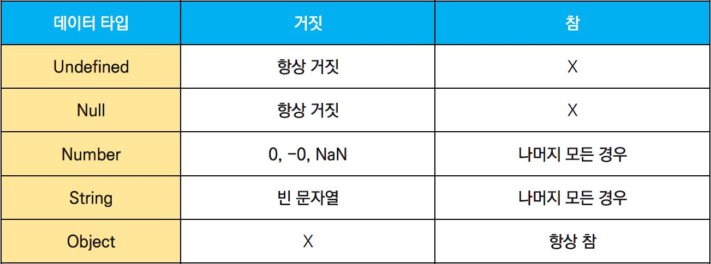
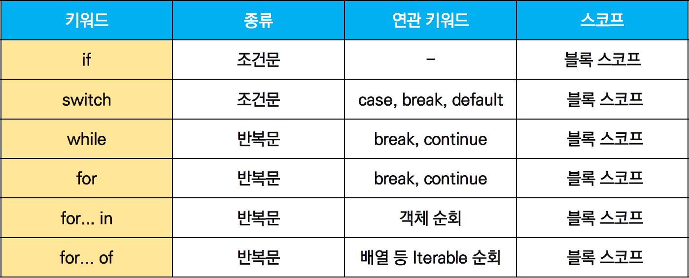

# JavaScript Grammar


### 변수와 식별자 (Variables & Identifiers)

- **Identifiers**

  - 변수를 구분할 수 있는 **변수명**

  - 문자, '$', '_' 로 시작 / 대소문자 구분

  - 클래스명 외 모든 식별자는 소문자로 시작

  - **스타일**

    ```markdown
    # 카멜 케이스 (camelCase, lower-camel-case)
    - 두 번째 단어부터 대문자 사용
    - 변수, 객체, 함수명에 사용
    
    # 파스칼 케이스 (PascalCase, upper-camel-case)
    - 모든 단어의 첫 글자 대문자 사용
    - 클래스, 생성자명에 사용
    
    # 대문자 스네이크 케이스 (SNAKE_CASE)
    - 모두 대문자로 사용, 단어 사이 언더스코어 사용
    - 상수(변경될 가능성이 없는 값)에 사용
    ```

  - **변수 선언 키워드**

    ```markdown
    # const
    - const a = value
    1) 재할당 불가능한 변수 선언
    2) 변수 재선언 불가
    3) 블록 스코프
    
    # let
    - let b = value
    1) 재할당 가능한 변수 선언
    2) 변수 재선언 불가
    3) 블록 스코프
    
    # var
    - var c = value
    - ES6 도입 후 사용 X
    1) 재할당 가능한 변수 선언
    2) 변수 재선언 가능
    3) 함수 스코프
    ```

  - **선언 / 할당 / 초기화**

    ```javascript
    // 선언 (Declaration)
    // - 변수를 생성하는 행위
    let foo
    console.log(foo) // undefined 반환
    
    // 할당 (Assignment)
    // - 선언된 변수에 값을 저장하는 행위
    foo = 11
    console.log(foo) // 11 반환
    
    // 초기화 (Initialization) [선언 + 할당]
    // - 선언된 변수에 처음으로 값을 저장하는 행위
    let bar = 0
    console.log(bar) // 0 반환
    ```

  - **스코프 / 호이스팅**

    ```markdown
    # 블록 스코프
    - 중괄호 { } 내부
    - 블록 스코프를 가지는 변수는 블록 바깥에서 접근 불가
    
    # 함수 스코프
    - 함수의 중괄호 { } 내부
    - 함수 스코프를 가지는 변수는 함수 바깥에서 접근 불가
    
    # 호이스팅 (hoisting)
    - 변수 선언 이전에 참조 가능한 현상
    - 변수 선언 이전에 참조 시 undefined 반환
    ```


---

### 타입과 연산자 (Types & Operators)

- **데이터 타입**

  - 모든 값은 **특정한 데이터 타입 보유**

    

    ```markdown
    # 원시타입 (Primitive type)
    - 객체(object)가 아닌 타입 / 값 그 자체
    - 변수 >> 타입의 값 저장
    - 복사 >> 실제 값 복사
    
    # 참조타입 (Reference type)
    - 객체(object) 타입
    - 변수 >> 참조 값 저장
    - 복사 >> 참조 값 복사
    ```

  - **null** v **undefined**

    ​	\- 빈 값을 표현하기 위한 데이터 타입

    ```markdown
    # null
    - 의도적으로 필요한 경우 할당
    - typeof >> object 반환
    
    # undefined
    - JS가 자동으로 할당
    - typeof >> undefined 반환
    ```

  - **Boolean**

    

  

- **연산자**

  - **할당 연산자**

    ```markdown
    1) += value
    	더하기
    
    2) -= value
    	빼기
    
    3) \*= vlaue
    	곱하기
    
    4) /= value
    	나누기
    
    5) variable++
    	1 증가
    
    5) variable--
    	1 감소
    ```

  - **비교 연산자**

    ```markdown
    1) <, > / 비교 연산자
    	- 피연산자들을 비교 >> boolean 값 반환
    	- 문자열 >> 유니코드 값 사용
    
    2) == / 동등 비교 연산자
    	- 피연산자들이 같은 값으료 평가되는지 비교 >> boolean 값 반환
    	- 암묵적 형변환을 통해 타입 일치화 후 비교
    
    3) === / 일치 비교 연산자
    	- 피연산자들이 같은 값으료 평가되는지 비교 >> boolean 값 반환
    	- 타입과 값이 모두 일치 여부 확인
    ```

  - **논리 연산자**

    ```markdown
    1) && / and 연산
    
    2) || / or 연산
    
    3) ! / not 연산
    ```

  - **삼항 연산자**

    ```javascript
    // 조건식이 참이면 우측, 거짓이면 좌측 값을 반환
    const ret = condition ? true-value : false-value
    ```


---

### 조건문과 반복문 (Conditions & Loops)



- **조건문**

  - **if 문 (if statement)**

    ​	\- 조건 표현식 결과값을 Boolean 타입으로 변환 후 참 / 거짓 판단

    ```javascript
    if (condition) {
        // content
    } else if (condition) {
        // content
    } else {
        // content
    }
    ```

  - **switch 문 (switch statement)**

    ​	\- 조건 표현식 결과값이 어느 case에 해당하는지 판단

    ​	\- 특정 변수의 값에 따라 조건을 분기할 때 사용

    ​	\- 표현식 결과값과 case문 value 비교

    ​	\- break, default 선택적 사용

    ​	\- break 미사용 시 다음 break 또는 default 까지 모든 조건문 실행

    ```javascript
    switch (expression) {
      case 'first value': {
        // content
        [break]
      }
      case 'second value': {
        // content
        [break]
      }
      [default: {
         // content
       }]
    }
    ```

  

- **반복문**

  - **while 문**

    ```javascript
    while (condition) {
      // content
    }
    ```

  - **for 문**

    ```javascript
    for (initializtion; condition; expression) {
      // content
    }
    ```

  - **for ... in 문**

    ​	\- **객체 (object)** 속성 순회 시 사용 + 반복 가능한 객체 가능 (인덱스 반환)

    ```javascript
    for (variable in object) {
      // content
    }
    ```

  - **for ... of 문**

    ​	\- **반복 가능한 (iterable) 객체**[Array, Map, Set, String 등] 순회 시 사용

    ```javascript
    const valiable = iterable
    for (let valiable of iterable) {
      // content
    }
    ```

