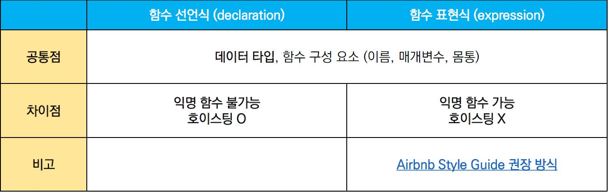
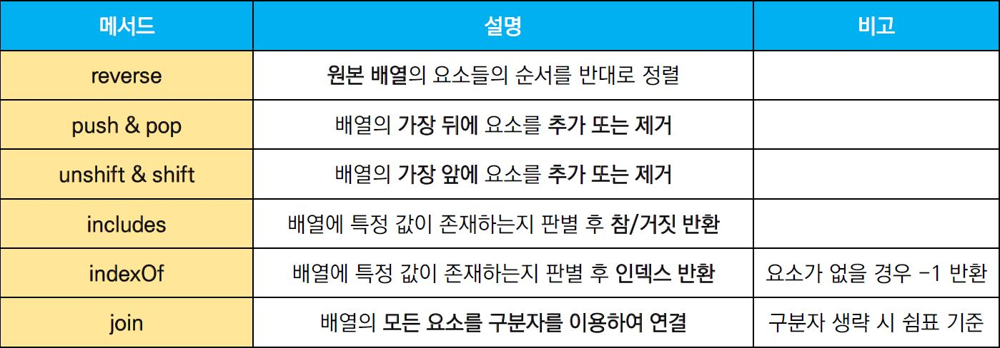
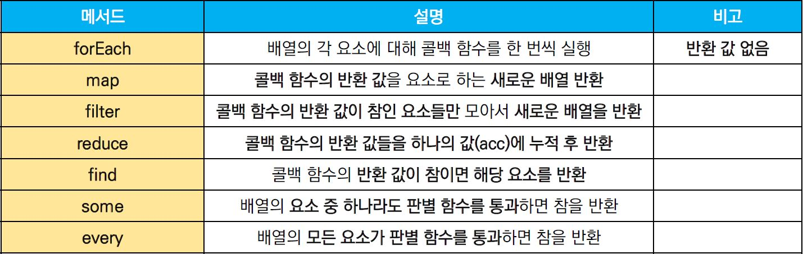
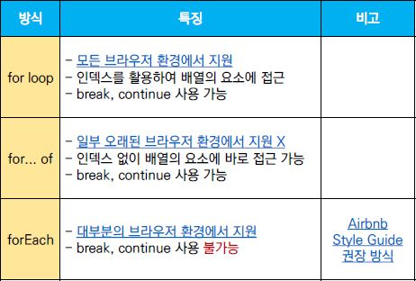

# JavaScript Grammar


### 변수와 식별자 (Variables & Identifiers)

- **Identifiers**

  - 변수를 구분할 수 있는 **변수명**

  - 문자, '$', '_' 로 시작 / 대소문자 구분

  - 클래스명 외 모든 식별자는 소문자로 시작

  - **스타일**

    ```markdown
    # 카멜 케이스 (camelCase, lower-camel-case)
    - 두 번째 단어부터 대문자 사용
    - 변수, 객체, 함수명에 사용
    
    # 파스칼 케이스 (PascalCase, upper-camel-case)
    - 모든 단어의 첫 글자 대문자 사용
    - 클래스, 생성자명에 사용
    
    # 대문자 스네이크 케이스 (SNAKE_CASE)
    - 모두 대문자로 사용, 단어 사이 언더스코어 사용
    - 상수(변경될 가능성이 없는 값)에 사용
    ```

  - **변수 선언 키워드**

    ```markdown
    # const
    - const a = value
    1) 재할당 불가능한 변수 선언
    2) 변수 재선언 불가
    3) 블록 스코프
    
    # let
    - let b = value
    1) 재할당 가능한 변수 선언
    2) 변수 재선언 불가
    3) 블록 스코프
    
    # var
    - var c = value
    - ES6 도입 후 사용 X
    1) 재할당 가능한 변수 선언
    2) 변수 재선언 가능
    3) 함수 스코프
    ```

  - **선언 / 할당 / 초기화**

    ```javascript
    // 선언 (Declaration)
    // - 변수를 생성하는 행위
    let foo
    console.log(foo) // undefined 반환
    
    // 할당 (Assignment)
    // - 선언된 변수에 값을 저장하는 행위
    foo = 11
    console.log(foo) // 11 반환
    
    // 초기화 (Initialization) [선언 + 할당]
    // - 선언된 변수에 처음으로 값을 저장하는 행위
    let bar = 0
    console.log(bar) // 0 반환
    ```

  - **스코프 / 호이스팅**

    ```markdown
    # 블록 스코프
    - 중괄호 { } 내부
    - 블록 스코프를 가지는 변수는 블록 바깥에서 접근 불가
    
    # 함수 스코프
    - 함수의 중괄호 { } 내부
    - 함수 스코프를 가지는 변수는 함수 바깥에서 접근 불가
    
    # 호이스팅 (hoisting)
    - 변수 선언 이전에 참조 가능한 현상
    - 변수 선언 이전에 참조 시 undefined 반환
    ```


---

### 타입과 연산자 (Types & Operators)

- **데이터 타입**

  - 모든 값은 **특정한 데이터 타입 보유**

    

    ```markdown
    # 원시타입 (Primitive type)
    - 객체(object)가 아닌 타입 / 값 그 자체
    - 변수 >> 타입의 값 저장
    - 복사 >> 실제 값 복사
    
    # 참조타입 (Reference type)
    - 객체(object) 타입
    - 변수 >> 참조 값 저장
    - 복사 >> 참조 값 복사
    ```

  - **null** v **undefined**

    ​	\- 빈 값을 표현하기 위한 데이터 타입

    ```markdown
    # null
    - 의도적으로 필요한 경우 할당
    - typeof >> object 반환
    
    # undefined
    - JS가 자동으로 할당
    - typeof >> undefined 반환
    ```

  - **Boolean**

    

  

- **연산자**

  - **할당 연산자**

    ```markdown
    1) += value
    	더하기
    
    2) -= value
    	빼기
    
    3) \*= vlaue
    	곱하기
    
    4) /= value
    	나누기
    
    5) variable++
    	1 증가
    
    5) variable--
    	1 감소
    ```

  - **비교 연산자**

    ```markdown
    1) <, > / 비교 연산자
    	- 피연산자들을 비교 >> boolean 값 반환
    	- 문자열 >> 유니코드 값 사용
    
    2) == / 동등 비교 연산자
    	- 피연산자들이 같은 값으료 평가되는지 비교 >> boolean 값 반환
    	- 암묵적 형변환을 통해 타입 일치화 후 비교
    
    3) === / 일치 비교 연산자
    	- 피연산자들이 같은 값으료 평가되는지 비교 >> boolean 값 반환
    	- 타입과 값이 모두 일치 여부 확인
    ```

  - **논리 연산자**

    ```markdown
    1) && / and 연산
    
    2) || / or 연산
    
    3) ! / not 연산
    ```

  - **삼항 연산자**

    ```javascript
    // 조건식이 참이면 우측, 거짓이면 좌측 값을 반환
    const ret = condition ? true-value : false-value
    ```


---

### 조건문과 반복문 (Conditions & Loops)


- **조건문**

  - **if 문 (if statement)**

    ​	\- 조건 표현식 결과값을 Boolean 타입으로 변환 후 참 / 거짓 판단

    ```javascript
    if (condition) {
        // content
    } else if (condition) {
        // content
    } else {
        // content
    }
    ```

  - **switch 문 (switch statement)**

    ​	\- 조건 표현식 결과값이 어느 case에 해당하는지 판단

    ​	\- 특정 변수의 값에 따라 조건을 분기할 때 사용

    ​	\- 표현식 결과값과 case문 value 비교

    ​	\- break, default 선택적 사용

    ​	\- break 미사용 시 다음 break 또는 default 까지 모든 조건문 실행

    ```javascript
    switch (expression) {
      case 'first value': {
        // content
        [break]
      }
      case 'second value': {
        // content
        [break]
      }
      [default: {
         // content
       }]
    }
    ```

  

- **반복문**

  - **while 문**

    ```javascript
    while (condition) {
      // content
    }
    ```

  - **for 문**

    ```javascript
    for (initializtion; condition; expression) {
      // content
    }
    ```

  - **for ... in 문**

    ​	\- **객체 (object)** 속성 순회 시 사용 + 반복 가능한 객체 가능 (인덱스 반환)

    ```javascript
    for (variable in object) {
      // content
    }
    ```

  - **for ... of 문**

    ​	\- **반복 가능한 (iterable) 객체**[Array, Map, Set, String 등] 순회 시 사용

    ```javascript
    const valiable = iterable
    for (let valiable of iterable) {
      // content
    }
    ```


----

### 함수 (Functions)

- 참조 타입 중 하나 (function type)

- **일급 객체**

- 정의 방법

  - **함수 선언식 (function declaration)**

  - **함수 표현식 (function expression)**

    


- **함수 선언식 (function statement, declaration)**

  - 함수의 이름과 함께 정의하는 방식
  - **함수명(name), 매개변수(args), 내용{ }**

  ```javascript
  function name(args) {
      // content
  }
  ```

- **함수 표현식 (function expression)**

  - 함수를 표현식 내부에서 정의하는 방식
  - 함수명을 생략하고 **익명함수**로 정의 가능
  - **함수명(생략가능), 매개변수, 내용**

  ```javascript
  // 정의
  const myFunc = function (args) {
      // content
  }
  
  // 예시
  const add = function (num1, num2) {
      return num1 + num2
  }
  
  const result = add(1, 2)
  console.log(result)
  ```


- **기본인자 (default arguments)**
  - 인자 작성 시 '=' 문자 뒤 기본 인자 선언 가능

- **호이스팅(hoisting)**
  - 함수 선언식으로 선언한 함수는 hoisting 발생
  - 호출 후 선언해도 동작


- **화살표 함수 (Arrow Function)**

  - 함수를 간결하게 정의할 수 있는 문법

    ```
    1) function 키워드 생략
    2) 매개변수가 하나라면 () 생략 가능
    3) 표현식이 하나라면 {}, return 생략 가능
    ```

  ```javascript
  // 기존
  const arrow = function (args) {
      return 'result'
  }
  
  // 1단계
  const arrow = (args) => {
      return 'result'
  }
  
  // 2단계
  const arrow = args => {
      return 'result'
  }
  
  // 3단계
  const arrow = args => 'result'
  ```


---

### 배열과 객체 (Arrays & Objects)

- **배열 (Array)**

  - 키와 속성들을 담고 있는 참조 타입의 객체(object)

  - 순서 보장

  - 주로 대괄호를 이용해 생성, 인덱스로 값 접근 가능

    

  - **배열 메서드I (methods)**

    

    ```javascript
    const numbers = [1, 2, 3]
    
    // reverse - 배열 요소를 반대로 정렬
    numbers.reverse() // [3, 2, 1]
    
    
    // push & pop -배열 마지막에 요소 추가 / 요소 제거
    numbers.push(4) // [3, 2, 1, 4]
    numbers.pop() // [3, 2, 1]
    
    
    // unshift & shift - 배열의 첫번째 요소 추가 / 요소 제거
    numbers.unshift(4) // [4, 3, 2, 1]
    numbers.shift() // [3, 2, 1]
    
    
    // includes - 특정 값 존재여부 판별 >> 참, 거짓 반환
    numbers.includes(1) // true
    
    
    // indexOf - 특정 값 존재여부 판별 >> 일치하는 첫 번째 요소 인덱스 또는 -1 반환
    numbers.indexOf(4) // -1
    
    
    // join - 모든 요소를 연결하여 반환 / separator 생략 === ','
    ret = numbers.join() // 3,2,1
    ret2 = numbers.join('') // 321
    ret3 = numbers.join(' ') // 3 2 1
    ```
  
    
  
  - **배열 메서드II (methods)**

    
  
    ```javascript
    const nums = [1, 2, 3]
    
    // forEach - 각 요소에 대해 콜백 함수를 한 번씩 실행
    // 콜백 함수 매개변수 >> element(요소)[, index(인덱스)[, array(배열)]
    nums.forEach((num, index) => console.log(num*2, index))
    // 2, 0 // 4, 1 // 6, 2
    
    
    // map - 각 요소에 대해 콜백 함수를 한 번씩 실행
    // 	 >> 콜백 함수의 반환 값을 요소로 하는 새 배열 반환
    const doubleNums = nums.map(num => num * 2) // [2, 4, 6]
    
    
    // filter - 각 요소에 대해 콜백 함수를 한 번씩 실행
    // 	 >> 콜백 함수의 반환 값이 참인 요소들을 모아 새 배열 반환
    const oddNums = nums.filter(num => num % 2) // [1, 3]
    
    
    // find - 각 요소에 대해 콜백 함수를 한 번씩 실행
    //   >> 찾는 값이 있으면 해당 요소 반환 / 없으면 undefined 반환
    const ret = nums.find(num => num === 1) // 1
    const ret = nums.find(num => num === 10) // undefined
    
    
    // some - 각 요소에 대해 콜백 함수를 한 번씩 실행
    //   >> 요소 중 하나라도 콜백 함수 결과 참을 반환하면 참 반환 / 빈 배열은 거짓
    const hasEvenNum = nums.some(num => num % 2 === 0) // true
    
    
    // every - 각 요소에 대해 콜백 함수를 한 번씩 실행
    //   >> 요소 중 하나라도 콜백 함수 결과 거짓을 반환하면 거짓 반환 / 빈 배열은 참
    const isOddNums = nums.every(num => num % 2) // false
    
    
    // reduce - 각 요소에 대해 콜백 함수를 한 번씩 실행
    //   >> 콜백 함수의 반환 값을 하나의 값(acc)에 누적 후 반환
    // 매개변수 >> acc(누적값), initialValue(optional) 초기 acc 값
    const result = nums.reduce((acc, num) => {acc + num} , 0) // 6
    ```
    
  - 배열 순회 방법
  
    


- **객체 (Objects)**

  - 속성(property)의 집합 / **key : value** 쌍으로 표현

  - key >> 문자열 / value >> 모든 타입

  - '.' 또는 []로 접근가능

  - **ES6 문법**

    - **1) 속성명 축약 (shorthand)**

      ​	\- 객체 정의 시 key와 할당하는 변수 명이 동일한 경우 축약 가능

      ```javascript
      let books = ['book 1', 'book 2']
      let magazines = null
      
      // ES5
      var bookShop = {
          books: books,
          magazines: magazines,
      }
      
      // ES6 - key와 변수명 동일 >> 축약 가능
      const bookShop = {
          books,
          magazines,
      }
      ```

    - **2) 메서드명 축양 (shorthand)**

      ​	\- 메서드 선언 시 function 키워드 생략 가능

      ```javascript
      // ES5
      var obj = {
          greeting: function () {
              console.log('Hi')
          }
      }
      
      // ES6
      const obj = {
          greeting() {
              console.log('Hi')
          }
      }
      ```

    - **3) 계산된 속성 (computed property name)**

      ​	\- key 명을 표현식을 이용하여 동적으로 생성 가능

      ```javascript
      const key = 'regions'
      const value = ['서울', '인천', '대전', '대구', '부산', '광주', '울산']
      
      const city = {
          [key]: value,
      }
      ```

    - **4) 구조 분해 할당 (destructing assignment)**

      ​	\- 배열 또는 객체를 분해하여 속성을 변수에 할당하는 문법

      ```javascript
      const userInformation = {
          name: 'LEE',
          userId: 'user123',
          phoneNum: '010-XXX-XXX',
          email: 'user123@email.net'
      }
      
      const { name } = userInformation
      const { userId } = userInformation
      const { phoneNum } = userInformation
      const { email } = userInformation
      
      // 여러 항목 가능
      const { name, userId } = userInformation
      ```

    - **JSON (JavaScript Object Notation)**

      ```markdown
      - key-value쌍의 형태 >> 데이터를 표기하는 언어 독립적 표준 포맷
      - JavaScript Object 형태의 문자열 (Object X)
      
      # method
      1) JSON.parse()
      	JSON >> JavaScript Object
      
      2) JSON.stringify()
      	JavaScript Object >> JSON
      ```

      

