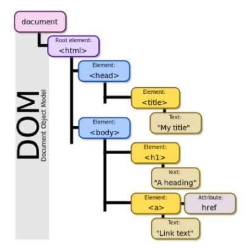
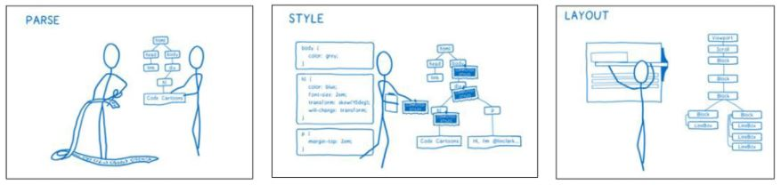
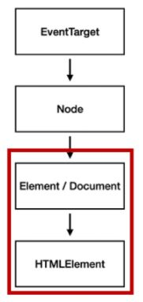

# JavaScript 01

### 브라우저 (Browser / Web Browser)

- 웹 서버에서 클라이언트와 서버간 양방향으로 통신하고, 리소스를 출력하는 GUI 기반의 소프트웨어
- ex) Google - Chrome, Mozilla - Firefox, Microsoft Edge, Opera, Safari


### JavaScript Intro

- 브라우저 화면을 동적으로 만드는 언어

- 브라우저를 조작할 수 있는 유일한 언어

- **History**

  - 인물

    - **팀 버너스리 (Tim Berners-Lee)**

      ```markdown
      - WWW, URL, HTTP, HTML 최초 설계자
      - 웹의 아버지
      ```

    - **브랜던 아이크 (Brendan Eich)**

      ```markdown
      - JavaScript 최초 설계자
      - 모질라 재단 공동 설립자
      - 코드네임 피닉스 프로젝트 : 파이어폭스의 전신
      ```

      

  - JavaScript 탄생 ~ 현재

    ```markdown
    # 탄생 `94 ~ `95
    1) 1994
    	넷스케이프 커뮤니케이션스의 Netscape Navigator(NN) 브라우저가 브라우저의 표준 역할 담당
    
    2) JS 개발
    	넷크케이프에 재직 중이던 브랜던 아이크가 HTML을 동적으로 동작시키기 위한 프로젝트 진행 중 JS 개발
    
    3) JavaScript 명칭 변천
    	Mocha >> LiveScript >> JavaScript(1995)
    	당시 가장 많이 사용되던 언어 Java에서 명칭을 땀
    
    4) 1995
    	마이크로소프트에서 JS를 커스터마이징한 JScript 제작
    	IE 1.0에 탑제 >> 1차 브라우저 전쟁
    
    # 제 1차 브라우저 전쟁 `96 ~ `08
    - 넷스케이프 v 마이크로소프트(MS)
    - IE 3에서 자체적인 JSscript 지원 >> 호환성 문제로 크로스 브라우징 등의 이슈 발생
    1) 1997
    	MS가 IE 4를 발표하면서 시장을 장악하기 시작
    
    2) 1998
    	브랜던 아이크 외 후계자들이 모질라 재단 설립
    	파이어폭스를 개발해 꾸준히 점유율 향상
    
    3) 2001
    	MS의 승리로 IE 점유율 90% 상회
    	
    # 제 2차 브라우저 전쟁 `09 ~ 
    - MS v Google
    1) 2008
    	Google의 Chrome 발표
    
    2) 2011 ~ 2012
    	`11 파이어폭스 점유율 돌파, `12 전 세계 점유율 1위
    
    +) 승리 요인
    	a) 빠른 속도
    	b) 강력한 개발자 도구 제공
    	c) 웹 표준 준수
    ```

    

  - **파편화와 표준화**

    ```markdown
    - 제 1차 브라우저 전쟁 이후 많은 브라우저에서 자체 JavaScript 언어를 사용
    	>> 크로스 브라우징 이슈 발생 >> 웹 표준 필요성 제기
    	>> 각 브라우저 기업과 재단이 표준화에 적극적으로 동참
    
    # 크로스 브라우징 (Cross Browsing)
    	W3C에서 체택된 표준 웹 기술을 채용하여 어느 한쪽에 치우치지 않도록
        구현 기술을 비슷하게 만들어 웹 페이지를 제작하는 방법론 (동일성X 동등성O)
        - 이유: 브라우저마다 렌더링에 사용하는 엔진이 다르기 때문
    
    1) 1996
    	넷스케이프 - 표준 제정의 필요성 주장
    	ECMA 인터내셔널에 표준 제정 요청
    
    2) 1997
    	ECMAScript 1 (ES1) 발표
    
    # JavaScript ES6+
    1) 2015
    	ES2015 (ES6) 발표
    		- Next-gen of JS
    		- JavaScript의 고질적 문제 해결 & 혁신적 변화
    		- 공식 명칭은 ES + 출시년도 / 통상적으로 ES6라 명명
    
    # Vanilla JavaScript
    - 크로스 브라우징, 간편한 활용 등을 위해 많은 라이브러리 등장
    
    - ES6 이후 다양한 도구의 등장으로 순수 자바스크립트 활용 증대
    ```


#### 브라우저가에서 가능한 작업

```markdown
1) DOM 조작
	문서(HTML) 조작

2) BOM 조작
	navigator, screen, location, frames, history, XHR

3) JavaScript Core
	Data Structure(Object, Array), Conditional Expression, Iteration
```

### BOM (Browser Object Model)

- JavaScript가 브라우저와 소통하기 위한 모델
- 브라우저의 창이나 프레임을 추상화해서 프로그래밍적으로 제어할 수 있도록 제공하는 수단


### JavaScript Core

- 프로그래밍 언어 (JavaScript)


### DOM (Document Object Model)

- HTML, XML과 같은 문서를 다루기 위한 문서 프로그래밍 인터페이스

- 문서를 구조화하고 **구조화된 구성 요소를 하나의 객체로 취급**하여 다루는 **논리적 트리 모델**

- 주요 객체

  ```markdown
  - window: DOM을 표현하는 창, 최상위 객체
  - document: 페이지 컨텐츠의 Entry Point 역할, \<body> 등 다양한 요소 포함
  - navigator, location, history, screen
  ```

  

- **파싱 (Parsing)**

  - 구문 분석, 해석

  - 브라우저가 문자열을 해석하여 DOM Tree로 만드는 과정

    

  

- **조작**

  - 순서

    ​	**1) 선택 (Select)**

    ​	**2) 변경 (Manipulation)**

    

  - **DOM 관련 객체의 상속 구조**

    ```markdown
    1) EventTarget
    	EventListener를 가질 수 있는 객체가 구현하는 DOM 인터페이스
    
    2) Node
    	여러가지 DOM 타입들이 상속하는 인터페이스
    
    3) Element
    	Document 안의 모든 객체가 상속하는 가장 범용적인 기반 클래스
    	부모인 Node와 조상인 EventTarget의 속성을 상속
    
    4) Document
    	브라우저가 불러온 웹 페이지
    	DOM 트리의 진입점(entry point) 역할 수행
    
    5) HTMLElment
    	모든 종류의 HTML 요소
    	부모 Element의 속상 상속
    ```

    

    

    ```markdown
    # const
    - JavaScript 변수 선언 시 사용하는 메서드
    ```

  - **DOM 선택**

    ```markdown
    # Document.querySelector(selector) / element
    - 제공한 선택자와 일치하는 element 하나 선택
    - 만족하는 첫 번째 element 객체 반환 / 없으면 null 반환
    
    # Document.querySelectorAll(selector) / NodeList
    - 제공한 선택자와 일치하는 모든 element 선택 / NodeList 반환
    - querySelectorAll()에 의해 반환되는 NodeList는 Static Collection으로 실시간 반영 X
    	>> 반복문 활용 변환 가능
    
    # document.getElementById(id) / element
    # document.getElementByTagName(name) / HTMLCollection
    # document.getElementByClassName(names) / HTMLCollection
    
    # HTMLCollection (Live Collection)
    - name, id, index 속성으로 각 항목에 접근 가능
    
    # NodeList (Live Collection / querySelectorAll()=Static Collection)
    - index로만 각 항목에 접근 가능
    - 배열에서 사용하는 forEach 함수 및 메서드 사용 가능
    ```

  - **DOM 변경**

    ```markdown
    ------- 변경 메서드 -------
    # Document.createElement()
    - 작성한 태그 명의 HTML 요소를 생성하여 반환
    
    # Document.append()
    - 부모 Node의 마지막에 Node 객체 또는 DOMString 삽입
    - 여러 Node 객체, DOMString 추가 가능
    - 반환 값 X
    
    # Document.appendChild()
    - 부모 Node의 마지막에 Node 객체 삽입
    - 한번에 하나의 Node만 추가 가능
    - 추가된 Node 반환
    
    ------- 변경 속성 -------
    # Document.innerText
    - Node 객체와 그 자손의 DOMString을 표현 (해당 element 내부의 raw text)
    
    # Document.innerHTML
    - element 내에 포함된 HTML 마크업 반환
    - XSS 공격에 취약 / 사용 시 주의
    
    # XSS (Cross-site Scripting)
    - 공격자가 웹 사이트 클라이언트 측 코드에 악성 스크립트를 삽입해 공격하는 방법
    - 피해자(사용자)의 브라우저가 악성 스크립트를 실행, 공격자가 엑세스 제어를 우회 및 사용자 가장 (CSRF 공격과 유사)
    ```

  - **DOM 삭제**

    ```markdown
    ------- 삭제 메서드 -------
    # ChildNode.remove()
    - Node가 속한 트리에서 해당 Node 제거
    
    # ParentNode.removeChild()
    - DOM에서 자식 Node를 제거하고 제거된 Node 반환
    ```

  - **DOM 속성**

    ```markdown
    ------- 속성 메서드 -------
    # Element.setAttribute(name, value)
    - 지정된 요소의 값을 설정
    - 이미 존재하는 값 >> 갱신 / 존재하지 않는 값 >> 추가
    
    # Element.getAttribute(attributeName)
    - 해당 요소의 지정된 값(문자열) 반환
    ```


### Event

- 네트워크 활동이나 사용자와의 상호작용 같은 사건의 발생을 알리기 위한 객체

- 역할

  - "~ 하면 ~ 한다."

- **Event handler**

  ```markdown
  # target.addEventListener(type, listener[, options])
  - 지정한 이벤트가 대상에게 전달될 대마다 호출할 함수 설정
  - type:
  	반응 할 이벤트 유형(대소문자 구분, 문자열 형태)
  - listener:
  	지정된 타입의 이벤트가 발생시 알림을 받는 객체
  	
  ------- Event 취소 -------
  # Event.preventDefault()
  - 현재 이벤트의 기본 동작을 중단
  - 태그읠 기본 동작을 작동하지 않게 막음
  ```

  

