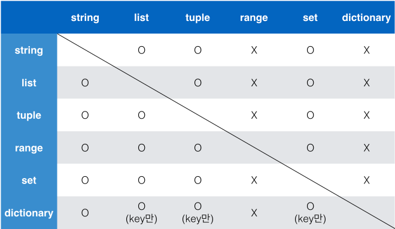

# Python Basic 정리

## ⊙ Container (컨테이너)

1. **Sequence Container(시퀀스 컨테이너)**

   \- 데이터가 순서대로 나열된 **(ordered)** 형식

   **※ 정렬(sorted) != 순서대로 나열(ordered) ※**

   - **특징**

     ```
     1) 순서를 가질 수 있다
     2) 특정 위치의 데이터를 가르킬 수 있다 (index)
     ```

   - **종류**

     ```
     1) list (리스트)
     2) tuple (튜플)
     3) range (레인지)
     4) string (문자열)
     5) binary (바이너리)
     ```

   - **List (리스트)**

     ```markdown
     i) 생성
     	[](대괄호) 또는 list() 함수를 이용하여 생성
     ii) 접근
     	list[idx]로 접근 : index를 이용하여 접근 가능
     ```

   - **Tuple (튜플)**

     ```markdown
     i) 생성
     	()(괄호) 또는 tuple = 1, 2 의 방법으로 생성
     	길이가 1인 튜플은 ,(콤마) 필수  / ex> tuple = (1,)
     ii) 접근
     	tuple[idx]로 접근
     ```

   - **Range (레인지)**

     ```markdown
     i) 형태
     	range(n, m, s)
     	n = 시작, m-1 = 종료, s = 스텝  /  n 기본값 = 0, s 기본값 = 1
     ii) 생성
     	range()함수 이용  /  range 객체 생성
     	※ 리스트로 활용하기 위해서는 list() 함수 사용
     ```

   - **시퀀스에서 활용할 수 있는 연산자 / 함수**

     |   Operation    |     Explanation     |
     | :------------: | :-----------------: |
     |   x **in** s   |  containment test   |
     | x **not in** s |  containment test   |
     |  s1 **+** s2   |    concatenation    |
     |   s ***** n    | n번 반복하여 더하기 |
     |    s**[i]**    |      indexing       |
     |   s**[i:j]**   |       slicing       |
     |   **len( )**   |        길이         |
     |   **min( )**   |       최솟값        |
     |   **max( )**   |       최댓값        |
     | **.count( )**  |      x의 개수       |

2. **Non-sequence Container(비 시퀀스 컨테이너)**

   \- 순서가 없는 **(unordered)** 형식

   - **Set (세트)**

     \- 순서가 없고 **중복된 값이 없는** 자료구조

     ```markdown
     i) 생성
     	{}(중괄호) 또는 set() 함수를 사용해 생성
     	※ 빈 set 생성 시 set() 함수 사용
     ii) 활용 가능 연산자
     	- : 차집합
     	| : 합집합
     	& : 교집합
     ```

   - **Dictionary (딕셔너리)**

     \- Key와 Value가 쌍으로 이뤄져있는 자료구조

     ```markdown
     i) 생성
     	{}(중괄호) 또는 dict() 함수를 사용해 생성
     	※ key = immutable(변경 불가능) 데이터만 가능
     	   value = list, dictionary 등 모두 가능
     ```

   - **컨테이너 형변환**

      

3. **데이터 분류**

   - **mutable**

     \- 변경 가능한 데이터

     ```
     list, set, dictionary
     ```

   - **immutable**

     \- 변경 불가능한 데이터

     ```
     literal(Number, String, Bool), range(), tuple(), frozenset()
     ```

## ⊙ Control Statement (제어문)

1. **Conditional Statment (조건문)**

   - **if 조건문**

     ```python
     # 문법
     if <expression>:
     	code block
     else:
     	code block
     ```

     ※ 들여쓰기 유의 / 기본 4spaces 사용

   - **elif 복수 조건**

     ```python
     # 문법
     if <expression>:
     	code block
     elif <expression>:
     	code block
     else:
     	code block
     ```

     ※  elif 복수 조건은 여러개 사용 가능

   - **중첩 조건문 (Nested Conditional Statement)**

     \- 조건문은 다른 조건문에 중첩 가능

     ```python
     # 문법
     if <expression>:
     	if <expression>:
     		cod block
     		...
     ```

   - **조건 표현식/Contitional Expression (삼항 연산자 / Ternary Operator)** 

     \- 일반적으로 조건에 따라 값을 정할 때 활용

     ```python
     # 문법
     true_vlaue if <expression> else false_value
     ```

     - 예제

       ```python
       # if 조건문
       num = 2
       if num % 2:
           result = '홀수입니다.'
       else:
           result = '짝수입니다.'
       print(result)
       ```

       ```python
       # 조건 표현식(삼항 연산자)
       num = int(input())
       print('홀수입니다.' if num % 2 else '짝수입니다.')
       ```

2. **Loop statment (반복문)**

   - **while 반복문**

     \- **조건식이 True인 경우 반복**적으로 코드 실행

     ```python
     # 문법
     while <expression>:
     	code block
     ```

     ※ 들여쓰기 유의 / 기본 4spaces 사용

     ※ **종료조건 설정 필수** → 미설정시 무한 루프 발생

   - **for 문**

     \- sequence를 포함한 **순회가능한 객체(iterable)의 요소 순회**

     ```python
     # 문법
     for <variable> in <iterable>:
     	code block
     ```

     ※ 들여쓰기 유의 / 기본 4spaces 사용

   - **반복 제어 (break, continue, for-else, pass)**

     - **break**

       \- 반복문을 종료하는 코드

     - **continue**

       \- 이후의 코드를 수행하지 않고 다음 요소부터 반복  수행

     - **else**

       \- 반복에서 리스트 소진(for) 또는 조건 False(while)로 인하여 반복문이 종료될 때 실행

       ※ break 시 실행 X

     - **pass**

       \- 아무것도 하지 않음

## ⊙ Function (함수) I

1. **함수의 정의**

   - **특징**

     ```
     1) 가독성
     2) 재사용성
     3) 유지보수
     ```

   - **선언 및 호출**

     ```python
     # 선언
     def <function>(parameter1, parameter2, ...):
     	code block
     	return value
     
     # 호출
     function(val1, val2, ...)
     ```

     \- 경우에 따라 parameter의 기본값 설정 및 생략 가능

2. **함수의 Output**

   - **return**

     \- 함수는 반환값이 존재 / 반환값의 종류는 상관 없음

     \- 함수가 return 또는 종료되면 함수를 호출한 곳으로 되돌아감

     **※ 함수의 반환값은 단, 한 개 ※**

3. **함수의 Input**

   - **매개변수(parameter) & 인자(argument)**

     - **매개변수**

       ```python
       # 입력 받아 함수 내부에서 활용할 변수
       # 함수 선언(정의)시에 작성
       def <function>(parameter):
           pass
           return value
       ```

     - **인자**

       ```python
       # 전달되는 입력값
       # 함수 호출 시에 작성
       function(argument)
       ```

   - **인자(argument)**

     - **위치 인자(Positional Arguments)**

       \- 기본적으로 인자는 위치에 따라 함수 내에 전달

       ```python
       def <function>(Pargs1, Pargs2):
       ```

     - **기본 인자(Default  Argument Values)**

       \- 함수를 정의할 때, 기본값을 지정하여 정의된 것 보다 적은 개수의 인자들로 호출 가능

        **※ 기본 인자 다음에 기본 값이 없는 인자를 사용할 수 없다 ※**
   
       ```python
       def <function>(Pargs, DargsV = 1)
       ```

     - **키워드 인자(Keyword Arguments)**

       \- 함수 호출 시 키워드 인자를 활용하여 직접 변수의 이름으로 특정 인자 전달 가능
   
       ```python
       def <function>(name, age):
       	pass
       	return value
       	
       function(name='kim', age='20')
       ```

   - **정해지지 않은 여러 인자 처리**

     - **가변인자 리스트 (*args)**

       \- 개수가 정해지지 않은 임의의 인자를 받기 위해서 함수를 정의할 때 가변인자 리스트 *args를 활용
   
       ```python
       def <function>(args, *args):
       	pass
       	return value
       ```

     - **가변 키워드 인자 (\**kwargs)**

       \- 정해지지 않은 키워드 인자들을 받기 위해서 함수를 정의할 때 가변 키워드 인자 \**kwargs를 활용

       \- 가변 키워드 인자는 dict 형태로 처리
   
       ```python
       def <function>(**kwargs):
       	pass
       	return value
       ```

## ⊙ Function (함수) II

1. **함수와 스코프(scope)**

   - **스코프 종류**

     ```
     1) 전역 스코프(global scope)
     2) 지역 스코프(local scope)
     ----------------------------
     3) 전역 변수(global variable)
     4) 지역 변수(local variable)
     ```

   - **수명주기**

     ```markdown
     1) built-in scope
     	파이썬 실행된 이후부터 영원히 유지
     2) global scope
     	모듈이 호출된 시점 이후 혹은 이름이 선언된 이후부터 인터프리트 종료시까지 유지
     3) local scope
     	함수가 호출될 때 생성, 함수가 종료될 때까지 유지
     ```

   - **Resolution(이름찾기) 규칙**

     **\- LEGB Rule**

     ```
     1) Local scope : 함수
     2) Enclosed scope : 상위 함수
     3) Global scope : 함수 밖의 변수, import 된 모듈
     4) Built-in scope : 파이썬에 내장되어 있는 함수 또는 속성
     ```

2. **재귀 함수(recursive function)**

   - 함수 내부에서 자기 자신을 호출하는 함수

     \- 알고리즘 설계 및 구현에서 유용하게 활용 / 기본적으로 점점 범위가 줄어드는 문제 해결 시 사용

     \- 반복문에 비해 변수 사용을 줄일 수 있음

     **※ 반드시 base case(종료 시점) 필요 ※**

     **※ 최대 재귀 깊이 = 1,000 / 변경 가능 ※**

## ⊙ Error Exception (예외 처리)

1. **에러 (Error)**

   - **Syntax Error (문법 에러)**

     - **lnvalid syntax**

       ```python
       while
       ```

     - **assign to literal**

       ```python
       5 = 3
       ```

     - **EOL (End of Line)**

       ```python
       print('hello)
       ```

     - **EOF (End of File)**

       ```python
       print(
       ```

   - **Exception (예외)**

     - **ZeroDivisionError**

       ```python
       # 0으로 나누고자 하는 경우
       10 / 0
       ```

     - **NameError**

       ```python
       # namespace에 이름이 없는 경우
       print(n)
       ```

     - **TypeError**

       ```python
       # 타입 불일치
       1 + '1'
       # argument 누락
       divmod()
       # argument 초과
       divmod(1, 2, 3)
       # argument type 불일치
       divmod('a', 2)
       ```

     - **ValueError**

       ```python
       # 타입은 올바르나 값이 적절하지 않거나 없는 경우
       int('3.5')
       ```

     - **IndexError**

       ```python
       # index가 범위를 벗어난 경우
       x_list = [1, 2]
       x_list[3]
       ```

     - **KeyError**

       ```python
       # key가 존재하지 않는 경우
       x_dict = {1: 'a', 2: 'b'}
       x_dict[3]
       ```

     - **ModuleNotFoundError**

       ```python
       # 설치되어있지 않은 모듈 또는 오타를 통한 모듈 호출 경우
       import give_me_money
       ```

     - **ImportError**

       ```python
       # 모듈은 있으나 불러오는 클래스/함수의 주소 또는 이름이 다른 경우
       from random import sample # 올바른 방법
       from random import saple  # 잘못된 방법
       ```

     - **KeyboardInterrupt**

       ```python
       # 임의 종료 시 발생
       ctrl + c
       ```

     - **IndentationError**

       ```python
       # Indentation(들여쓰기)이 적절하지 않은 경우
       for i in rnage(3):
       print(i)
       ```

2. **예외 처리 (Exception Handling)**

   - **try & except**

     \- try  아래 코드블럭 실행  ------ 예외 미발생 ---->> 종료

     \- 									  	------ 예외 발생 ---->> except 아래 코드블럭 실행

     ※ as 키워드를 이용하여 에러 메시지 전달 가능 ※

     ```python
     # 문법
     try:
     	code block1
     except:				# except 복수 사용 가능
     	code block2
     ```

   - **try & except & else**

     \- try  아래 코드블럭 실행  ------ 예외 미발생 ---->> else 아래 코드블럭 실행

     \- 									  	------ 예외 발생 ---->> except 아래 코드블럭 실행

     ```python
     # 문법
     try:
     	code block1
     except:
     	code block2
     else:				# 모든 except절 뒤에 위치
         code block3
     ```

   - **try & except & finally**

     \- try  아래 코드블럭 실행  ------ 예외 미발생 ---->> 종료 ----------------------------------->> finally 아래 코드블럭 실행

     \- 									  	------ 예외 발생 ---->> except 아래 코드블럭 실행 ------->> finally 아래 코드블럭 실행

     ```python
     # 문법
     try:
     	code block1
     except:
     	code block2
     finally:				# 예외 발생 여부와 상관없이 실행
         code block3
     ```

   - **예외 발생 시키기 (Exception Raising)**

     ```python
     # raise
     raise<Error>('message')
     -------------------------
     def avg(scores):
         if not len(scores):
             raise Exception('학생이 없습니다.')
         
         return sum(scores) / len(scores)
     
     print(avg([]))
     -------------------------
     Exception: 학생이 없습니다
     ```

     ```python
     # assert (AssertionError 발생)
     # 디버깅 용도
     assert Boolean expression, error message
     assert len([1, 2]) == 1, '길이가 1이 아닙니다.'
     --------------------------------------------
     # 위 검증 식이 거짓일 경우를 발생
     Traceback (most recent call last):
       File "code.py", line 1, in <module>
         assert len([1, 2]) == 1, '길이가 1이 아닙니다.'
     AssertionError: 길이가 1이 아닙니다.
     ```

## ⊙ Data Structure (데이터 구조) I

- dir(type) = method 확인

1. **문자열(String)**

   - **immutable / ordered / iterable**

   - **메서드(method)**

     ```markdown
     1) 조회/탐색
     	.find(x) / -1
     	.index(x) / Value Error
     2) 문자열 변경
     	.replace(old, new[, count])
     	.strip([chars]) / .rstrip() / .lstrip()
     	.split([chars])
     	'separator'.join(iterable)
     	.capitalize() / .title() / .upper() / .lower() / .swapcase()
     3) 참/거짓 반환
     	.isalpha() / .isdecimal() / .isdigit() / .isnumeric() / .isspace() / .isupper() / .istitle()  etc
     ```

2. **리스트(List)**

   - **mutable / ordered / iterable**

   - **메서드(method)**

     ```markdown
     1) 값 추가 및 삭제
     	.append(x)
     	.extend(iterable) / TypeError
     	.insert(idx, x)
     	.remove(x) / ValueError
     	.pop(idx) / IndexError
     	.clear()
     2) 탐색 및 정렬
     	.index(x) / ValueError
     	.count(x)
     	.sort([reverse=True])
     	.revers() / ※ sort X ※
     ```

   - **리스트 복사**

     ```markdown
     1) shallow copy
     	a = [1, 2, 3]
     	i) slice 연산자 활용 / b = a[:]
     	ii) list()함수 활용 / b = list(a)
     	iii) copy module 활용 / b = copy.copy(a)
     2) deep copy
     	i) copy module 활용 / b = copy.deepcopy(a)
     ```

   - **List Comprehenshion**

     ```python
     x = [<expression> for <variable> in <iterable>]
     x = list(<expression> for <variable> in <iterable>)
     # 조건문
     x = [<expression> for <variable> in <iterable> if <expression>]
     ```

3. **데이터 구조에 적용 가능한 Built-in Function**

   \- iterable type에 적용 가능한 내장 함수

   \- `list` `dict` `set` `str` `bytes` `tuple` `range`

   ```python
   map(function, iterable)
   sum(iterable[, start])
   filter(function, iterable)
   zip(*iterable)
   ```

## ⊙ Data Structure (데이터 구조) II

1. **세트(Set)**

   - **mutable / unordered / iterable**

   - **메서드(method)**

     ```markdown
     1) 추가 및 삭제
     	.add(x)
     	.update(*iteralbe)
     	.remove(x) / KeyError
     	.discard(x)
     	.pop() / KeyError
     ```

2. **딕셔너리(Dictionary)**

   - **mutable / unordered / iterable**

   - **key:value pair**

   - **메서드(method)**

     ```markdown
     1) 조회
     	.get(key[, default]) / default = None
     2) 추가 및 삭제
     	.pop(key[, default]) / default 미설정 = KeyError
     	.update({key:value})
     3) 기타(순회)
     	.keys()
     	.values()
     	.items()
     ```

   - **Dictionary Comprehension**

     ```python
     x = {key: Value for <*variables> in <iterable>}
     x = dict({key: Value for <*variables> in <iterable>})
     # 조건문
     x = {key: value for <*variables> in <iterable> if <expression>}
     ```

## ⊙ Module (모듈)

1. **모듈(Module)**

   - 특정 기능을 하는 코드를 담고 있는 파일(or 스크립트)

     ```markdown
     1) 생성
     	<name>.py로 저장
     2) 활용
     	import <module_name>
     ```

     ```python
     import module
     from module import var, function, Class
     from module import *
     ```

2. **패키지(Package)**

   - 모듈들의 집합 / 모듈을 구조화하는 방법

     ```markdown
     1) 생성
     	package_name/
     		__init__.py
     		module_name/
     			__init__.py
     			module_name.py
     2) 활용
     	from package_name import module_name [as nickname]
     ```

     ```python
     from package import module
     from package.module import var, funciton, Class
     ```

## ⊙ Object-Oriented Programming (객체지향)

1. **객체(object)**

   - 클래스(class)에서 정의한 것을 토대로 메모리(실제 저장공간)에 할당된 것

   - 객체는 특정 타입의 인스턴스 (object == instance)

     ```
     <예시>
     100, 95, 5 => int의 인스턴스
     'hello', 'bye' => str의 인스턴스
     [1, 2], ['a', 'b'] => list의 인스턴스
     ```

   - **특징**

     - **타입(type)** : 어떤 operator와 method가 가능한가?
     - **속성(attribute)** : 어떤 data를 가지는가
     - **조작(method)** : 어떤 행위(함수)를 할 수 있는가?

   - **속성 (attribute)**

     - \<object>.\<attribute>
     - 객체의 상태 / 데이터

   - **메서드 (method)**

     - \<object>.\<method>( )
     - 특정 객체에 적용될 수 있는 행위 / 일반적으로 클래스에 정의된 함수

     |       Object       |       Class        |        Instance        |
     | :----------------: | :----------------: | :--------------------: |
     |    - 현실세계 -    |     - 출입구 -     |      - 가상세계 -      |
     | - 현실의 모든 것 - |     - 설계도 -     | - 가상세계의 모든 것 - |
     |     현실의 나      | 데이터, 행동 등을  |     가상세계의 나      |
     |         🤵          | 저장하기 위한 수단 |           🤵            |

2. **객체지향 프로그래밍 (OOP)**

   - **명령형 프로그래밍**

     - **절차지향 프로그래밍** : 데이터와 함수

     - **객체지향 프로그래밍** : 데이터와 메서드 분리, 추상화된 구조(인터페이스)

         **\- 직관성 / 용이성 / 유연성**

   - **클래스와 인스턴스**

     - **클래스(class)** =  객체들의 분류
     - **인스턴스(instance)** = 하나하나의 객체
     - **속성(attribute)** = 인스턴스들이 가지는 상태 및 데이터
     - **메서드(method)** = 인스턴스가 적용 가능한 행위(함수)

     ```python
     class MyClass:            # class 정의
         pass
     my_instance = MyClass()   # 인스턴스 생성
     my_instance.my_method()   # 메서드 호출
     my_instance.my_attribute  # 속성
     ```

   - **self**

     - 인스턴스 자기자신
     - 인스턴스 메서드는 호출 시 첫번째 인자로 인스턴스 자신이 전달되도록 설계

   - **생성자 (constructor)**

     - **\__init__**

     - 인스턴스 객체가 생성될 때 호출되는 메서드

   - **소멸자 (distructor)**

     - **\__del__**
     - 인스턴스 객체가 제거될 때 호출되는 메서드

   - **매직 메서드**

     - Double underscore(__ / 던더스코어)가 있는 메서드는 특수한 동작을 위해 만들어진 메서드
     - 스페셜 메서드 or 매직 메서드

     ```python
     __str__(self) # 객체의 출력 형태를 지정하는 메서드
     __repr__(self) # 프린팅 메서드 / 객체를 출력할 때 호출하는 메서드
     __len__(self), __lt__(self,other) etc...
     ```

3. **클래스와 인스턴스**

   - *인스턴스 변수**

     - 인스턴스 속성(attribute)

     - 각 인스턴스들의 고유한 변수

       ```
       self.<name> 으로 정의
       <instance>.<name>으로 접근
       ```

   - **클래스 변수**

     - 클래스 속성(attribute)

     - 모든 인스턴스가 공유

       ```
       클래스 내부에서 정의
       <classname>.<name>으로 접근 및 할당
       ```

   - 인스턴스와 클래스의 **namespace**

     - **namespace 탐색 순서**

       ​	**① instance 변수**

       ​	**② class 변수**

       ​	**③ global 변수**

       ```markdown
       	※ 인스턴스 변수가 클래스 변수에 접근해 변경하면 클래스 변수 변경 X
       	   해당 인스턴스 에 새로운 변수 생성 및 더 이상 클래스 변수 접근 불가
       ```

   - **메서드의 종류**

     - **인스턴스 메서드**

       - 인스턴스가 사용할 메서드

         → 클래스에 영향 X, 독립적으로 행동

       - 클래스 내부에 정의되는 메서드의 기본

       - 호출 시, 첫 인자로 self 전달

         ```python
         class Myclass:
         	def instance_method(self, arg1, ...):
         	
         my_instance = MyClass()
         my_instance.instance_method(...)
         ```

     - **클래스 메서드**

       - 클래스가 사용할 메서드

         → 클래스의 변수에 접근 및 변경

       - @classmethod 데코레이터 사용하여 정의

       - 호출 시, 첫 인자로 클래스(cls) 전달

         ```python
         class Myclass:
             @classmethod
             def class_method(cls, arg1, ...):
              
         MyClass.class_method(...)
         ```

     - **스태틱 메서드(정적 메서드)**

       - 클래스가 사용할 메서드

       - @staticmethod 데코레이터 사용하여 정의

       - 호출 시, 어떠한 인자도 전달 X

         ```python
         class MyClass:
             @staticmethod
             def staticmethod()
          
         MyClass.staticmethod()
         ```

     - **메서드 정리**

       - 인스턴스는 모든 메서드 호출 가능 (할 수 있지만 하지 말 것!)
       - 클래스는 클래스 속성 접근 여부에 따라 클래스메서드 또는 스태틱 메서드 정의

4. **상속**

   - **상속**

     - 부모 클래스의 속성, 메서드를 상속 → 코드 재사용성 향상

       ```python
       class ChildClass(ParentClass):
       	pass
       ```

   - **isinstance(object, classinfo)**

     - object가 classinfo의 instance 이거나 subclass인 경우 True 반환

   - **issubclass(class, classinfo)**

     - class가 classinfo의 subclass인 경우 True 반환
     - classinfo는 튜플로 전달 가능 (모든 항목 검사)

   - **super( )**

     - 자식클래스에서 부모클래스의 속성 및 메서드를 사용하려는 경우

   - **메서드 오버라이딩**

     - 부모 클래스로 부터 상속 받은 메서드를 재정의하여 사용하는 것
     - 상속 받은 메서드를 그대로 사용하는 경우  super() 사용

   - **다중상속**

     - 두개 이상의 부모클래스를 상속
     - 같은 이름의 변수에 접근 시 앞의 부모클래스를 먼저 탐색

