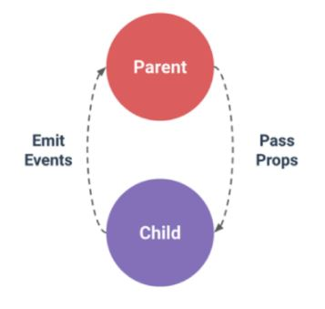
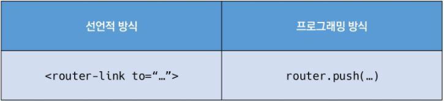
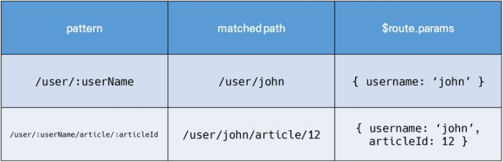

# Vue CLI

### 1. SFC

- **Component (컴포넌트)**

  - Vue Component === Vue Instance

  - **재사용성**을 위해 개발된 소프트웨어 구성 요소

    \>> 재사용성 향상 및 유지보수 용이


- **SFC (Single File Component)**

  - **Vue Component === Vue Instance === .vue File**

  - 컴포넌트는 .vue 확장자 파일 안에서 작성되는 코드의 결과물

    \>> HTML, CSS, JavaScript 코드로 작성

    

    ```markdown
    # 단일 파일 개발
    - 개발 시작 단계가 편리
    - 코드 양이 많아지면 변수 관리 및 유지보수에 불리
    
    # 기능별 분할 팔일 개발
    - 개발 시작 단계 소요시간 증가
    - 이후 변수 관리 및 유지보수에 유리
    ```

    

### 2. Vue CLI

- **NPM (Node Package Manage)**

  - 자바스크립트 언어를 위한 패키지 관리자 (Node.js)

    ```markdown
    # Vue CLI 설치
    $ npm i(install) -g @vue/cli
    
    # 프로젝트 생성
    $ vue create pjt_name
    
    # Vue 버전 선택
    - 학습 간 Vue 2로 진행
    
    # 프로젝스 생성 후
    $ cd pjt_name
    $ npm run serve
    ```

    

### 3. Babel & Webpack

- **Babel**

  - ES6 코드를 이전 버전으로 번역 / 변환하는 도구

    ```markdown
    # Why?
    - 최신 문법 사용시 이전 브라우저 및 환경에서 동작하지 않는 상황 발생 가능 >> 개발자가 직접 이전 버전 문법으로 코드 작성을 할 필요성 제거
    ```

- **Webpack**

  - 모듈 간의 의존성 문제를 해결하기 위한 도구
  - 모듈 매핑    >>    내부적으로 종속성 그래프를 빌드


- **Static Module Bundler**
  - **Module 의존성 문제**
    - 모듈의 수가 많아지고 라이브러리 혹은 모듈 간 의존성(연결성)이 깊어지면서 문제가 발생시 원인을 파악하기 어려워짐	>>	이를 해결하기 위해 Webpack 등장
  - **Bundler**
    - 모듈 의존성 문제를 해결하는 작업
    - 여러 모듈을 하나로 묶고 묶인 파일은 하나 또는 여러 개로 통합
    - **Webpack은 Module Bundler 중 하나**


### 4. Pass Props & Emit Events

- 컴포넌트 작성
  - Vue app은 중첩된 컴포넌트 트리로 구성

  - 컴포넌트 간 부모 / 자식 관계 구성    >>    의사소통 필요

  - **부모 >> 자식 : Props (데이터 전달)**

  - **자식 >> 부모 : Events (매시지 전달)**

    

- **Pass Props**

  - 부모 컴포넌트의 정보를 자식 컴포넌트에게 전달하기 위한 특성

  - data를 props 옵션을 통해 자식 컴포넌트에게 전달

  - **Static Props**

    ```vue
    // Parent
    <child parent-data="value"></child>
    
    
    // Child
    // template
    {{ parentData }}
    
    // Script
    props: {
      parentData: dataType,
    }
    ```

  - **Dynamic Props**

    - **v-bind** directive를 사용해 동적으로 바인딩
    - 부모에서 데이터 업데이트 시 마다 >> 자식 데이터로 전달

    ```vue
    // Parent
    // template
    <child :parent-data="parentData"></child>
    
    // script
    data: function () {
      return {
        parentData: value,
      }
    }
    
    
    // Child
    // template
    {{ parentData }}
    
    // Script
    props: {
      parentData: dataType,
    }
    ```

    

  - **Props 이름 컨벤션**

    - **JavaScript : camelCase**
    - **HTML : kebab-case**

  - **단방향 바인딩**

    - 모든 props는 하위 속성과 상위 속성 간 단방향 바인딩 형성


- **Emit Events**

  - 자식 컴포넌트가 부모 컴포넌트에게 메시지를 전달하는 것

  - **$emit(eventName)**

    ```vue
    // Child
    // template
    <tag @event="eventFunction">
    </tag>
    // script
    methods: {
      eventFunction: function () {
        this.$emit('child-event', this.childData)
      },
    }
    
    
    // Parent
    // template
    <child @child-event="parentGetEvent">
    </child>
    
    // script
    methods: {
      parentGetEvent: function (childData) {
        content
      },
    }
    ```

    

  - **event 이름 컨벤션**

    - 이벤트 명 작성은 **kebab-case** 사용 권장


# Vue Router

### 1. Vue Router

- ```markdown
  # Vue Router plugin 설치 (Vue CLI 환경)
  $ vue add router
  	프로젝트 진행 전에 추가 권장
  	프로젝트 진행 중에 추가시 App.vue를 덮어쓰기 때문에 백업 필수
  ```

- **\<router-link>**
  - 사용자 네비게이션을 가능하게 하는 컴포넌트
  - a tag로 구성되어있지만 GET 요청 이벤트를 제거한 형태로 구성
- **\<router-view/>**
  - 주어진 라우트와 일치하는 컴포넌트를 렌더링하는 컴포넌트
  - component가 DOM에 부착되어 출력되는 위치
- **History mode**
  - HTML History API를 사용해서 router를 구현한 것
  - 히스토리를 저장하여 페이지 이동 없이 이전 항목을 불러올 수 있음
  - 페이지 리로드 없이 URL 탐색 가능


- **1. Named Routes**

  - 이름을 가지는 라우트

    ```vue
    // index.js
    {
      path: 'path',
      name: 'routeName',
      component: componentName
    }
    
    
    // App.vue
    <router-link :to="{ name: 'routeName' }"></router-link>
    ```

- **2. 프로그래밍 방식 네비게이션**

  

  - Vue 인스턴스 내부에서 라우터 인스턴스에 **$router**로 접근 가능
  - **this.$router.push()**를 호출하여 다른 URL로 이동 가능

- **3. Dynamic Route Matching**

  

  - 동적 인자 전달 방식
  - 동적 인자는 ':'(콜론)으로 시작
  - **this.$route.params**로 사용 가능

