# Vue.js

>## 1. Vue.js
>
>### # SPA	# CSR	# SSR	# SEO

### Vue.js

- UI를 만들기 위한 자바스크립트 프레임워크


### SPA

- Single Page Application (단일 페이지 어플리케이션)
- 페이지를 동적으로 렌더링함으로써 사용자와 소통하는 웹 어플리케이션
- CSR (Client Side Rendering) 구조를 따름


### CSR

- Client Side Rendering

- 최초 요청 시 데이터를 제외한 각종 리소스를 응답받고

  이후 클라이언트에서는 필요한 데이터만 요청해 JS로 DOM을 렌더링 하는 방식

  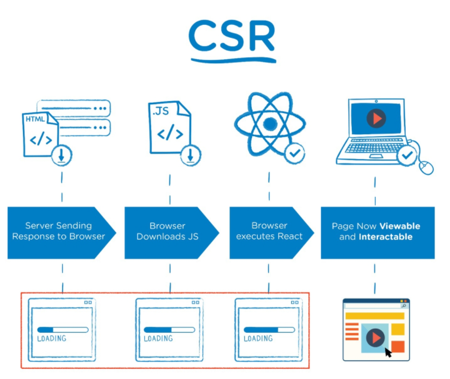

- **장점**

  - 서버와 클라이언트 간 트래픽 감소
  - UX 향상

- **단점**

  - SSR에 비해 전체 페이지 렌더링이 느림
  - SEO (검색 엔진 최적화)에 어려움 (최초 데이터 X)


### SSR

- Server Side Rendering

- 서버에서 클라이언트에게 보여줄 페이지를 모두 구성하여 전달하는 방식

  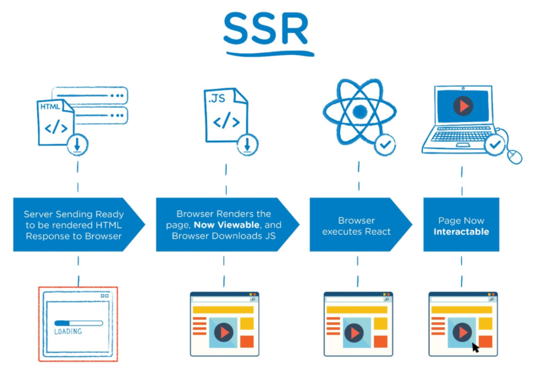

- **장점**

  - 초기 구동 속도가 빠름
  - SEO (검색 엔진 최적화)에 적합

- **단점**

  - 모든 요청마다 새로운 페이지를 구성하여 전달

    \>> 트래픽 과다로인한 서버 부담 향상

    \>> UX 감소


### SEO

- Search Engine Optimization (검색 엔진 최적화)

- 검색엔진이 자료를 수집하고 순위를 매기는 방식에 맞게

  웹 페이지를 구성해서 검색 결과 상위에 노출될 수 있도록 하는 작업

- **Nuxt.js (Vue.js) / Next.js (React)**

  - CSR에서 SEO 대응을 위해 개발된 프레임워크


---

>## 2. Concept & Basic syntax
>
>### # MVVM	# Vue-Instance

### MVVM Pattern

- 어플리케이션 로직을 UI로부터 분리하기 위해 설계된 디자인 패턴

  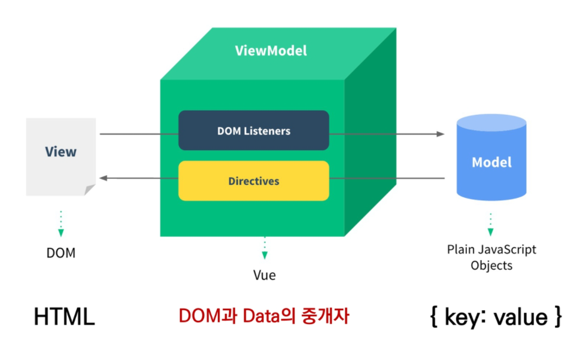

- 구성요소

  - **Model**

    ```markdown
    - JavaScript Object (Data)
    - Vue Instance 내부에서 Data로 사용 / Model이 바뀌면 View(DOM)가 반응
    ```

  - **View**

    ```markdown
    - DOM (HTML)
    - Data에 따라서 변화하는 대상
    ```

  - **View Model**

    ```markdown
    - Vue Instance
    - Model과 View 사이에서 Data와 DOM에 관련된 모든 일 처리
    ```


### Vue Instance

- **Vue Instance === Vue Component**

- Vue instance 생성 시 Options 객체 전달

  \>> Options 객체를 통해 원하는 동작 구현

- **Options**

  - DOM - **'el'**

    \- Vue instance에 마운트할 기존 DOM 요소

    ```javascript
    const app = new Vue({
      el: '#app'
    })
    ```

  - Data - **'data'**

    \- Vue instance의 데이터 객체

    \- 상태 데이터 정의

    \- Vue 객체 내 다른 함수에서 **this 키워드**를 통해 접근 가능

    \- 'data'에서 **화살표 함수 사용 불가** / 부모 컨텍스트를 바인딩하여 Vue instance를 가리키지 않음

    ```javascript
    const app = new Vue({
      data: {
        objName: value,
      }
    })
    ```

  - Data - **'methods'**

    \- Vue instance에 추가할 메서드

    \- Vue 객체 내 다른 함수에서 **this 키워드**를 통해 접근 가능

    \- 'data'에서 **화살표 함수 사용 불가** / 부모 컨텍스트를 바인딩하여 Vue instance를 가리키지 않음

    ```javascript
    const app = new Vue({
      methods: {
        methodName: function () {
          ...
        },
      }
    })
    ```

    - **'this'** keyword

      ```markdown
      - Vue 객체 내 vue instance를 가리킴
      - 사용 불가인 경우
        1. 'data'
        2. 'methods'
      ```

      

  - Data - **'computed'**

    \- 데이터를 기반으로 하는 계산된 속성

    \- 종속된 데이터에 따라 **저장(캐싱)** 됨

    \- **종속된 데이터가 변경될 때만 함수 실행**

    \- **반환값 필수**

    \- **'선언형 프로그래밍'** : 계산해야 하는 목표 데이터를 정의하는 방식

    ​	\>> 특정 값이 변동하면 해당 값을 재계산해서 전달

    ```javascript
    const app = new Vue({
      computed: {
        funcName: function () {
          return value
        },
      }
    })
    ```

  - Data - **'watch'**

    \- 데이터를 감시

    \- **데이터에 변화가 일어났을 때 실행되는 함수**

    \- **'명령형 프로그래밍'** : 감시할 데이터를 지정하고 그 데이터가 바뀌면 실행할 함수(행동)를 정의하는 방식

    ​	\>> 특정 값이 변동하면 특정 작업을 실행

    ```javascript
    const app = new Vue({
      watch: {
        funcName: function () {
          return value
        },
      }
    })
    ```

  - Assets - **'filter'**

    \- 텍스트 형식화를 적용할 수 있는 필터

    \- interpolation 또는 v-bind 이용 시 사용

    \- JS 표현식 마지막에 **'|' (파이프) 와 함께 추가**

    \- 이어서 사용(캐싱) 가능

    ```javascript
    const app = new Vue({
      filters: {
        filter1: function (data) {
          return value
        },
        ...
      }
    })
    
    {{ data | filter1 | filter2 }}
    ```


---

>## 3. Template Syntax
>
>### # Interpolation	# Directive

### Interpolation (보간법)

- **Text**

  ```vue
  <tag>{{ instanceName }}</tag>
  
  <tag v-text="instancName"></tag>
  ```

- **Raw HTML**

  ```vue
  <tag v-html="rawHtml"></tag>
  ```

- **Attributes**

  ```vue
  <tag v-bind:id="dynamicId" v-bind:class="dynamicClass"></tag>
  
  <tag :id="dynamicId" :class="dynamicClass"></tag>
  ```

- **JS 표현식**

  ```vue
  {{ insatnce + 1 }}
  
  {{ insatnce.split('').reverse().join('') }}
  ```


### Directive (디렉티브)

- **v- 접두사**가 있는 특수 속성

- 표현식의 값이 변경될 때 반응적으로 DOM에 적용하는 역할 수행

- **전달인자 (Arguments)**

  - ':' 콜론을 통해 전달인자 수령 가능

    ```vue
    <tag v-bind:herf="url"></tag>
    ```

- **수식어(Modifiers)**

  - '.' 점으로 표시되는 특수 접미사

    ```vue
    <tag v-on:event.prevent="instanceName"></tag>
    ```

- 종류

  - **v-text**

    \- 요소의 textContent 업데이트

    ```vue
    <tag v-text="instancName"></tag>
    ```

  - **v-html**

    \- 요소의 innerHTML을 업데이트

    \- **XSS공격에 취약** / 사용자로부터 입력 받은 내용 사용 금지

    ```vue
    <tag v-html="rawHtml"></tag>
    ```

  - **v-show**

    \- 조건부 렌더링

    \- 요소는 **항상 렌더링** / DOM에 존재

    \- **display CSS 속성을 토글**하여 출력, 미출력 결정

    \- 장점 : 토글 비용이 적음

    \- 단점 : 렌더링 비용이 높음

    ```vue
    <tag v-show="isTrueOrFalse"></tag>
    ```

  - **v-if, v-else-if, v-else**

    \- 조건부 렌더링

    \- **true 인 경우에만 렌더링**

    \- 요소 및 포함된 directive는 토글하는 동안 **삭제 및 재생성**

    \- 장점 : 렌더링 비용이 적음

    \- 단점 : 토글 비용이 높음

    ```vue
    <tag v-if="isTrueOrFalse"></tag>
    <tag v-else-if="isTrueOrFalse"></tag>
    <tag v-else="isTrueOrFalse"></tag>
    ```

  - **v-for**

    \- 원본 데이터를 기반으로 요소 또는 템플릿 블록을 여러 번 렌더링

    \- **item in items** 구문 사용

    \- item 위치의 변수를 각 요소에서 사용 가능

    \- **key 속성을 각 요소에 작성 필수**

    \- v-if와 함께 사용하는 경우 v-for 우선순위가 높음 / **그러지 말 것**

    ```vue
    <tag v-for="item in items" :key="item.key">
      {{ item }}
    </tag>
    ```

  - **v-on**

    \- 요소에 EventListener 연결

    \- 전달인자로 이벤트 유형 전달

    \- **약어(Shorthand) : '@'**

    ```vue
    <tag v-on:"event"></tag>
    
    <tag @:"event"></tag>
    ```

  - **v-bind**

    \- HTML 요소의 속성에 Vue의 상테 데이터를 값으로 할당

    \- Object 형태로 사용 시 value가 true인 key가 바인딩 값으로 할당

    **\- 약어(Shorthand): ':'**

    ```vue
    <tag v-bind:attr="instance"></tag>
    <tag v-bind:attr="{ attr : instance }"></tag>
    
    <tag :attr="instance"></tag>
    <tag :attr="{ attr : instance }"></tag>
    ```

  - **v-model**

    \- HTML form 요소의 값과 data를 **양방향 바인딩**

    \- **.lazy** : input 대신 change 이벤트 이후 동기화

    \- **.number** : 문자열을 숫자로 변경

    \- **.trim** : 입력에 대한 trim(좌, 우 공백제거)


---

>## 4. Lifecycle Hooks

### Lifecylce Hooks

- Vue 인스턴스 생성 시 거치는 초기화 단계

  - 생성, 마운트, 업데이트 등

  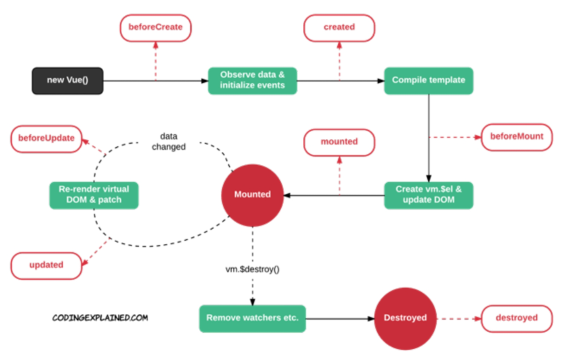

- **Creation 단계**

  - Data와 Event가 추가되는 단계
  - **beforeCreate, created**

- **Mounting 단계**

  - DOM과 Vue Instance의 마운트되는 단계
  - **beforeMount, mounted**

- **Updating 단계**

  - 데이터의 변경으로 화면 렌더링이 다시 일어날 때의 단계
  - **beforeUpdate, updated**
  - updated에서 상태 변경 시 무한루프

- **Destruction 단계**

  - Vue Instance가 삭제되는 단계
  - **beforeDestroy, destroyed**


---

>## 5. SFC
>
>### # Component	# SFC

### Component

- 재사용성을 위해 개발된 소프트웨어 구성요소
- **재사용성 향상 및 유지보수 용이**


### SFC

- Single File Component

- Vue Component === Vue Instance === .vue file

- 하나의 컴포넌트는 .vue 확장자를 가진 하나의 파일 안에서 작성되는 코드의 결과물

  \>> HTML, CSS, JavaScript Code

- 단일 파일 개발

  ```markdown
  - 개발 시작 단계가 편리
  - 코드 양이 많아지면 변수 관리 및 유지보수에 불리
  ```

- 기능별 분할 팔일 개발

  ```markdown
  - 개발 시작 단계 소요시간 증가
  - 이후 변수 관리 및 유지보수에 유리
  ```


---

>## 6. Vue CLI
>
>### # Node.js	# NPM

### Node.js

- JavaScript를 브라우저가 아닌 환경에서도 구동할 수 있도록 하는 JavaScript 런타임 환경


### NPM

- Node Package Manage

- 자바스크립트 언어를 위한 패키지 관리자

- Vue CLI 프로젝트 생성 단계

  - Vue CLI 설치

    ```
    $ npm i(install) -g @vue/cli
    ```

  - 프로젝트 생성

    ```
    $ vue create pjt_name
    ```

  - Vue 버전 선택

    ```
    학습 간 Vue 2로 진행
    ```

  - 프로젝스 생성 후

    ```
    $ cd pjt_name
    $ npm run serve
    ```


---

>## 7. Babel & Webpack
>
>### # Babel	# Webpack

### Babel

- JavaScript compiler

- ES6 이후의 코드를 이전 버전으로 번역 / 변환하는 도구

  \>> 최신 문법 사용시 이전 브라우저 및 환경에서 동작하지 않는 상황 발생 가능

  \>> 개발자가 직접 이전 버전 문법으로 코드 작성을 할 필요성 제거


### Webpack

- **static module bundler** 중 하나
- 모듈 간의 의존성 문제를 해결하기 위한 도구
- 모듈 매핑    >>    내부적으로 종속성 그래프를 빌드


---

>## 8. Pass Props & Emit Events
>
>### # Component	# Pass Props	# Emit Events

### Component

- Vue app은 중첩된 컴포넌트 트리로 구성

  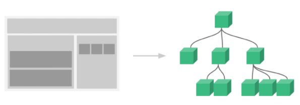

- 컴포넌트 간 부모 / 자식 관계 구성    >>    의사소통 필요

- 컴포넌트 등록 3단계

  1. **불러오기**
  2. **등록하기**
  3. **보여주기**

- **부모 >> 자식 : Props (데이터 전달)**

- **자식 >> 부모 : Events (매시지 전달)**

  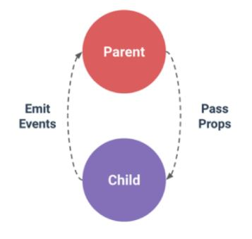


### Pass Props

- 부모 컴포넌트의 정보를 자식 컴포넌트에게 전달하기 위한 특성

- data를 props 옵션을 통해 자식 컴포넌트에게 전달

- **Static Props**

  ```vue
  // Parent
  <child parent-data="value"></child>
  
  
  // Child
  // template
  {{ parentData }}
  
  // Script
  props: {
    parentData: dataType,
  }
  ```

- **Dynamic Props**

  - **v-bind** directive를 사용해 동적으로 바인딩
  - 부모에서 데이터 업데이트 시 마다 >> 자식 데이터로 전달

  ```vue
  // Parent
  // template
  <child :parent-data="parentData"></child>
  
  // script
  data: function () {
    return {
      parentData: value,
    }
  }
  
  
  // Child
  // template
  {{ parentData }}
  
  // Script
  props: {
    parentData: dataType,
  }
  ```

- **Props 이름 컨벤션**

  - **JavaScript : camelCase**
  - **HTML : kebab-case**

- **단방향 바인딩**

  - 모든 props는 하위 속성과 상위 속성 간 단방향 바인딩 형성


### Emit Events

- Listening to Child Components Events

- 자식 컴포넌트가 부모 컴포넌트에게 메시지를 전달하는 것

- **$emit(eventName)**

  ```vue
  // Child
  // template
  <tag @event="eventFunction">
  </tag>
  // script
  methods: {
    eventFunction: function () {
      this.$emit('child-event', this.childData)
    },
  }
  
  
  // Parent
  // template
  <child @child-event="parentGetEvent">
  </child>
  
  // script
  methods: {
    parentGetEvent: function (childData) {
      content
    },
  }
  ```

- **event 이름 컨벤션**

  - 이벤트 명 작성은 **kebab-case** 사용 권장


---

>## 9. Vue Router
>
>### # History mode	# Named Routes	# Navigation
>
>### # Dynamic Route Matching	# components & views
>
>### # Environment Variable

### Vue Router

- Vue Router plugin 설치 (Vue CLI 환경)

  \- 프로젝트 진행 전에 추가 권장

  \- 프로젝트 진행 중에 추가시 App.vue를 덮어쓰기 때문에 백업 필수

  ```
  $ vue add router
  ```

- index.js

  - 라우트 관련 정보 및 설정이 작성되는 위치

- **\<router-link>**

  \- 사용자 네비게이션을 가능하게 하는 컴포넌트

  \- 목표 경로는 **'to'** prop으로 지정

  \- a tag로 구성되어있지만 **GET 요청 이벤트를 제거한 형태**로 구성

  ```vue
  <router-link to="경로">componentName</router-link>
  ```

- **\<router-view/>**

  \- 주어진 라우트와 일치하는 컴포넌트를 렌더링하는 컴포넌트

  \- component가 DOM에 부착되어 출력되는 위치

  ```vue
  <router-view/>
  ```


### History mode

- HTML History API를 사용해서 router를 구현한 것
- 히스토리를 저장하여 페이지 이동 없이 이전 항목을 불러올 수 있음
- 페이지 리로드 없이 URL 탐색 가능


### Named Routes

- 이름을 가지는 라우트

- 명명된 경로로 이동하려면 객체를 vue-router 컴포넌트 요소의 prop에 전달

  ```vue
  // index.js
  {
    path: 'path',
    name: 'routeName',
    component: componentName
  }
  
  
  // App.vue
  <router-link :to="{ name: 'routeName' }"></router-link>
  ```

  

### Navigation

- Vue 인스턴스 내부에서 라우터 인스턴스에 **$router**로 접근 가능

- **this.$router.push()**를 호출하여 다른 URL로 이동 가능

  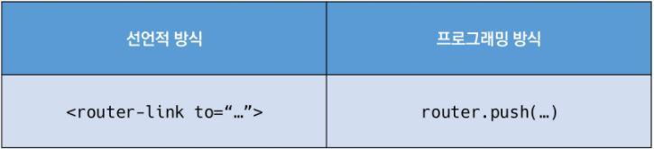


### Dynamic Route Matching

- 동적 인자 전달 방식

- 동적 인자는 ':'(콜론)으로 시작

- **this.$route.params**로 사용 가능

  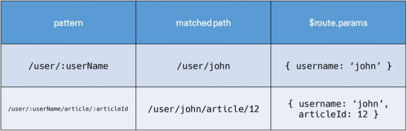


### Components & Views

- components폴더와 views 폴더 내부에 각기 다른 컴포넌트 존재
- **App.vue**
  - 최상위 컴포넌트
- **views/**
  - router에 매핑되는 컴포넌트 폴더
- **components/**
  - router에 매핑된 컴포넌트 내부에 작성하는 컴포넌트 폴더


### Environment Variable

- 프로젝트 최상단에 배치하여 환경 변수 지정 가능
- **변수명**
  - **'Node_ENV', 'BASE_URL', 'VUE_APP_'**
  - 해당 변수명으로 시작하는 변수만 클라이언트 번들에 정적으로 포함

- **.env.local**에 작성한 환경 변수는 원격 저장소에 노출시키지 않기 위해 git에서 무시


---

>## 10. Vuex
>
>### # Statement Management Pattern

### Vuex

- Statement management pattern + Library for vue.js (상태 관리 패턴 + 라이브러리)

- State(data)를 전역 저장소로 관리할 수 있도록 지원하는 라이브러리

  - 모든 컴포넌트에 대한 중앙 **집중식 저장소** 역할

  ```
  $ vue add vuex
  ```


### Statement Management Pattern

- 컴포넌트의 공유된 상태를 추출하고 이를 전역에서 관리

- 모든 컴포넌트는 트리에 상관없이 상태에 접근하거나 동작을 트리거 가능

  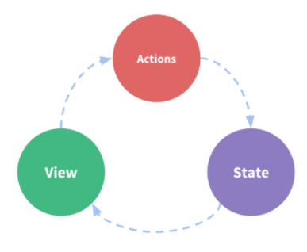

- **기존 Passprops & Emit events**

  - **단방향** 데이터 흐름

  - 장점 : 데이터 흐름을 직관적으로 파악 가능
  - 단점 : 중첩이 깊어지는 경우 동위 관계의 컴포넌트로의 데이터 전달이 불편

- **Vuex를 활용한 state 관리**

  - 상태를 한 곳(**store**)에 모두 모아두고 관리
  - **상태 흐름 관리가 중요**

  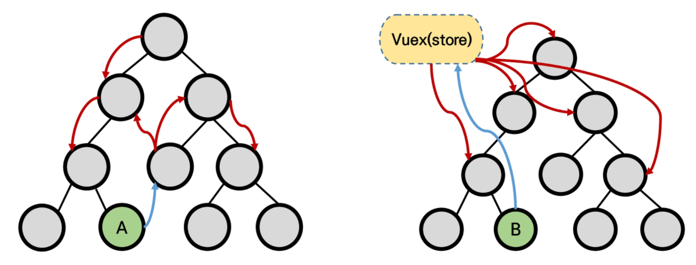


---

>## 11. Vuex Core Concepts
>
>### # State	# Mutations	# Actions	# Getters

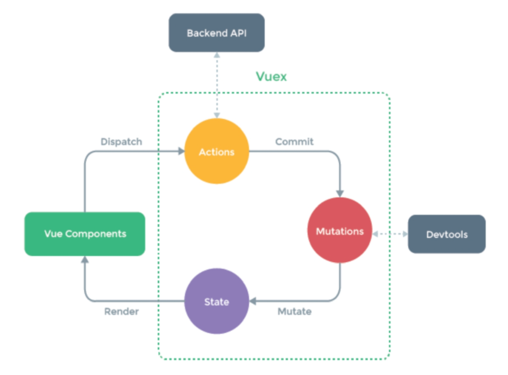

### State

- 중앙에서 관리하는 모든 상태 정보 (**Data**)
- Vuex는 **single state tree** 사용
- State 변화 시 해당 state를 공유하는 모든 컴포넌트의 DOM 렌더링


### Mutations

- 실제로 **state를 변경**하는 방법
- mutation의 **handler(함수)는 반드시 동기적**
- **첫번째 인자 === state**
- Actions에서 **commit()** 메서드에 의해 호출


### Actions

- **state 변경 금지**
  - mutation을 commit() 메서드로 호출하여 state 변경
- **첫번째 인자 === context**
  - store에 있는 모든 요소의 속성 접근 및 메서드 호출 가능 / state 변경 금지
- 컴포넌트에서 **dispatch()** 메서드에 의해 호출


### Getters

- state를 변경하지 않고 활용하여 계산 수행 (**computed 속성과 유사**)
- state 종속성에 따라 **캐시**되고, **종속성이 변경된 경우에만 재계산**


---

>## 12. Component Binding Helper
>
>### # mapState	# mapGetters	# mapActions	# mapMutations

### mapState

- Computed와 State 매핑

  ```javascript
  import { mapState } from 'vuex'
  
  export default {
    ...
    computed: {
      ...mapState([
        'stateName',
      ])
    }
  }
  ```

  

### mapGetters

- Computed와 Getters 매핑

  ```javascript
  import { mapGetters } from 'vuex'
  
  export default {
    ...
    computed: {
      ...mapGetters([
        'getterName',
      ])
    }
  }
  ```


### mapActions

- acions를 객체 전개 연산자(Object Spread Operator)로 계산하여 추가

  ```javascript
  import { mapActions } from 'vuex'
  
  export default {
    ...
    methods: {
      ...mapActions([
        'actionName',
      ])
    }
  }
  ```

