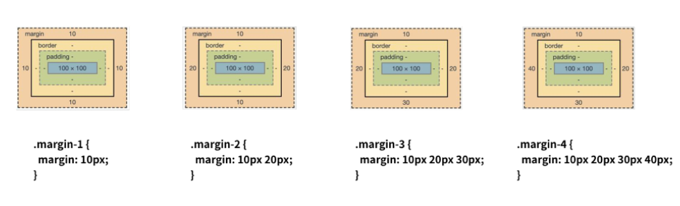

# CSS

## I. CSS 정의

- **Cascading Style Sheets**
- 스타일, 레이아웃 등을 통해 **문서(HTML)를 표시하는 방법을 지정하는 언어**

## II. CSS 구문

```css
h1 {
  color: blue;
  font-size: 15px;
}
```

- **용어 정리**

  - **선택자(Selector)**: h1

      \- 스타일을 지정할 HTML 요소 선택

  - **속성(Property)** : color, font-size

      \- 어떤 스타일 기능을 변경할지 결정

  - **값(Value)** : blue, 15px

      \- 어떻게 스타일 기능을 변경할지 결정

  - **선언(Declaration)** : color: blue, font-size: 15px

      \- 속성과 값이 하나의  쌍으로 이루어짐

- **정의 방법**

  - **인라인(Inline)**

      \- 해당 태그에 직접 style 속성 활용

  - **내부참조(embedding)**

      \- head tag 내에 `<style>`에 지정

  - **외부참조(link file)**

      \- 외부 CSS 파일을 `<head>`내 `<link>`를 통해 호출

## III. CSS Selectors

- **기본 선택자**

  | Selector       | Description____________________________________________________________________________________________________________________________________________ |
  | -------------- | ------------------------------------------------------------ |
  | *              | 전체 선택자                                                  |
  | tag            | 요소 선택자                                                  |
  | .\<class name> | 클래스 선택자                                                |
  | #\<id name>    | 아이디 선택자                                                |

- **결합자**

  | Selector            | Description____________________________________________________________________________________________________________________________________________ |
  | ------------------- | ------------------------------------------------------------ |
  | 부모tag 자식1tag    | **자식 결합자** / 부모tag의 모든 자식1tag 요소               |
  | 부모tag > 자식1tag  | **자손 결합자** / 부모tag의 바로 아래 자식1tag 요소          |
  | 형제1tag ~ 형제2tag | **일반 형제 결합자** / 형제1tag 뒤에 위치하는 모든 형제2tag  |
  | 형제1tag + 형제2tag | **인접 형제 결합자** / 형제1tag 바로 뒤의 형제2tag           |

- **의사 클래스/요소**

- **CSS 적용 우선순위**

  1. **!important**
  2. **Inline**
  3. **id Selector**
  4. **class Selector**
  5. **element Selector**
  6. **source**

- **CSS 상속**

  - 부모 요소의 속성을 자식에게 상속
  - **상속 요소 : Text 관련 요소**
  - **비상속 요소 : Box model, Position 관련 요소**

## IV. CSS 단위

- **크기 단위**

  | Unit     | Description                                                  |
  | -------- | ------------------------------------------------------------ |
  | px       | 해상도의 한 '픽셀'기준 / 고정적 단위                         |
  | %        | 백분율 단위 / 가변적인 레이아웃에서 주로 사용                |
  | em       | 배수 단위 / 상속의 영향을 받음                               |
  | rem      | 배수 단위 / 상속의 영향을 받지 않음 / 사이즈 기준=최상위 요소 |
  | viewport | 보이는 웹 컨텐츠의 영역 기준 / 디바이스의 viewport를 기준으로 상대적 사이즈 결정 / vw, vh, vmin, vmax |

- **색상 단위**

  | Color Unit  | Description                                                  |
  | ----------- | ------------------------------------------------------------ |
  | 색상 키워드 | 대소문자 구분 X                                              |
  | RGB         | 16진수 표기법(#000000) or 함수형 표기법(rgb\[a](0, 0, 0[, 0])) |
  | HSL         | 색상, 채도, 명도를 이용 (hsl\[a](120, 100%, 0[, 0]))         |

## V. CSS Box model

- **Box model 구성**

  - **Margin** : 테두리 바깥의 외부 여백

  - **Border** : 테두리 영역

  - **Padding** : 테두리 안쪽의 내부 여백 (배경색 및 이미지 적용 가능)

  - **Content** : 요소의 실제 내용

    

- **Box sizing**

  - box-sizing 기본값 = content-box
  - 생상 영역의 크기를 맞추기 위해선 **box-sizing: border-box** 적용 필요

- **마진상쇄 (Margin collapsing)**

  - top과 bottom이 만나는 경우 둘 중 큰 마진 값으로 결합되는 현상

    **※ 주로 top 또는 bottom만 적용 ※**

## VI. CSS Display

- HTML 요소들을 시각적으로 어떻게 보여줄지 결정하는 속성

- 모든 요소는 BoxModel / display에 따라 문서의 배치가 달라질 수 있음

- **Display**

  | Display      | Description                                                  |
  | ------------ | ------------------------------------------------------------ |
  | block        | 줄 바꿈이 일어나는 요소 / 화면 크기 전체의 가로 폭 차지 / inline 포함 가능 |
  | inline       | 줄 바꿈이 일어나지 않는 행의 일부 요소 / content 너비만큼 폭 차지 / margin-r,l 만 지정 가능 / line-height |
  | inline-block | block과 inline의 특징 모두 존재 / 한 줄 표시 가능 / margin, width, height 지정 가능 |
  | none         | 해당 요소를 표시 X / 공간도 제거 / (visibility: hidden = 공간은 존재, 요소 표시 X) |

- **Block & Inline elements 수평 정렬**

  |                 block                  |   sort   |       inline        |
  | :------------------------------------: | :------: | :-----------------: |
  |          margin-right: auto;           | 좌측정렬 |  text-algin: left;  |
  |           margin-left: auto;           | 우측정렬 | text-algin: right;  |
  | margin-right: auto; margin-left; auto; | 중앙정렬 | text-algin: center; |

## VII. CSS Position

- **static**
  - 모든 태그의 기본값(기준 위치)
  - 좌측상단, 부모 요소 내 배치되는 경우 부모 요소의 위치를 기준으로 배치
  - static 외는 top, bottom, left, right를 사용하여 이동 가능
- **relative (상대위치)**
  - 자신의 static을 기준으로 이동 / 레이아웃에서 차지하는 공간은 static과 동일
- **absolute (절대 위치)**
  - 가장 가까운 부모/조상 요소를 기준으로 이동(없는 경우 body를 기준) / 레이아웃에서 공간을 차지하지 않음
- **fixed (고정 위치)**
  - viewport를 기준으로 이동(스크롤 시에도 같은 곳에 위치) / 레이아웃에서 공간을 차지하지 않음
- **sticky (부모영역 고정 위치)**
  - 부모 영역을 기준으로 이동(스크롤 시 부모의 영역까지 viewport에 존재) / 레이아웃에서 공간을 차지