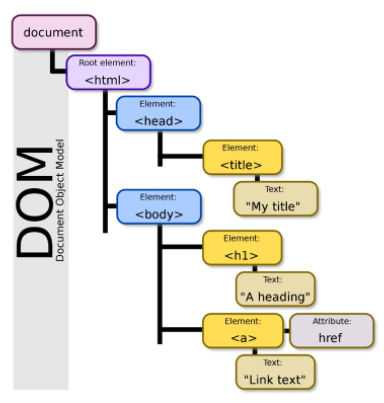

# HTML

## I. 웹 표준

- **W3C** : HTML5
- **WHATWG** : HTML Living Standard
  - Google, Apple, Microsoft, Mozilla 

## II. HTML 정의

- **Hyper Text Markup Language**
  - 웹 페이지를 작성하기 위한 언어 / **웹 컨텐츠의 의미와 구조 정의**
- **Hyper text**
  - 참조를 통해 사용자가 한 문서에서 다른 문서로 즉시 접근할 수 있는 텍스트
- **Markup Language**
  - \<tag> 등을 이용하여 특정 텍스트에 역할을 부여하는 언어
  - 단순 데이터 표현만 가능

## III. HTML 기본 구조

- **기본구조**

  ```html
  <!DOCTYPE html>
  <html lang="en">
  <head>
    <meta charset="UTF-8">
    <meta http-equiv="X-UA-Compatible" content="IE=edge">
    <meta name="viewport" content="width=device-width, initial-scale=1.0">
    <title>Document</title>
  </head>
  <body>
    
  </body>
  </html>
  ```

  - **html 요소**

      \- `<html>` 내용 `</html>`

      \- HTML문서 최상위 요소 / 문서의 root를 의미

      \- head and body 로 구분

  - **head 요소**

      \- `<head>` 내용 `</head>`

      \- 문서의 정보를 내장 / 브라우저에 표시 X

      \- CSS 선언 및 외부 로딩 파일 지정 등 작성

  - **body 요소**

      \- `<body>` 내용 `</body>`

      \- 브라우저 화면에 표시되는 정보 (실제 내용)

- **DOM(Document Object Model) 트리**

   

  - 문서의 구조화된 표현 제공

  - 부모 / 형제 관계

    **※ 들여쓰기 2spaces ※**

- **요소 (element)**

  ```html
  <h1>content</h1>
  ```

  - **태그(시작/종료)와 내용**으로 구성 / 중첩 가능

      \- 태그는 컨텐츠(내용)을 감싸는 것으로 정보의 성격과 의미를 정의

  - **내용이 없는 태그**

    ```
    br, hr, img, input, link, meta
    ```

- **속성**

  ```html
  <a href="https://google.com"></a>
  ```

  - 태그의 부가적인 정보 설정 가능

  - 태그별 사용 가능한 속성이 다름

    **※ 공백 X, " "사용 ※**

  - **공통으로 사용 가능한 속성**

    | Attribute | Description                                                  |
    | :-------- | :----------------------------------------------------------- |
    | id        | 유일한 식별자를 요소에 지정 (중복 불가)                      |
    | class     | 스타일시트에 정의된 class를 요소에 지정 (중복 가능)          |
    | hidden    | CSS와 다르게 의미상으로도 브라우저에 노출되지 않음           |
    | lang      | 지정된 요소의 언어를 지정 (크롤링 시 웹페이지의 언어 인식 가능) |
    | style     | 요소에 인라인 스타일 지정                                    |
    | tabindex  | 사용자가 키보드로 페이지를 내비게이션 시 이동 순서 지정      |
    | title     | 요소에 관한 제목 지정                                        |

- **시맨틱 테그**

  - 의미론적 요소를 담은 태그

  - 개발자 및 사용자 뿐만 아니라 검색엔진 등에 의미 있는 정보의 그룹을 태그로 표현

    | tag     | Descripton                     |
    | :------ | ------------------------------ |
    | header  | 문서 또는 섹션의 헤더 (머릿말) |
    | nav     | 내비게이션                     |
    | aside   | 사이드에 위치한 공간           |
    | section | 컨텐츠의 그룹 (article 모음)   |
    | article | 본문의 내용이 들어가는 공간    |
    | footer  | 문서 또는 섹션의 푸터 (바닥글) |

## IV. HTML 문서 구조화

- **그룹 컨텐츠**

  | tag            | Descripton                                          |
  | -------------- | --------------------------------------------------- |
  | `<p>`          | 단락(Paragraphs) 지정                               |
  | `<hr>`         | 수평줄 삽입                                         |
  | `<ol>`         | 순서 있는 목록 (Ordered List)                       |
  | `<ul>`         | 순서 없는 목록 (Unordered List)                     |
  | `<pre>`        | 미리 서식을 지정한 텍스트 / 작성한 내용 그대로 표현 |
  | `<blockquote>` | 안쪽의 텍스트가 인용문임을 나타냄                   |
  | `<div>`        | 공간을 분할하는 태그 (의미 X / Block)               |

- **텍스트 관련 요소**

  | tag                | Description                                                  |
  | ------------------ | ------------------------------------------------------------ |
  | `<a>`              | 하이퍼 링크 생성 (href="URL")                                |
  | `<b>` v `<strong>` | Blod체 (stront = 강조 / b = 의미 X)                          |
  | `<i>` v `<em>`     | Italic체 (em = 중요 / i = 의미 X)                            |
  | `<span>`           | 공간을 분할하는 태그 (의미X / Inline)                        |
  | `<br>`             | 개행(line break) 지정                                        |
  | ``            | 웹 페이지에 이미지 삽입 (srt="경로" alt="오류메시지" [width / height]) |

- **table**

  | tag    | Description                       |
  | ------ | --------------------------------- |
  | `<tr>` | 표 내부의 행 (table row)          |
  | `<th>` | 행 내부의 제목 셀 (table heading) |
  | `<tb>` | 행 내부의 행(table)               |

- **form**

  | tag       | Description                           | Grammer                                        |
  | --------- | ------------------------------------- | ---------------------------------------------- |
  | `<form>`  | 서버(목적지)에서 처리될 데이터를 제공 | \<form action="URL(목적지)" method="get/post"> |
  | `<input>` | 다양한 타입을 가지는 입력 데이터 필드 | \<input type="type" name=" " etc...>           |

- **input**

  - type에 따라 input의 동작이 다름

  | type attribute | Description                               |
  | -------------- | ----------------------------------------- |
  | button         | 버튼 생성                                 |
  | checkbox       | 체크 박스 생성                            |
  | color          | 컬러 선택 생성                            |
  | date           | 년/월/일 생성                             |
  | datetime-local | 지역 년/월/일/시/분/초 생성               |
  | month          | 월 선택 폼 생성                           |
  | time           | 시간 선택 폼 생성                         |
  | week           | 주 선택 입력 폼 생성                      |
  | email          | 이메일 입력 폼 생성 (submit 시 자동 검증) |
  | file           | 파일 선택 폼 생성                         |
  | hidden         | 감추어진 입력 폼 생성                     |
  | submit         | 제출 버튼 생성                            |
  | image          | 이미지로 된 제출 버튼 생성                |
  | number         | 숫자 입력 폼 생성                         |
  | password       | 페스워드 입력 폼 생성                     |
  | radio          | 라디오 버튼 생성                          |
  | range          | 범위 선택 폼 생성                         |
  | reset          | 초기화 버튼 생성                          |
  | search         | 검색어 입력 폼 생성                       |
  | tel            | 전화번호 입력 폼 생성                     |
  | text           | 텍스트 입력 폼 생성                       |
  | url            | url 입력 폼 생성                          |

  참고 : https://poiemaweb.com/html5-tag-forms