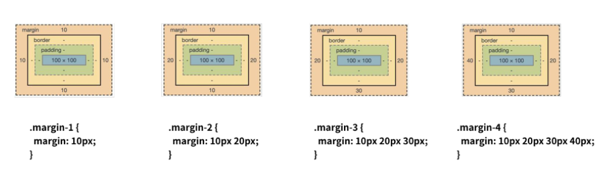

# HTML

## I. 웹 표준

- **W3C** : HTML5
- **WHATWG** : HTML Living Standard
  - Google, Apple, Microsoft, Mozilla 

## II. HTML 정의

- **Hyper Text Markup Language**
  - 웹 페이지를 작성하기 위한 언어 / **웹 컨텐츠의 의미와 구조 정의**
- **Hyper text**
  - 참조를 통해 사용자가 한 문서에서 다른 문서로 즉시 접근할 수 있는 텍스트
- **Markup Language**
  - \<tag> 등을 이용하여 특정 텍스트에 역할을 부여하는 언어
  - 단순 데이터 표현만 가능

## III. HTML 기본 구조

- **기본구조**

  ```html
  <!DOCTYPE html>
  <html lang="en">
  <head>
    <meta charset="UTF-8">
    <meta http-equiv="X-UA-Compatible" content="IE=edge">
    <meta name="viewport" content="width=device-width, initial-scale=1.0">
    <title>Document</title>
  </head>
  <body>
    
  </body>
  </html>
  ```

  - **html 요소**

    \- `<html>` 내용 `</html>`

    \- HTML문서 최상위 요소 / 문서의 root를 의미

    \- head and body 로 구분

  - **head 요소**

    \- `<head>` 내용 `</head>`

    \- 문서의 정보를 내장 / 브라우저에 표시 X

    \- CSS 선언 및 외부 로딩 파일 지정 등 작성

    - **Open Graph Protocol**

      \- 메타 데이터를 표현하는 새로운 규약

      \- HTML 문서의 메타 데이터를 통해 문서의 정보 전달 (ex. 썸네일)

      \- Facebook에서 제작 / 제목, 설명 등을 작성 할 수 있도록 정의

  - **body 요소**

    \- `<body>` 내용 `</body>`

    \- 브라우저 화면에 표시되는 정보 (실제 내용)

- **DOM(Document Object Model) 트리**

   

  - 문서의 구조화된 표현 제공

  - Web Page의 객체 지향 표현

  - 부모 / 형제 관계

    **※ 들여쓰기 2spaces ※**

- **요소 (element)**

  ```html
  <h1>content</h1>
  ```

  - **태그(시작/종료)와 내용**으로 구성 / 중첩 가능

    \- 태그는 컨텐츠(내용)을 감싸는 것으로 정보의 성격과 의미를 정의

  - **내용이 없는 태그**

    ```
    br, hr, img, input, link, meta
    ```

- **속성**

  ```html
  <a href="https://google.com"></a>
  ```

  - 태그의 부가적인 정보 설정 가능

  - 보통 속성명과 속성값이 하나의 쌍으로 존재

  - 태그별 사용 가능한 속성이 다름

    **※ 공백 X, " "사용 ※**

  - **공통으로 사용 가능한 속성**

    | Attribute | Description                                                  |
    | :-------- | :----------------------------------------------------------- |
    | id        | 유일한 식별자를 요소에 지정 (중복 불가)                      |
    | class     | 스타일시트에 정의된 class를 요소에 지정 (중복 가능)          |
    | hidden    | CSS와 다르게 의미상으로도 브라우저에 노출되지 않음           |
    | lang      | 지정된 요소의 언어를 지정 (크롤링 시 웹페이지의 언어 인식 가능) |
    | style     | 요소에 인라인 스타일 지정                                    |
    | tabindex  | 사용자가 키보드로 페이지를 내비게이션 시 이동 순서 지정      |
    | title     | 요소에 관한 제목 지정                                        |

- **시맨틱 테그**

  - 의미론적 요소를 담은 태그 (HTML5 부터 추가)

  - 개발자 및 사용자 뿐만 아니라 검색엔진 등에 의미 있는 정보의 그룹을 태그로 표현

  - 가독성 향상 및 유지보수 용이

    | tag     | Descripton                     |
    | :------ | ------------------------------ |
    | header  | 문서 또는 섹션의 헤더 (머릿말) |
    | nav     | 내비게이션                     |
    | aside   | 사이드에 위치한 공간           |
    | section | 컨텐츠의 그룹 (article 모음)   |
    | article | 본문의 내용이 들어가는 공간    |
    | footer  | 문서 또는 섹션의 푸터 (바닥글) |

## IV. HTML 문서 구조화

- **그룹 컨텐츠 (block)**

  | tag            | Descripton                                          |
  | -------------- | --------------------------------------------------- |
  | `<p>`          | 단락(Paragraphs) 지정                               |
  | `<hr>`         | 수평줄 삽입                                         |
  | `<ol>`         | 순서 있는 목록 (Ordered List)                       |
  | `<ul>`         | 순서 없는 목록 (Unordered List)                     |
  | `<pre>`        | 미리 서식을 지정한 텍스트 / 작성한 내용 그대로 표현 |
  | `<blockquote>` | 안쪽의 텍스트가 인용문임을 나타냄                   |
  | `<div>`        | 공간을 분할하는 태그 (의미 X / Block)               |

- **텍스트 관련 요소 (inline)**

  | tag                | Description                                                  |
  | ------------------ | ------------------------------------------------------------ |
  | `<a>`              | 하이퍼 링크 생성 (href="URL")                                |
  | `<b>` v `<strong>` | Blod체 (stront = 강조 / b = 의미 X)                          |
  | `<i>` v `<em>`     | Italic체 (em = 중요 / i = 의미 X)                            |
  | `<span>`           | 공간을 분할하는 태그 (의미X / Inline)                        |
  | `<br>`             | 개행(line break) 지정                                        |
  | ``            | 웹 페이지에 이미지 삽입 (srt="경로" alt="오류메시지" [width / height]) |

- **table**

  | tag    | Description                       |
  | ------ | --------------------------------- |
  | `<tr>` | 표 내부의 행 (table row)          |
  | `<th>` | 행 내부의 제목 셀 (table heading) |
  | `<tb>` | 행 내부의 행(table)               |

- **form**

  | tag       | Description                           | Grammer                                        |
  | --------- | ------------------------------------- | ---------------------------------------------- |
  | `<form>`  | 서버(목적지)에서 처리될 데이터를 제공 | \<form action="URL(목적지)" method="get/post"> |
  | `<input>` | 다양한 타입을 가지는 입력 데이터 필드 | \<input type="type" name=" " etc...>           |

- **input**

  - type에 따라 input의 동작이 다름

  | type attribute | Description                               |
  | -------------- | ----------------------------------------- |
  | button         | 버튼 생성                                 |
  | checkbox       | 체크 박스 생성                            |
  | color          | 컬러 선택 생성                            |
  | date           | 년/월/일 생성                             |
  | datetime-local | 지역 년/월/일/시/분/초 생성               |
  | month          | 월 선택 폼 생성                           |
  | time           | 시간 선택 폼 생성                         |
  | week           | 주 선택 입력 폼 생성                      |
  | email          | 이메일 입력 폼 생성 (submit 시 자동 검증) |
  | file           | 파일 선택 폼 생성                         |
  | hidden         | 감추어진 입력 폼 생성                     |
  | submit         | 제출 버튼 생성                            |
  | image          | 이미지로 된 제출 버튼 생성                |
  | number         | 숫자 입력 폼 생성                         |
  | password       | 페스워드 입력 폼 생성                     |
  | radio          | 라디오 버튼 생성                          |
  | range          | 범위 선택 폼 생성                         |
  | reset          | 초기화 버튼 생성                          |
  | search         | 검색어 입력 폼 생성                       |
  | tel            | 전화번호 입력 폼 생성                     |
  | text           | 텍스트 입력 폼 생성                       |
  | url            | url 입력 폼 생성                          |

  참고 : https://poiemaweb.com/html5-tag-forms


# CSS

## I. CSS 정의

- **Cascading Style Sheets**
- 스타일, 레이아웃 등을 통해 **문서(HTML)를 표시하는 방법을 지정하는 언어**

## II. CSS 구문

```css
h1 {
  color: blue;
  font-size: 15px;
}
```

- **용어 정리**

  - **선택자(Selector)**: h1

    \- 스타일을 지정할 HTML 요소 선택

  - **속성(Property)** : color, font-size

    \- 어떤 스타일 기능을 변경할지 결정

  - **값(Value)** : blue, 15px

    \- 어떻게 스타일 기능을 변경할지 결정

  - **선언(Declaration)** : color: blue, font-size: 15px

    \- 속성과 값이 하나의  쌍으로 이루어짐

- **정의 방법**

  - **인라인(Inline)**

    \- 해당 태그에 직접 style 속성 활용

  - **내부참조(embedding)**

    \- head tag 내에 `<style>`에 지정

  - **외부참조(link file)**

    \- 외부 CSS 파일을 `<head>`내 `<link>`를 통해 호출

## III. CSS Selectors

- **기본 선택자**

  | Selector       | Description____________________________________________________________________________________________________________________________________________ |
  | -------------- | ------------------------------------------------------------ |
  | *              | 전체 선택자                                                  |
  | tag            | 요소 선택자                                                  |
  | .\<class name> | 클래스 선택자                                                |
  | #\<id name>    | 아이디 선택자                                                |

- **결합자**

  | Selector            | Description____________________________________________________________________________________________________________________________________________ |
  | ------------------- | ------------------------------------------------------------ |
  | 부모tag > 자식1tag  | **자식 결합자** / 부모tag의 모든 자식1tag 요소               |
  | 부모tag 자식1tag    | **자손 결합자** / 부모tag의 바로 아래 자식1tag 요소          |
  | 형제1tag ~ 형제2tag | **일반 형제 결합자** / 형제1tag 뒤에 위치하는 모든 형제2tag  |
  | 형제1tag + 형제2tag | **인접 형제 결합자** / 형제1tag 바로 뒤의 형제2tag           |

- **의사 클래스/요소**

- **CSS 적용 우선순위**

  1. **!important**
  2. **Inline**
  3. **id Selector**
  4. **class Selector**
  5. **element Selector**
  6. **source**

- **CSS 상속**

  - 부모 요소의 속성을 자식에게 상속
  - **상속 요소 : Text 관련 요소**
  - **비상속 요소 : Box model, Position 관련 요소**

## IV. CSS 단위

- **크기 단위**

  | Unit     | Description                                                  |
  | -------- | ------------------------------------------------------------ |
  | px       | 해상도의 한 '픽셀'기준 / 고정적 단위                         |
  | %        | 백분율 단위 / 가변적인 레이아웃에서 주로 사용                |
  | em       | 배수 단위 / 상속의 영향을 받음                               |
  | rem      | 배수 단위 / 상속의 영향을 받지 않음 / 사이즈 기준=최상위 요소 |
  | viewport | 보이는 웹 컨텐츠의 영역 기준 / 디바이스의 viewport를 기준으로 상대적 사이즈 결정 / vw, vh, vmin, vmax |

- **색상 단위**

  | Color Unit  | Description                                                  |
  | ----------- | ------------------------------------------------------------ |
  | 색상 키워드 | 대소문자 구분 X                                              |
  | RGB         | 16진수 표기법(#000000) or 함수형 표기법(rgb\[a](0, 0, 0[, 0])) |
  | HSL         | 색상, 채도, 명도를 이용 (hsl\[a](120, 100%, 0[, 0]))         |

## V. CSS Box model

- **Box model 구성**

  - **Margin** : 테두리 바깥의 외부 여백

  - **Border** : 테두리 영역

  - **Padding** : 테두리 안쪽의 내부 여백 (배경색 및 이미지 적용 가능)

  - **Content** : 요소의 실제 내용

    

- **Box sizing**

  - box-sizing 기본값 = content-box
  - 생상 영역의 크기를 맞추기 위해선 **box-sizing: border-box** 적용 필요

- **마진상쇄 (Margin collapsing)**

  - top과 bottom이 만나는 경우 둘 중 큰 마진 값으로 결합되는 현상

    **※ 주로 top 또는 bottom만 적용 ※**

## VI. CSS Display

- HTML 요소들을 시각적으로 어떻게 보여줄지 결정하는 속성

- 모든 요소는 BoxModel / display에 따라 문서의 배치가 달라질 수 있음

- **Display**

  | Display      | Description                                                  |
  | ------------ | ------------------------------------------------------------ |
  | block        | 줄 바꿈이 일어나는 요소 / 화면 크기 전체의 가로 폭 차지 / inline 포함 가능 |
  | inline       | 줄 바꿈이 일어나지 않는 행의 일부 요소 / content 너비만큼 폭 차지 / margin-r,l 만 지정 가능 / line-height |
  | inline-block | block과 inline의 특징 모두 존재 / 한 줄 표시 가능 / margin, width, height 지정 가능 |
  | none         | 해당 요소를 표시 X / 공간도 제거 / (visibility: hidden = 공간은 존재, 요소 표시 X) |

- **Block & Inline elements 수평 정렬**

  |                 block                  |   sort   |       inline        |
  | :------------------------------------: | :------: | :-----------------: |
  |          margin-right: auto;           | 좌측정렬 |  text-algin: left;  |
  |           margin-left: auto;           | 우측정렬 | text-algin: right;  |
  | margin-right: auto; margin-left; auto; | 중앙정렬 | text-algin: center; |

## VII. CSS Position

- **static**
  - 모든 태그의 기본값(기준 위치)
  - 좌측상단, 부모 요소 내 배치되는 경우 부모 요소의 위치를 기준으로 배치
  - static 외는 top, bottom, left, right를 사용하여 이동 가능
- **relative (상대위치)**
  - 자신의 static을 기준으로 이동 / 레이아웃에서 차지하는 공간은 static과 동일
- **absolute (절대 위치)**
  - 가장 가까운 부모/조상 요소를 기준으로 이동(없는 경우 body를 기준) / 레이아웃에서 공간을 차지하지 않음
- **fixed (고정 위치)**
  - viewport를 기준으로 이동(스크롤 시에도 같은 곳에 위치) / 레이아웃에서 공간을 차지하지 않음
- **sticky (부모영역 고정 위치)**
  - 부모 영역을 기준으로 이동(스크롤 시 부모의 영역까지 viewport에 존재) / 레이아웃에서 공간을 차지


# CSS & Bootstrap

## I. CSS Layout

1. **Display**

   | Display      | Description                                                  |
   | ------------ | ------------------------------------------------------------ |
   | block        | 줄 바꿈이 일어나는 요소 / 화면 크기 전체의 가로 폭 차지 / inline 포함 가능 |
   | inline       | 줄 바꿈이 일어나지 않는 행의 일부 요소 / content 너비만큼 폭 차지 / margin-r,l 만 지정 가능 |
   | inline-block | block과 inline의 특징 모두 존재 / 한 줄 표시 가능 / margin, width, height 지정 가능 |
   | none         | 해당 요소를 표시 X / 공간도 제거 / (visibility: hidden = 공간은 존재, 요소 표시 X) |

   **Block & Inline elements 수평 정렬**

   |                                  block |   sort   | inline              |                                                   |
   | -------------------------------------: | :------: | :------------------ | ------------------------------------------------- |
   |                    margin-right: auto; | 좌측정렬 | text-algin: left;   |                                                   |
   |                     margin-left: auto; | 우측정렬 | text-algin: right;  |                                                   |
   | margin-right: auto; margin-left; auto; | 중앙정렬 | text-algin: center; | ------------------------------------------------- |

2. **Position**

   - **static (기준 위치)** 
     - 모든 태그의 기본값(기준 위치)
     - 좌측상단, 부모 요소 내 배치되는 경우 부모 요소의 위치를 기준으로 배치
     - static 외는 top, bottom, left, right를 사용하여 이동 가능
   - **relative (상대위치)**
     - 자신의 static을 기준으로 이동 / 레이아웃에서 차지하는 공간은 static과 동일
   - **absolute (절대 위치)**
     - 가장 가까운 부모/조상 요소를 기준으로 이동(없는 경우 body를 기준) / 레이아웃에서 공간을 차지하지 않음
   - **fixed (고정 위치)**
     - viewport를 기준으로 이동(스크롤 시에도 같은 곳에 위치) / 레이아웃에서 공간을 차지하지 않음
   - **sticky (부모영역 고정 위치)**
     - 부모 영역을 기준으로 이동(스크롤 시 부모의 영역까지 viewport에 존재) / 레이아웃에서 공간을 차지

3. **Float**

   - 이미지 좌, 우측에 텍스트로 둘러싸는 레이아웃을 위해 도입

     → 다른 요소들에게도 적용해 웹 사이트 전체 레이아웃을 만드는 display로 발전

     → 현재는 이전의 역할로 회귀 / 여전히 사용되는 경우가 있음

     **※ float 시 레이아웃 상 위치를 가지지 않음 ※**

   - **속성**

     \- none : 기본값

     \- left : 요소를 좌측 정렬

     \- right : 요소를 우측 정렬

   - **Float clear (가상요소)**

     ```css
     .clearfix::after {
     	content: "";
     	disblay: block;
     	clear: both;
     }
     ```

       \- 선택한 요소의 마지막 자식으로 가상 요소를 생성 (기본값 = inline)

       \- 보통 content 속성과 함께 사용 / 장식용 콘텐츠를 추가할 때 사용

4. **Flexbox**

   - 구성요소

     - **Flex Container (부모 요소)**

       \- flexbox 레이아웃 형성의 가장 기본적인 모델

       \- flex item들이 놓이는 영역

       **\- display 속성 = flex / inline-flex**

       ​	**※ 부모 요소에 flex 작성 ※**

     - **Flex Item (자식 요소)**

       \- 컨테이너의 컨텐츠

   - 축

     - **main axis (메인축)**
     - **cross axis (교차축)**

      

   - 속성

     - **배치 방향**

       **\- flex-direction (메인축)**

       ```markdown
       	row(default)	우 → 좌
       	row-reverse		좌 → 우
       	column			상 → 하
       	column-reverse	하 → 상
       ```

     - **메인축 방향 정렬 (justify)**

       **\- justify-content**

       ```
       flex-start, end / center
       space-between
       space-around
       space-evenly
       ```

     - **교차축 방향 정렬 (align)**

       **\- align-items**

       ```1
       flex-start, end / center
       stretch = 컨테이너를 가득 채움(default)
       baseline
       ```

         **\- align-self**

       ```
       auto (default)
       flex-start, end / center
       stretch = 부모 컨테이너에 자동으로 맞춰서 늘어남
       space-between
       space-around
       ```

         **\- algin-content**

       ```
       auto
       flex-start, end / center
       stretch = 컨테이너를 가득 채움(default)
       baseline
       ```

         \- content = 여러 줄

         \- items = 한 줄

         \- self = 개별 요소

     - 기타

       **\- flex-wrap** : 허용량을 벗어나면 강제로 한 줄 배치할지 또는 줄을 바꿔 배치할지 결정

        					   \- nowrap(default)
        	
        					   \- wrap
        	
        					   \- wrap-reverse : 넘치면 윗줄로

       **\- flex-flow** : flex-direction과 flex wrap을 한 번에 설정하는 shorthand

       **\- flex-grow** : 주축에서 남은 공간을 항목에게 분배

       **\- order** : 항목이 나타날 순서 지정(1 = default)

## II. Bootstrap

1. **CSS library**

   - **spacing**

       \- html 텍스트 기본 사이즈는 16px

      

      

   - **color**

      

   - **Text**

       \- text-start, center, end

       \- text-decoration-none

       \- fw-bold, normal, light

       \- fst-italic

   - **Components**

       \- Bootstrap에서 제공하는 컨텐츠

   - **Flexbox in Bootstrap**

       \- d-flex

       \- justify-content-center

       \- align-items-center

   - **Responsive Web**

       \- 반응형 웹 (디바이스의 viewport에 따라 보이는 화면이 다르게 구성)

       \- 웹에 대한 접근 방식

2. **Grid System**

   - flexbox로 제작

   - **container, rows, column**으로 컨텐츠 배치 및 정렬

   - **12개 column / 6개 grid breakpoints**

   - **row**

       \- column의 wrapper

   - **column**

       \- content는 column에 존재

       \- row의 자식 == column

   - **breakpoints**

       \- 뷰포트 크기에서 반응형 레이아웃이 작동하는 방식을 결정하는 사용자 지정 가능한 너비

      

   - **offset**

       \- 지정한 만큼의 column 공백 설정

   - **nesting** (중첩)